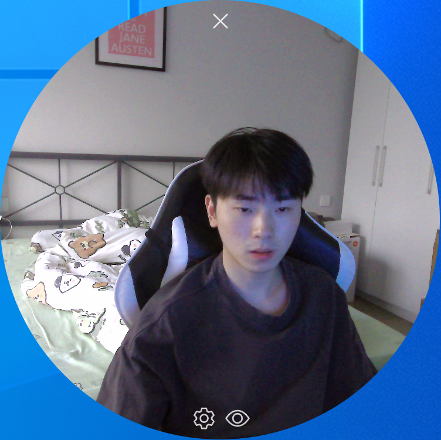
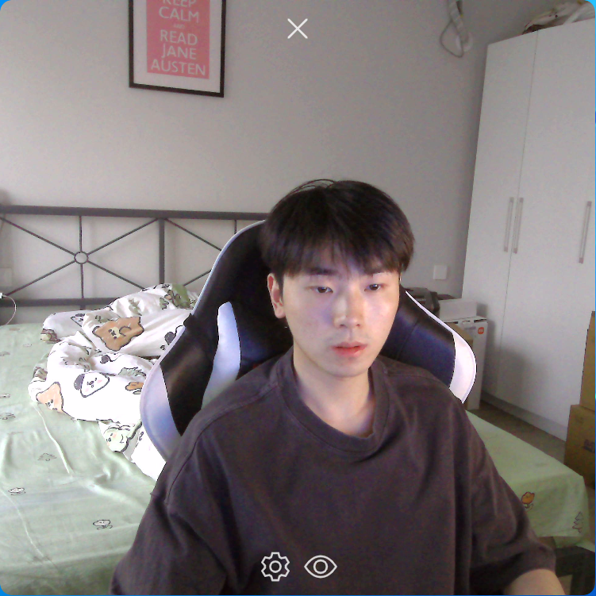
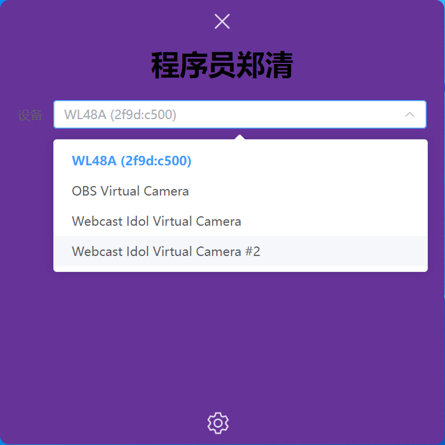

# 摄像头初版

效果




`src/main/index.js`

```
const mainWindow = new BrowserWindow({
    width: 800,
    height: 600,
    show: false,
    autoHideMenuBar: true, // 隐藏菜单栏
    ...(process.platform === 'linux' ? { icon } : {}),
    webPreferences: {
      preload: join(__dirname, '../preload/index.js'),
      sandbox: false
      // nodeIntegration: true // 允许在渲染进程中使用Node.js
    },
    transparent: true, // 透明
    frame: false, // 去除边框
    devTools: false,
    alwaysOnTop: true, // 窗口置顶
    // allowMediaDevices: true // 允许访问摄像头和麦克风
    resizable: true, //是否可以拖拉窗口边框改变大小
    backgroundColor: '#00000000' //窗口底色为透明色
  })
```

`src/preload/index.js`

```
const api = {
  // 点击exit退出
  exit: () => {
    // 向主进程发送退出事件
    ipcRenderer.send('exit')
  },
  // 右键退出
  quit: () => {
    // 向主进程发送退出事件
    ipcRenderer.send('quit')
  },
  // 设置窗口尺寸事件
  setWindowSize: (opt) => {
    ipcRenderer.send('setWindowSize', opt)
  }
}
```

`src/renderer/src/components/base-camera.vue`

```vue
<template>
  <div
    :style="{ 'border-radius': config.isRound ? '50%' : '10px' }"
    style="width: 100vh; height: 100vh; overflow: hidden"
  >
    <video style="width: 100%; height: 100vh; border-radius: 10px" />
  </div>
</template>

<script setup>
import { onMounted, toRefs, getCurrentInstance } from 'vue'
const { proxy } = getCurrentInstance()
let { setWinSize } = proxy.$store.settings.useSettingsStore()
let { config } = toRefs(proxy.$store.settings.useSettingsStore())

onMounted(() => {
  show()
})

// 打开摄像头
function show() {
  const video = document.querySelector('video')

  // 拿到指定媒体设备 https://developer.mozilla.org/zh-CN/docs/Web/API/MediaDevices/getUserMedia
  navigator.mediaDevices
    .getUserMedia({
      audio: false, // 设置这个摄像头不捕获声音
      video: {
        deviceId: config.value.deviceId, // 设置摄像头设备ID
        width: 1920,
        height: 1920
      }
    })
    .then(function (stream) {
      video.srcObject = stream
      video.play()
    })

  setWinSize()
}
</script>

<style lang="scss" scoped></style>
```

`src/renderer/src/components/base-set.vue`

```vue
<template>
  <div
      class="flex-c-start-center"
      style="
      width: 100vh;
      height: 100vh;
      padding: 50px 20px;
      background-color: rebeccapurple;
      border-radius: 10px;
    "
  >
    <h1>程序员郑清</h1>
    <el-form
        class="no-drag"
        style="margin-top: 20px; width: 100%; height: 100vh"
        label-position="left"
        :model="config"
        label-width="40px"
    >
      <el-form-item label="设备">
        <el-select v-model="config.deviceId" placeholder="请选择摄像头">
          <el-option
              v-for="item in config.cameraList"
              :key="item.deviceId"
              :label="item.label"
              :value="item.deviceId"
          ></el-option>
        </el-select>
      </el-form-item>
    </el-form>
  </div>
</template>

<script setup>
  import { onMounted, ref, toRefs, getCurrentInstance } from 'vue'
  const { proxy } = getCurrentInstance()
  let { config } = toRefs(proxy.$store.settings.useSettingsStore())

  onMounted(() => {
    getCameraList()
  })

  // 获取摄像头列表
  async function getCameraList() {
    // 1.获取系统的所有音频设备
    const deviceList = await navigator.mediaDevices.enumerateDevices()
    // console.log('deviceList:', deviceList)

    // 2.从音频设备中过滤出摄像头
    config.value.cameraList = deviceList.filter((d) => d.kind.includes('video'))
    // console.log('cameraList:', config.value.cameraList)
  }
</script>

<style lang="scss" scoped></style>
```

`src/renderer/src/App.vue`

```vue
<template>
  <div style="background-color: rgba(0, 0, 0, 0)" @contextmenu="quit">
    <base-camera v-if="$store.settings.useSettingsStore().config.isCamera" />
    <base-set v-else />

    <div class="close-btn no-drag flex-center-center">
      <el-icon :size="28" color="white" @click="exit"><Close /></el-icon>
    </div>

    <div class="set-btn no-drag flex-center-center">
      <el-icon :size="28" color="white" @click="changeConfig"><Setting /></el-icon>
      <span style="width: 10px"></span>
      <el-icon
        v-if="$store.settings.useSettingsStore().config.isCamera"
        :size="28"
        color="white"
        @click="changeRound"
        ><View
      /></el-icon>
    </div>
  </div>
</template>

<script setup>
import BaseCamera from './components/base-camera.vue'
import BaseSet from './components/base-set.vue'
import { toRefs, getCurrentInstance } from 'vue'
const { proxy } = getCurrentInstance()
let { changeRound, changeConfig } = proxy.$store.settings.useSettingsStore()
let { config } = toRefs(proxy.$store.settings.useSettingsStore())

// 右键退出
const quit = () => {
  window.api.quit()
}

// 点击退出icon
function exit() {
  window.api.exit()
}
</script>

<style lang="scss" scoped>
.close-btn {
  width: 100%;
  position: absolute;
  top: 10px;
  z-index: 1000;
  opacity: 0.8;
}

.set-btn {
  width: 100%;
  position: absolute;
  bottom: 10px;
  z-index: 1000;
  opacity: 0.8;
}
</style>
```

`src/renderer/src/stores/settings.js`

```vue
import { defineStore } from 'pinia'
import { ref } from 'vue'
import { ElMessage } from 'element-plus'

export const useSettingsStore = defineStore('settings', () => {
  let config = ref({ cameraList: [], isRound: true, isCamera: true })

  function changeRound() {
    config.value.isRound = !config.value.isRound
    setWinSize()
    // ElMessage({ message: '切换：' + config.value.isRound, type: 'success', duration: 500 })
  }

  function changeConfig() {
    config.value.isCamera = !config.value.isCamera
    // ElMessage({ message: '显示：' + config.value.isCamera, type: 'success', duration: 500 })
  }

  function setWinSize() {
    if (config.value.isRound) {
      // 如果是圆角 设置窗口为1/1缩放
      window.api.setWindowSize({ AspectRatio: 1, width: 500, height: 500 })
    } else {
      // 如果不是圆角 设置窗口为16/9缩放
      window.api.setWindowSize({ AspectRatio: 16 / 9, width: 500, height: 500 })
    }
  }

  return { config, changeRound, changeConfig, setWinSize }
})
```

