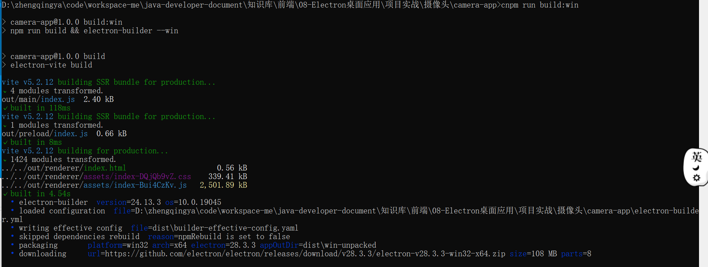
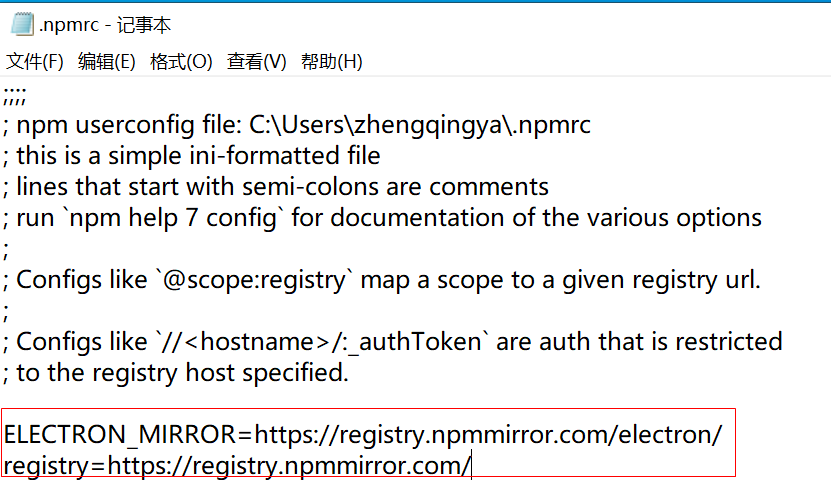
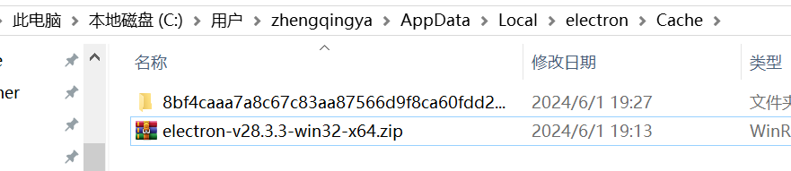
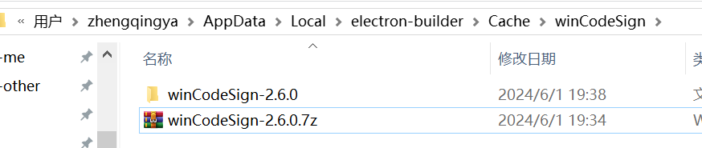
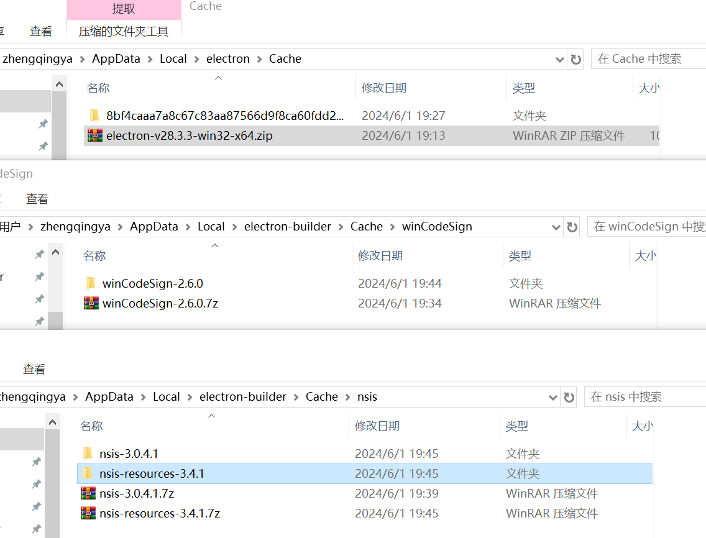
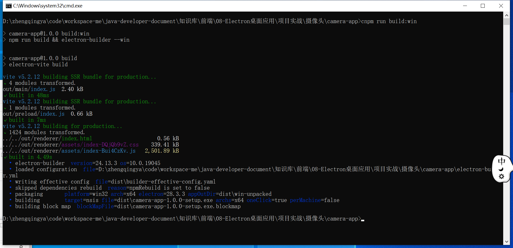
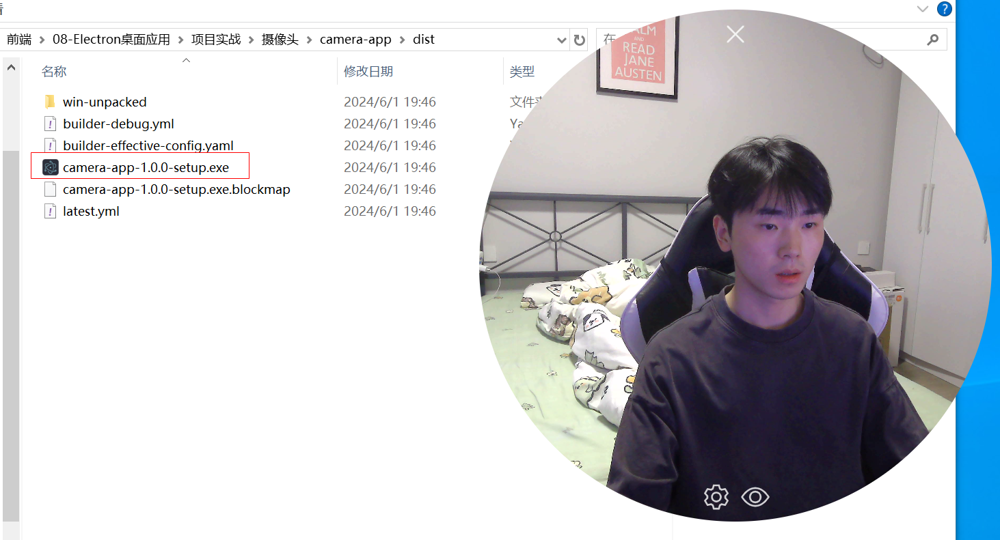

# 打包

```shell
cnpm run build:win
```

打包下载慢问题



### 解决

```shell
# 修改配置
npm config edit

# 或直接使用命令方式
# npm install -g cnpm --registry=https://registry.npmmirror.com/
# npm config set ELECTRON_MIRROR https://registry.npmmirror.com/electron/
```

文件中添加如下配置

```
ELECTRON_MIRROR=https://registry.npmmirror.com/electron/
registry=https://registry.npmmirror.com/
```




如果下载还是慢的情况下，手动下载相关资源

eg: 
`https://github.com/electron/electron/releases/download/v28.3.3/electron-v28.3.3-win32-x64.zip` 存放到 `C:\Users\zhengqingya\AppData\Local\electron\Cache`目录下


`https://github.com/electron-userland/electron-builder-binaries/releases/download/winCodeSign-2.6.0/winCodeSign-2.6.0.7z` 
存放到 `C:\Users\zhengqingya\AppData\Local\electron-builder\Cache\winCodeSign`目录下并解压



- `https://github.com/electron-userland/electron-builder-binaries/releases/download/nsis-3.0.4.1/nsis-3.0.4.1.7z`
- `https://github.com/electron-userland/electron-builder-binaries/releases/download/nsis-resources-3.4.1/nsis-resources-3.4.1.7z` 

存放到 `C:\Users\zhengqingya\AppData\Local\electron-builder\Cache\nsis`目录下并解压


再次build打包，成功！


完成


