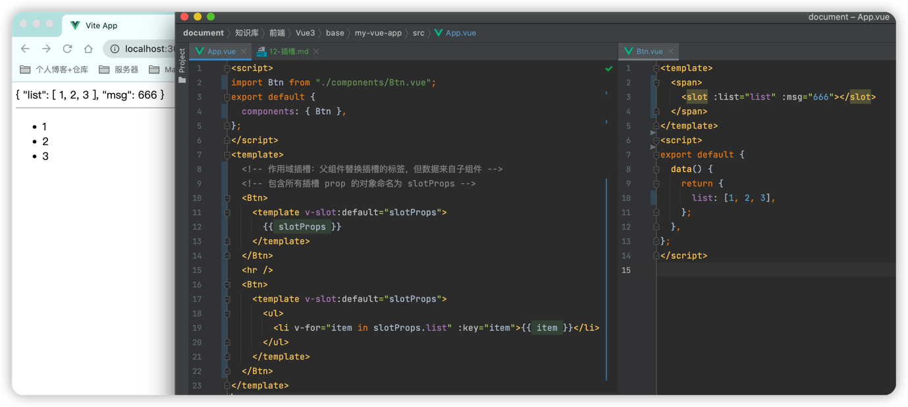

### 插槽内容


App.vue

```vue
<script>
import Btn from "./components/Btn.vue";
export default {
  components: { Btn },
};
</script>
<template>
  <Btn>click</Btn>
</template>
```

Btn.vue

```vue
<template>
  <button>
    <slot></slot>
  </button>
</template>
```

### 具名插槽

> 多个插槽的区分

```vue
<script>
import Btn from "./components/Btn.vue";
export default {
  components: { Btn },
};
</script>
<template>
  <Btn>
    <!-- 以 v-slot 参数的形式提供其名称 -->
    <template v-slot:a>aaa</template>
    <template v-slot:b>bbb</template>
  </Btn>
</template>
```


```vue
<template>
  <button>
    <!-- name: 为不同的插槽分配独立的ID -->
    <slot name="a"></slot>
    <slot name="b"></slot>
  </button>
</template>
```

### 渲染作用域


```vue
<script>
import Btn from "./components/Btn.vue";
export default {
  components: { Btn },
  data() {
    return {
      msg: "hi",
    };
  },
};
</script>
<template>
  <Btn>
    <!-- 渲染作用域：不能访问子组件的作用域 -->
    <!-- 父级模板里的所有内容都是在父级作用域中编译的；子模板里的所有内容都是在子作用域中编译的。 -->
    <template v-slot:a>{{ msg }}</template>
  </Btn>
</template>
```

```vue
<template>
  <button>
    <slot name="a"></slot>
  </button>
</template>
<script>
export default {
  data() {
    return {
      msg: "btn",
    };
  },
};
</script>
```

### 备用内容

```vue
<script>
import Btn from "./components/Btn.vue";
export default {
  components: { Btn },
};
</script>
<template>
  <Btn></Btn>
  <Btn>
    <template v-slot:a></template>
  </Btn>
</template>
```

```vue
<template>
  <button>
    <!-- 备用内容:只会在没有提供内容的时候被渲染 -->
    <slot name="a">xxx</slot>
  </button>
</template>
```

### 作用域插槽



```vue
<script>
import Btn from "./components/Btn.vue";
export default {
  components: { Btn },
};
</script>
<template>
  <!-- 作用域插槽：父组件替换插槽的标签，但数据来自子组件 -->
  <!-- 包含所有插槽 prop 的对象命名为 slotProps -->
  <Btn>
    <template v-slot:default="slotProps">
      {{ slotProps }}
    </template>
  </Btn>
  <hr />
  <Btn>
    <template v-slot:default="slotProps">
      <ul>
        <li v-for="item in slotProps.list" :key="item">{{ item }}</li>
      </ul>
    </template>
  </Btn>
</template>
```

```vue
<template>
  <span>
    <slot :list="list" :msg="666"></slot>
  </span>
</template>
<script>
export default {
  data() {
    return {
      list: [1, 2, 3],
    };
  },
};
</script>
```