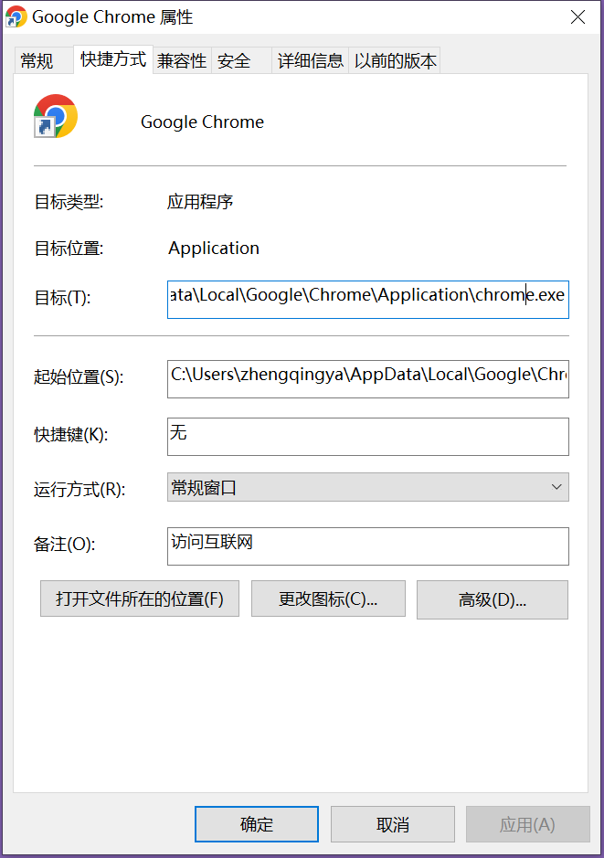

# Chrome设置 --disable-web-security 禁用CORS解决跨域问题

个人 Google Chrome 版本：133.0.6943.60（正式版本） （64 位）

### 方式1

> 经尝试，此方式无效。

1. 打开Chrome浏览器，访问 chrome://flags/#block-insecure-private-network-requests
2. 将 `Block insecure private network requests` 设置为 `Disabled`
3. 关闭Chrome浏览器并重新打开，即可解决问题。


---

### 方式2

> 未尝试，网上说这种方式可能会丢失标签数据...

在chrome快捷方式右键 -> `属性` -> `快捷方式` -> `目标` 路径最后添加如下配置：

```
# Chrome（关闭所有Chrome实例后执行）
chrome --disable-web-security --user-data-dir=/tmp/chrome
```



