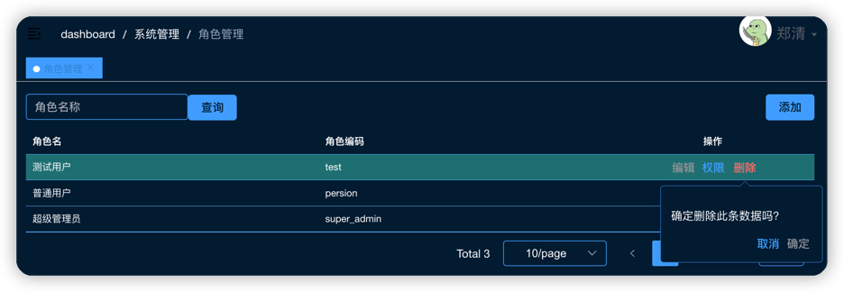

```vue

<template>
  <base-wraper>
    <base-header>
      <el-input v-model="listQuery.name" clearable placeholder="角色名称" style="width: 200px" @clear="refreshTableData"/>
      <el-button type="primary" @click="refreshTableData">查询</el-button>
      <template #right>
        <el-button type="primary" @click="add">添加</el-button>
      </template>
    </base-header>

    <base-table-p ref="baseTable" api="sys_role.listPage" :params="listQuery">
      <el-table-column prop="name" label="角色名"/>
      <el-table-column prop="code" label="角色编码"/>
      <el-table-column label="操作" align="center" width="250">
        <template v-slot="scope">
          <el-button link @click="update(scope.row)">编辑</el-button>
          <router-link :to="{ path: '/system/roleForm', query: { id: scope.row.roleId } }">
            <el-button link>权限</el-button>
          </router-link>
          <base-delete-btn @ok="deleteData(scope.row.roleId)"/>
        </template>
      </el-table-column>
    </base-table-p>

    <base-dialog v-model="dialogVisible" :title="textMap[dialogStatus]" width="50%">
      <el-form ref="roleFormRef" :model="roleForm" :rules="rules" label-width="100px">
        <el-form-item label="角色名：" prop="name">
          <el-input v-model="roleForm.name" placeholder="请输入角色名"/>
        </el-form-item>
        <el-form-item label="角色编码：" prop="code">
          <el-input v-model="roleForm.code" placeholder="请输入角色编码"/>
        </el-form-item>
      </el-form>
      <template #footer>
        <el-button @click="dialogVisible = false">取 消</el-button>
        <el-button type="primary" @click="saveForm">确 定</el-button>
      </template>
    </base-dialog>
  </base-wraper>
</template>

<script setup lang="ts">
import {reactive, toRefs, getCurrentInstance} from 'vue'
// 组件实例
const {proxy}: any = getCurrentInstance()
// 响应式
const state = reactive({
  roleForm: {
    roleId: null, // 角色id
    name: '', // 角色名称
    code: '', // 角色编号
  } as any,
  dialogVisible: false,
  listLoading: false,
  listQuery: {
    name: '', // 角色名称
  },
  total: 0,
  rules: {
    code: [{required: true, message: '请输入角色编码', trigger: 'blur'}],
    name: [{required: true, message: '请输入角色名称', trigger: 'blur'}],
  },
  dialogStatus: '',
  textMap: {
    update: '编辑',
    create: '添加',
  } as any,
})
const {roleForm, dialogVisible, listQuery, rules, dialogStatus, textMap} = toRefs(state)

async function refreshTableData() {
  proxy.$refs.baseTable.refresh()
}

function saveForm() {
  proxy.$refs.roleFormRef.validate(async (valid: any) => {
    if (valid) {
      let res = await proxy.$api.sys_role[state.roleForm.roleId ? 'update' : 'add'](state.roleForm)
      proxy.submitOk(res.msg)
      refreshTableData()
      state.dialogVisible = false
    }
  })
}

function update(row: any) {
  state.roleForm = Object.assign({}, row)
  state.dialogVisible = true
  state.dialogStatus = 'update'
}

function add() {
  state.dialogVisible = true
  state.dialogStatus = 'create'
  state.roleForm.roleId = null
  state.roleForm.name = ''
  state.roleForm.code = ''
}

async function deleteData(id: number) {
  let res = await proxy.$api.sys_role.delete(id)
  proxy.submitOk(res.msg)
  refreshTableData()
}
</script>

<style scoped></style>
```

```js
import request from '@/utils/request'

const BASE_API = '/system/web/api/role'

export default {
    listPage(query, headers) {
        return request({
            url: BASE_API + '/listPage',
            method: 'get',
            params: query,
            headers,
        })
    },
    list(query) {
        return request({
            url: BASE_API + '/list',
            method: 'get',
            params: query,
        })
    },
    detail(id) {
        return request({
            url: BASE_API + '/detail',
            method: 'get',
            params: {roleId: id},
        })
    },
    add(data) {
        return request({
            url: BASE_API,
            method: 'post',
            data,
        })
    },
    update(data) {
        return request({
            url: BASE_API,
            method: 'put',
            data,
        })
    },
    delete(id) {
        return request({
            url: BASE_API,
            method: 'delete',
            params: {roleId: id},
        })
    }
}
```