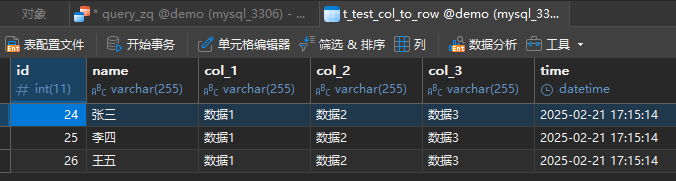
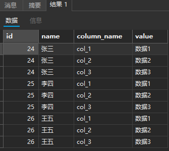
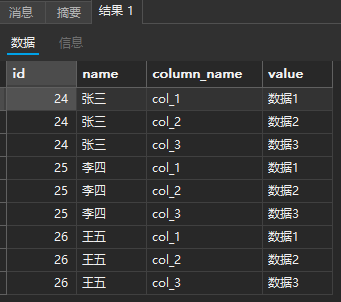

### DDL

```
CREATE TABLE `t_test_col_to_row` (
  `id` int(11) NOT NULL AUTO_INCREMENT,
  `name` varchar(255) DEFAULT NULL,
  `col_1` varchar(255) DEFAULT NULL,
  `col_2` varchar(255) DEFAULT NULL,
  `col_3` varchar(255) DEFAULT NULL,
  `time` datetime DEFAULT CURRENT_TIMESTAMP,
  PRIMARY KEY (`id`)
) ENGINE=InnoDB AUTO_INCREMENT=24 DEFAULT CHARSET=utf8mb4;
```

### DML

```
insert into t_test_col_to_row(name,col_1,col_2,col_3) values ('张三','数据1','数据2','数据3');
insert into t_test_col_to_row(name,col_1,col_2,col_3) values ('李四','数据1','数据2','数据3');
insert into t_test_col_to_row(name,col_1,col_2,col_3) values ('王五','数据1','数据2','数据3');
```




### DQL

#### 方式1

```
SELECT id, name, 'col_1' AS column_name, col_1 AS value FROM t_test_col_to_row
UNION ALL
SELECT id, name, 'col_2' AS column_name, col_2 AS value FROM t_test_col_to_row
UNION ALL
SELECT id, name, 'col_3' AS column_name, col_3 AS value FROM t_test_col_to_row
ORDER BY name;
```

结果：



#### 方式2

```sql
select id, name, column_name,
(
 CASE WHEN column_name='col_1' THEN col_1
      WHEN column_name='col_2' THEN col_2
      WHEN column_name='col_3' THEN col_3
      ELSE '未知' END
) as value
from (
    select * from t_test_col_to_row ctr
    join (
        SELECT 'col_1' AS column_name
        UNION ALL
        SELECT 'col_2' AS column_name
        UNION ALL
        SELECT 'col_3' AS column_name
    ) AS c
    ORDER BY id asc
) as tt 
ORDER BY name asc, column_name asc
```

结果：

