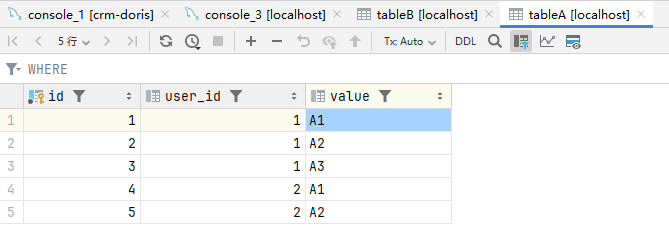
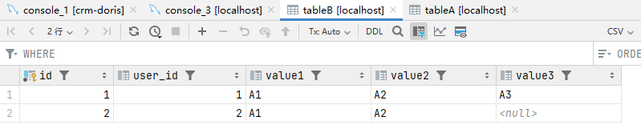

# 指定n行数据转n列字段值存储

需求：将 tableA 表中关于 user_id 的 value值（一个user_id对应3行数据） 存储到 tableB 的 value1、value2、value3 三个字段中。
业务场景：tableA中存储了用户的行指标数据，现在需要打平存储到 tableB 中。

### 一、环境准备

#### DDL

```
CREATE TABLE tableA
(
    id    INT primary key auto_increment,
    user_id    INT,
    value VARCHAR(100)
) ENGINE=InnoDB AUTO_INCREMENT=1 DEFAULT CHARSET=utf8mb4;

CREATE TABLE tableB
(
    id    INT primary key auto_increment,
    user_id     INT,
    value1 VARCHAR(100),
    value2 VARCHAR(100),
    value3 VARCHAR(100)
) ENGINE=InnoDB AUTO_INCREMENT=1 DEFAULT CHARSET=utf8mb4;
```

#### DML

```
insert INTO tableA (user_id, value) VALUES (1, 'A1');
insert INTO tableA (user_id, value) VALUES (1, 'A2');
insert INTO tableA (user_id, value) VALUES (1, 'A3');
insert INTO tableA (user_id, value) VALUES (2, 'A1');
insert INTO tableA (user_id, value) VALUES (2, 'A2');
```




### 二、DQL

#### mysql5.7

```
-- 使用变量 @row_num 和 @current_user_id 来模拟 ROW_NUMBER() 函数。
INSERT INTO tableB (user_id, value1, value2, value3)
SELECT
    t.user_id,
    MAX(CASE WHEN t.row_num = 1 THEN t.value END) AS value1,
    MAX(CASE WHEN t.row_num = 2 THEN t.value END) AS value2,
    MAX(CASE WHEN t.row_num = 3 THEN t.value END) AS value3
FROM (
         SELECT
             user_id,
             value,
             -- @row_num 在 user_id 相同时递增，否则重置为1。
             @row_num := IF(@current_user_id = user_id, @row_num + 1, 1) AS row_num,
             -- @current_user_id 用于跟踪当前的 user_id。
             @current_user_id := user_id
         FROM tableA, (SELECT @row_num := 0, @current_user_id := NULL) vars
         ORDER BY user_id
     ) t
GROUP BY t.user_id;
-- 分组后再过滤 -- 目的：保证3个字段都有值的情况下才插入
# HAVING COUNT(t.row_num) = 3;
```

#### mysql8.0 +

```
INSERT INTO tableB (user_id, value1, value2, value3)
SELECT
    t.user_id,
    MAX(CASE WHEN t.row_num = 1 THEN t.value END) AS value1,
    MAX(CASE WHEN t.row_num = 2 THEN t.value END) AS value2,
    MAX(CASE WHEN t.row_num = 3 THEN t.value END) AS value3
FROM (
         SELECT
             user_id,
             value,
             ROW_NUMBER() OVER (PARTITION BY user_id ORDER BY user_id) AS row_num
         FROM tableA
     ) t
GROUP BY t.user_id;
-- 分组后再过滤 -- 目的：保证3个字段都有值的情况下才插入
# HAVING COUNT(t.row_num) = 3;
```

结果：

