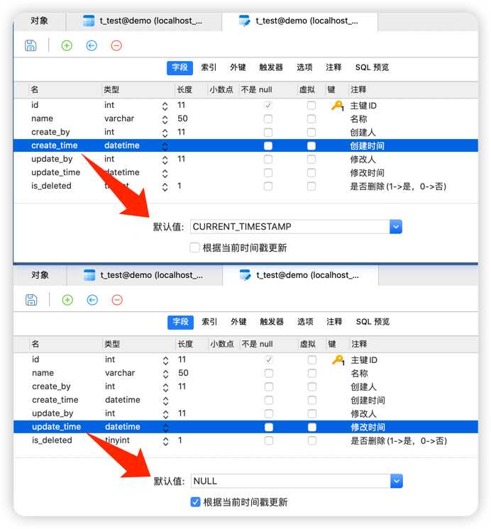

# 时间自动生成

> 操作由 mysql 数据库本身维护

| 字段名      | 字段类型 | 字段注释 | 字段默认配置                             | 说明                                   |
| ----------- | -------- | -------- | ---------------------------------------- | -------------------------------------- |
| create_time | datetime | 创建时间 | CURRENT_TIMESTAMP 不勾选根据当前时间更新 | 插入数据时，该字段默认值为当前时间     |
| update_time | datetime | 更新时间 | NULL 勾选根据当前时间更新                | 更新数据时，该字段默认更新值为当前时间 |

