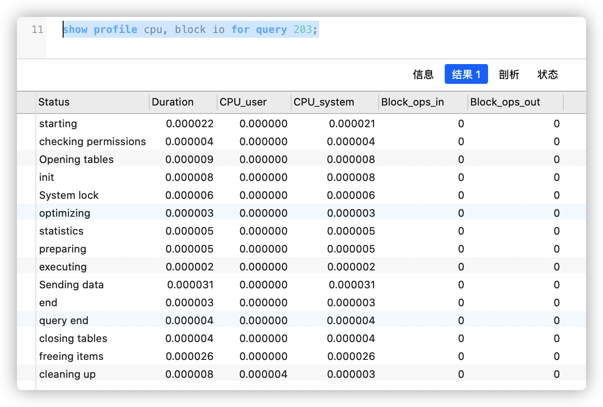

# show profile

> https://dev.mysql.com/doc/refman/8.0/en/show-profile.html

mysql5.0.37中加入了一个新的变量：profiling。可以用来查看query执行的细节，方便优化。

```shell
# 开启 (开启之后，mysql会自动记录所有执行的Query的profile信息)
set profiling=1;

# 关闭
set profiling=0;
```

### 查看query执行的性能信息

```shell
set profiling=1;
select * from t_demo;
set profiling=0;
```

```shell
show profiles;
```

| Query_ID | Duration   | Query                |
| -------- | ---------- | -------------------- |
| 1        | 0.00067425 | SHOW STATUS          |
| 2        | 0.000144   | SELECT * from t_demo |
| 3        | 0.000625   | SHOW STATUS          |


```shell
# 查看最近一条
show profile
# 查看指定
show profile for query 2;

# 查看更多性能信息 ex: cpu 和 io操作次数
show profile cpu, block io for query 2;
# 查看所有性能信息
show profile all for query 2;
```

*`type`*可以指定 可选值以显示特定的附加信息类型：

- `ALL` 显示所有信息
- `BLOCK IO` 显示块输入和输出操作的计数
- `CONTEXT SWITCHES` 显示自愿和非自愿上下文切换的计数
- `CPU` 显示用户和系统 CPU 使用时间
- `IPC` 显示发送和接收消息的计数
- `MEMORY` 目前未实施
- `PAGE FAULTS` 显示主要和次要页面错误的计数
- `SOURCE` 显示源代码中函数的名称，以及函数所在文件的名称和行号
- `SWAPS` 显示交换计数


