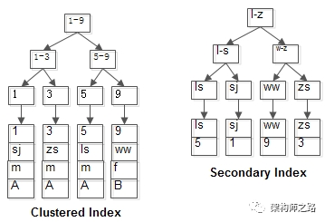
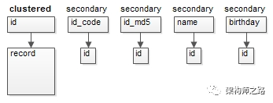
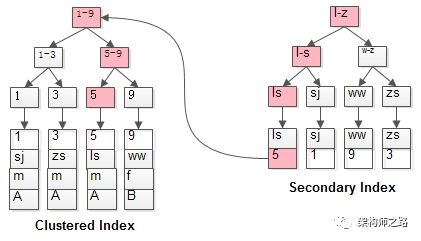

# InnoDB索引

> https://mp.weixin.qq.com/s?__biz=MjM5ODYxMDA5OQ==&mid=2651967183&idx=1&sn=d033755bf26244f4866b38750acfbb2b

### 问题1：MyISAM的索引结构是怎样的？

MyISAM的索引与行记录是分开存储的，叫做非聚集索引（UnClustered Index）。

其主键索引与普通索引没有本质差异：

1. 有连续聚集的区域单独存储行记录；
2. 主键索引的叶子节点，存储主键，与对应行记录的指针；
3. 普通索引的叶子结点，存储索引列，与对应行记录的指针；

画外音：MyISAM的表可以没有主键。

主键索引与普通索引是两棵独立的索引B+树，通过索引列查找时，先定位到B+树的叶子节点，再通过指针定位到行记录。

举个例子，MyISAM：

```
t(id PK, name KEY, sex, flag);
```

表中有四条记录：

```
1, shenjian, m, A
3, zhangsan, m, A
5, lisi, m, A
9, wangwu, f, B
```


其B+树索引构造如上图：

1. 行记录单独存储；
2. id为PK，有一棵id的索引树，叶子指向行记录；
3. name为KEY，有一棵name的索引树，叶子也指向行记录；

### 问题2：InnoDB的索引结构是怎样的？

InnoDB的主键索引与行记录是存储在一起的，故叫做聚集索引（Clustered Index）：

1. 没有单独区域存储行记录；
2. 主键索引的叶子节点，存储主键，与对应行记录（而不是指针）；

画外音：因此，InnoDB的PK查询是非常快的。

因为这个特性，InnoDB的表必须要有聚集索引：

1. 如果表定义了PK，则PK就是聚集索引；
2. 如果表没有定义PK，则第一个非空unique列是聚集索引；
3. 否则，InnoDB会创建一个隐藏的row-id作为聚集索引；

聚集索引，也只能够有一个，因为行数据在物理磁盘上只能有一份聚集存储。



InnoDB的普通索引可以有多个，它与聚集索引是不同的： 
普通索引的叶子节点，存储主键（也不是指针）；

### 问题3：InnoDB为何建议使用趋势递增主键？

InnoDB由于数据行与索引一体，如果使用趋势递增主键，插入记录时，不会索引分裂，不会大量行记录移动。

### 问题4：InnoDB为何不宜使用较长的列做主键？

假设有一个用户中心场景，包含身份证号，身份证MD5，姓名，出生年月等业务属性，这些属性上均有查询需求，并且有事务需求，必须使用InnoDB存储引擎。

此时，如何来设计数据表呢？

最容易想到的设计方式是：

1. 身份证作为主键；
2. 其他属性上建立索引；

```
user(id_code PK,
id_md5(index),
name(index),
birthday(index));
```


此时的索引树与行记录结构如上：

1. id_code聚集索引，关联行记录；
2. 其他索引，存储id_code属性值；

身份证号id_code是一个比较长的字符串，每个索引都存储这个值，在数据量大，内存珍贵的情况下，MySQL有限的缓冲区，存储的索引与数据会减少，磁盘IO的概率会增加。

画外音：同时，索引占用的磁盘空间也会增加。

此时，应该新增一个无业务含义的id自增列：

1. 以id自增列为聚集索引，关联行记录；
2. 其他索引，存储id值；

```
user(id PK auto inc,
id_code(index),
id_md5(index),
name(index),
birthday(index));
```



如此一来，有限的缓冲区，能够缓冲更多的索引与行数据，磁盘IO的频率会降低，整体性能会增加。

### 问题5：InnoDB的普通索引存储主键键值，可能存在什么问题？

使用普通索引查询时，可能出现回表查询。

什么是回表查询？

还是上面的例子：

```
t(id PK, name KEY, sex, flag);
```

画外音：id是聚集索引，name是普通索引。

表中有四条记录：

```
1, shenjian, m, A
3, zhangsan, m, A
5, lisi, m, A
9, wangwu, f, B
```


两个B+树索引分别如上图：

1. id为PK，聚集索引，叶子节点存储行记录；
2. name为KEY，普通索引，叶子节点存储PK值，即id；

既然从普通索引无法直接定位行记录，那普通索引的查询过程是怎么样的呢？

通常情况下，需要扫码两遍索引树。

例如：

```
select id,name,sex from t where name='lisi';
```

是如何执行的呢？



如粉红色路径，需要扫码两遍索引树：

1. 先通过普通索引定位到主键值id=5；
2. 在通过聚集索引定位到行记录；

这就是所谓的回表查询，先定位主键值，再定位行记录，它的性能较扫一遍索引树更低。

### 问题6：如何优化回表查询？

常见的解决方案是覆盖索引。

什么是索引覆盖(Covering index)？

只需要在一棵索引树上就能获取SQL所需的所有列数据，无需回表，速度更快。

如何实现索引覆盖？

常见的方法是：将被查询的字段，建立到联合索引里去。

对于查询需求

```
select id,name,sex from t where name='lisi';
```

将单列索引(name)升级为联合索引(name, sex)，即可避免回表。

画外音：属性sex不用到聚集索引查询了。


总结
MyISAM和InnoDB都使用B+树来实现索引：

1. MyISAM的索引与数据分开存储；
2. MyISAM的索引叶子节点存储指针，主键索引与普通索引无太大区别；
3. InnoDB的聚集索引和行数据统一存储；
4. InnoDB的聚集索引存储数据行本身，普通索引存储主键；
5. InnoDB不宜使用较长的列作为PK；
6. InnoDB普通索引可能存在回表查询，常见的解决方案是覆盖索引；
