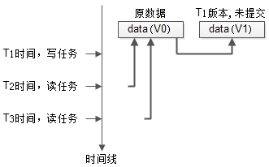

# MVCC

> [https://mp.weixin.qq.com/s/fmzaIobOihKKZ7kyZQInTg](https://mp.weixin.qq.com/s/fmzaIobOihKKZ7kyZQInTg)

MVCC，全称Multi-Version Concurrency Control，即多版本并发控制。

1. 常见并发控制保证数据一致性的方法有`锁`，`数据多版本`；
2. 普通锁`串行`，读写锁`读读并行`，数据多版本`读写并行`；
3. `redo日志`保证`已提交事务的ACID特性`，设计思路是，通过顺序写替代随机写，提高并发；
4. `undo日志`用来`回滚未提交的事务`，它存储在回滚段里；
5. InnoDB是基于MVCC的存储引擎，它利用了存储在回滚段里的undo日志，即数据的旧版本，提高并发；
6. InnoDB之所以并发高，`快照读不加锁`；
7. InnoDB所有`普通select都是快照读`；

### 数据多版本

数据多版本是一种能够进一步提高并发的方法，它的核心原理是：

1. 写任务发生时，将数据克隆一份，以版本号区分；
2. 写任务操作新克隆的数据，直至提交；
3. 并发读任务可以继续读取旧版本的数据，不至于阻塞；



1. 最开始数据的版本是V0；
2. T1时刻发起了一个写任务，这是把数据clone了一份，进行修改，版本变为V1，但任务还未完成；
3. T2时刻并发了一个读任务，依然可以读V0版本的数据；
4. T3时刻又并发了一个读任务，依然不会阻塞；

可以看到，数据多版本，通过“读取旧版本数据”能够极大提高任务的并发度。

提高并发的演进思路，就在如此：

1. 普通锁，本质是`串行`执行；
2. 读写锁，可以实现`读读并发`；
3. 数据多版本，可以实现`读写并发`；

---

# 其它

###### InnoDB的内核，会对所有row数据增加三个内部属性：

1. DB_TRX_ID，6字节，记录每一行最近一次修改它的事务ID；
2. DB_ROLL_PTR，7字节，记录指向回滚段undo日志的指针；
3. DB_ROW_ID，6字节，单调递增的行ID；

###### InnoDB为何能够做到这么高的并发？

回滚段里的数据，其实是历史数据的快照（snapshot），这些数据是不会被修改，select可以肆无忌惮的并发读取他们。

快照读（Snapshot Read），这种一致性不加锁的读（Consistent Nonlocking Read），就是InnoDB并发如此之高的核心原因之一。

这里的一致性是指，事务读取到的数据，要么是事务开始前就已经存在的数据（当然，是其他已提交事务产生的），要么是事务自身插入或者修改的数据。

###### 什么样的select是快照读？

除非显示加锁，普通的select语句都是快照读，例如：

```
select * from t where id>2;
```

这里的显示加锁，非快照读是指：

```
select * from t where id>2 lock in share mode;

select * from t where id>2 for update;
```
