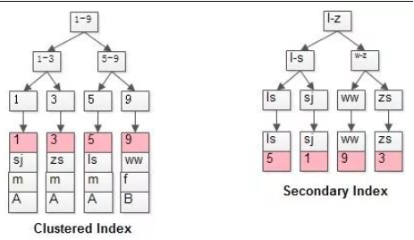

# 插入意向锁(Insert Intention Locks)

针对insert的，如果插入位置不冲突，多个事务不会阻塞，以提高插入并发；

对已有数据行的修改与删除，必须加强互斥锁X锁，那对于数据的插入，是否还需要加这么强的锁，来实施互斥呢？插入意向锁，孕育而生。

插入意向锁，是间隙锁(Gap Locks)的一种（所以，也是实施在索引上的），它是专门针对insert操作的。

> 间隙锁下文才会介绍，暂且理解为，它是一种实施在索引上，锁定索引某个区间范围的锁。

它的玩法是： 多个事务，在同一个索引，同一个范围区间插入记录时，如果插入的位置不冲突，不会阻塞彼此。

```
CREATE TABLE `t` (
  `id` int(10) NOT NULL AUTO_INCREMENT,
  `name` varchar(50) DEFAULT NULL,
  PRIMARY KEY (`id`)
) ENGINE=InnoDB DEFAULT CHARSET=utf8mb4;

insert into t(id, name) values(10, 10);
insert into t(id, name) values(20, 20);
insert into t(id, name) values(30, 30);
```

```
-- 事务A
START transaction;
insert into t(id, name) values(11, 11); -- 正常

-- 事务B
START transaction;
insert into t(id, name) values(12, 12); -- 正常
```

【思路小结】

1. InnoDB使用共享锁，可以提高读读并发；
2. 为了保证数据强一致，InnoDB使用强互斥锁，保证同一行记录修改与删除的串行性；
3. InnoDB使用插入意向锁，可以提高插入并发；

---

【继续插入，知识铺垫】 InnoDB的细粒度锁，是实现在索引记录上的，如果查询没有命中索引，也将退化为表锁。

【InnoDB的索引】 InnoDB的索引有两类索引，聚集索引(Clustered Index)与普通索引(Secondary Index)。

InnoDB的每一个表都会有聚集索引：

1. 如果表定义了PK，则PK就是聚集索引；
2. 如果表没有定义PK，则第一个非空unique列是聚集索引；
3. 否则，InnoDB会创建一个隐藏的row-id作为聚集索引；

> 为了方便说明，后文都将以PK说明。

索引的结构是B+树，这里不展开B+树的细节，说几个结论：

1. 在索引结构中，非叶子节点存储key，叶子节点存储value；
2. 聚集索引，叶子节点存储行记录(row)；
   画外音：所以，InnoDB索引和记录是存储在一起的，而MyISAM的索引和记录是分开存储的。
3. 普通索引，叶子节点存储了PK的值；

画外音：
所以，InnoDB的普通索引，如果未满足索引覆盖，实际上会扫描两遍：

- 第一遍，由普通索引找到PK；
- 第二遍，由PK找到行记录；

举个例子，假设有InnoDB表： t(id PK, name KEY, sex, flag);

表中有四条记录：

- 1, shenjian, m, A
- 3, zhangsan, m, A
- 5, lisi, m, A
- 9, wangwu, f, B



可以看到：

1. 第一幅图，id PK的聚集索引，叶子存储了所有的行记录；
2. 第二幅图，name上的普通索引，叶子存储了PK的值；

对于： select * from t where name=’shenjian’;

1. 会先在name普通索引上查询到PK=1；
2. 再在聚集索引上查询到(1,shenjian, m, A)的行记录；
