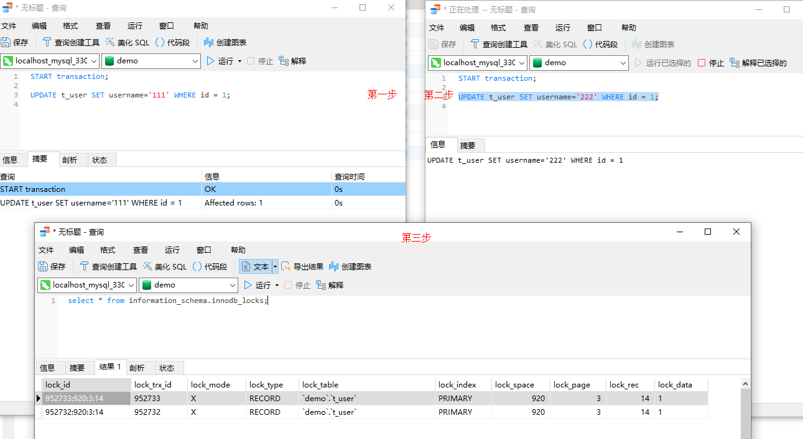

# 记录锁(Record Locks)

索引记录上加锁，对索引记录实施互斥，以保证数据一致性；

```
-- 开启事务A
START transaction;
select * from t where id=1 for update;
```

```
-- 事务B  这时候无法操作
UPDATE t SET name='111' WHERE id = 1;
```

查看正在锁的事务

```
-- mysql5.7版本
select * from information_schema.innodb_locks;

-- mysql8版本
-- select * from performance_schema.data_locks;
```



