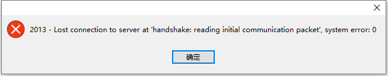

# 2013 - Lost connection to server at 'handshake: reading initial communication packet', system error: 0



可能原因

1. MySQL服务器未运行。
2. MySQL服务器不在正确的端口上运行。
3. 防火墙阻止了MySQL服务器的连接。

我这里的原因是由于我压测mysql性能时把数据库搞崩了，然后删除了data下的部分表文件数据，重启mysql，InnoDB恢复时会去找之前删除的文件，然后找不到...

```shell
2023-04-12T07:26:25.251110Z 0 [Note] InnoDB: Doing recovery: scanned up to log sequence number 4008688128
2023-04-12T07:26:25.287833Z 0 [Note] InnoDB: Doing recovery: scanned up to log sequence number 4013931008
2023-04-12T07:26:25.310191Z 0 [Note] InnoDB: Doing recovery: scanned up to log sequence number 4017169141
2023-04-12T07:26:25.310431Z 0 [Note] InnoDB: Database was not shutdown normally!
2023-04-12T07:26:25.310453Z 0 [Note] InnoDB: Starting crash recovery.
2023-04-12T07:26:25.310466Z 0 [ERROR] InnoDB: Tablespace 376 was not found at ./test/sbtest2.ibd.
2023-04-12T07:26:25.310469Z 0 [ERROR] InnoDB: Set innodb_force_recovery=1 to ignore this and to permanently lose all changes to the tablespace.
2023-04-12T07:26:25.310472Z 0 [ERROR] InnoDB: Tablespace 374 was not found at ./test/sbtest4.ibd.
2023-04-12T07:26:25.310485Z 0 [ERROR] InnoDB: Tablespace 377 was not found at ./test/sbtest1.ibd.
2023-04-12T07:26:25.310488Z 0 [ERROR] InnoDB: Tablespace 375 was not found at ./test/sbtest3.ibd.
```

### 解决

> tips： 操作前记得备份重要数据

#### 网上解决方式

> tips: 由于个人不是线上环境，只是本地环境，也不过多研究了，临时处理下...

在`my.cnf`中的`[mysqld]`中添加 `innodb_force_recovery=6` 跳过恢复

- innodb_force_recovery=0 表示当需要恢复时执行所有的恢复操作；
- innodb_force_recovery=1 表示忽略检查到的corrupt页；
- innodb_force_recovery=2 表示阻止主线程的运行，如主线程需要执行full purge操作，会导致crash；
- innodb_force_recovery=3 表示不执行事务回滚操作；
- innodb_force_recovery=4 表示不执行插入缓冲的合并操作；
- innodb_force_recovery=5 表示不查看重做日志，InnoDB存储引擎会将未提交的事务视为已提交；
- innodb_force_recovery=6 表示不执行前滚的操作，强制重启！

网上有些说需要删除data数据目录下的 `ib_logfile*` 和 `ibdata1` ，经测试删除重启无效，百度了一下发现这几个文件还挺重要的，因此这步不处理！

`my.cnf`
临时关闭binlog日志相关配置，重启MySQL，这个时候修改表数据时会报错 `1015 - Can't lock file (errno: 165 - Table is read only)`
因此将mysql数据导出备份，然后重装MySQL恢复数据

```shell
# 导出所有库
mysqldump -h 127.0.0.1 -P 3306 -uroot -proot --all-databases > /tmp/all.sql

# 导入数据
mysql -uroot -proot
source /tmp/all.sql;
```

---

data目录的文件，最好不要去乱动！！！

