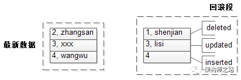
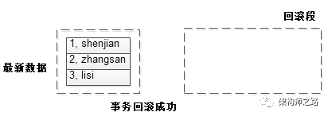

# redo undo 回滚段

> [https://mp.weixin.qq.com/s/fmzaIobOihKKZ7kyZQInTg](https://mp.weixin.qq.com/s/fmzaIobOihKKZ7kyZQInTg)

### redo

数据库事务提交后，必须将更新后的数据刷到磁盘上，以保证ACID特性。 磁盘随机写性能较低，如果每次都刷盘，会极大影响数据库的吞吐量。

优化方式是，将修改行为先写到redo日志里（此时变成了顺序写），再定期将数据刷到磁盘上，这样能极大提高性能。

画外音：这里的架构设计方法是，随机写优化为顺序写，思路更重要。

假如某一时刻，数据库崩溃，还没来得及刷盘的数据，在数据库重启后，会重做redo日志里的内容，以保证已提交事务对数据产生的影响都刷到磁盘上。

一句话，`redo日志`用于保障，`已提交事务的ACID特性`。

### undo

数据库事务未提交时，会将事务修改数据的镜像（即修改前的旧版本）存放到undo日志里，当事务回滚时，或者数据库奔溃时，可以利用undo日志，即旧版本数据，撤销未提交事务对数据库产生的影响。

画外音：更细节的，

对于insert操作，undo日志记录新数据的PK(ROW_ID)，回滚时直接删除；

对于delete/update操作，undo日志记录旧数据row，回滚时直接恢复；

他们分别存放在不同的buffer里。

一句话，`undo日志`用于保障，`未提交事务不会对数据库的ACID特性`产生影响。

### 回滚段

存储undo日志的地方，是回滚段。

undo日志和回滚段和InnoDB的MVCC密切相关，这里举个例子展开说明一下。

栗子： t(id PK, name);

数据为：

1. shenjian
2. zhangsan
3. lisi


此时没有事务未提交，故回滚段是空的。

接着启动了一个事务：

```
start trx;
delete (1, shenjian);
update set(3, lisi) to (3, xxx);
insert (4, wangwu);
```

并且事务处于`未提交`的状态。



可以看到：

1. 被`删除前`的(1, shenjian)作为旧版本数据，进入了回滚段；
2. 被`修改前`的(3, lisi)作为旧版本数据，进入了回滚段；
3. 被`插入的`数据，PK(4)进入了回滚段；

接下来，假如事务rollback，此时可以通过回滚段里的undo日志回滚。

画外音：假设事务提交，回滚段里的undo日志可以删除。


可以看到：

1. 被删除的旧数据恢复了；
2. 被修改的旧数据也恢复了；
3. 被插入的数据，删除了；



事务回滚成功，一切如故。
