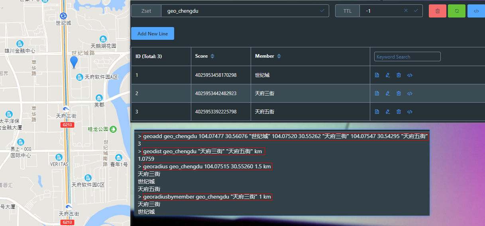

# Redis - 其他数据类型

## GEO：地理信息定位，使用有序集合实现

使用场景：求最近的附近人

```shell
# 添加地理位置的坐标
geoadd geo_chengdu 104.07477 30.56076 "世纪城" 104.07520 30.55262 "天府三街" 104.07547 30.54295 "天府五街"
# 获取地理位置的坐标
geopos geo_chengdu "天府三街" "天府五街"
# 计算两个位置之间的距离 单位：km
geodist geo_chengdu "天府三街" "天府五街" km
# [6.2.0版本之后弃用] 根据用户给定的经纬度坐标(这里是天府三街坐标)来获取指定范围内的地理位置集合
georadius geo_chengdu 104.07515 30.55260 1.5 km
# [6.2.0版本之后弃用] 根据储存在位置集合里面的某个地点获取指定范围内的地理位置集合
georadiusbymember geo_chengdu "天府三街" 1 km

# [6.2.0版本新增] 根据经纬度(这里是天府三街坐标)搜索半径2km以内的
geosearch geo_chengdu fromlonlat 104.07515 30.55260 byradius 2 km withdist

# 返回一个或多个位置对象的 geohash 值
geohash geo_chengdu "天府三街" "天府五街"
```

