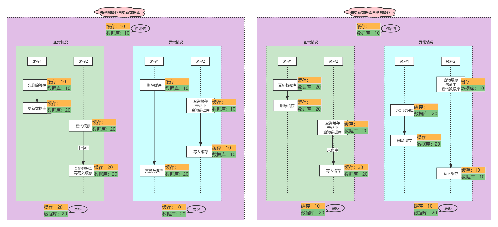

# 缓存更新策略

|                      |                        内存淘汰                        |                超时剔除                 |                  主动更新                  |
| -------------------- | :----------------------------------------------------: | :-------------------------------------: | :----------------------------------------: |
| 概述                 | redis 自带的内存淘汰机制，当内存不足时自动淘汰部分数据 | 给缓存数据添加 TTL 时间，到期后自动删除 | 编写业务逻辑，修改数据库数据时同步更新缓存 |
| 解决数据一致性的问题 |                           差                           |                  一般                   |                     好                     |
| 使用成本             |                           无                           |                   低                    |                     高                     |

### 主动更新

1. [X] 由缓存的调用者，在更新数据库时同时更新缓存
2. [ ] 将缓存与数据库整合为一个服务，由服务来维护一致性，调用者无需关心缓存一致性问题
3. [ ] crud在缓存中进行，由其他线程异步的将缓存数据持久化到数据库。

#### 问题

###### 更新缓存还是删除缓存？

1. [ ] 更新缓存：每次更新数据库都要更新缓存。 -- 写多读少时会导致多次无效写操作
2. [X] 删除缓存：更新数据库时让缓存失效，查询时再更新缓存。

> https://www.processon.com/view/6332be9c637689341d798b57

###### 总结

- 读操作：
    - 缓存命中直接返回
    - 缓存未命中则先查询数据库，写入缓存，并设定超时时间（防止出现异常情况后的长时间数据不一致问题）
- 写操作：
    - 先写数据库，再删除缓存
    - 确保数据库与缓存操作的原子性
        - 单体系统：将缓存和数据库放在同一个事务中
        - 分布式系统：通过TTC等分布式事务方案

