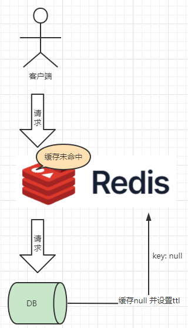

# 缓存穿透

缓存穿透：指缓存和数据库中都没有数据，而用户不断发起请求。
在流量大时很可能导致DB压力过大挂掉...

> https://www.processon.com/view/6335048b0e3e740798fc171e

### 解决方案：

缓存null值，并设置ttl过期时间（ex:30秒 tips:设置太长会导致db正常有数据了，但缓存数据为null，最终也无法使用）

> tips: 短时间数据不一致问题
> https://www.processon.com/view/6335048b0e3e740798fc171e

- id -- 增加复杂度 ex：id=1 -> id=684668461645451
- 数据格式校验
- 用户接口权限校验
- 热点参数限流-sentinel