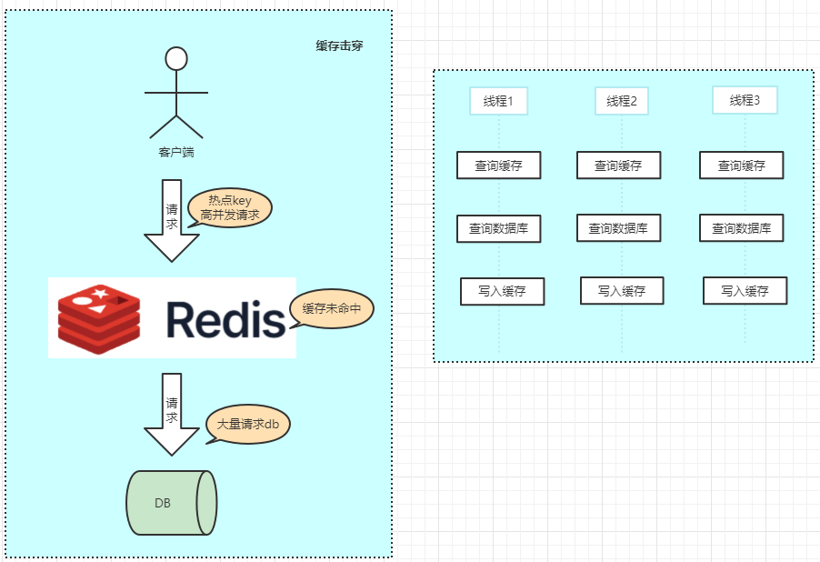

# 缓存击穿

缓存击穿(热点key问题)：指缓存中没有但数据库中有的数据（一般是缓存时间到期），由于用户高并发请求，同时查缓存没数据，又同时去查数据库，导致DB压力瞬间增大。

> https://www.processon.com/view/633543881e085373dc9e9598

### 解决方案：

1. 设置热点数据永远不过期。
2. 接口限流与熔断，降级。
3. 加互斥锁。