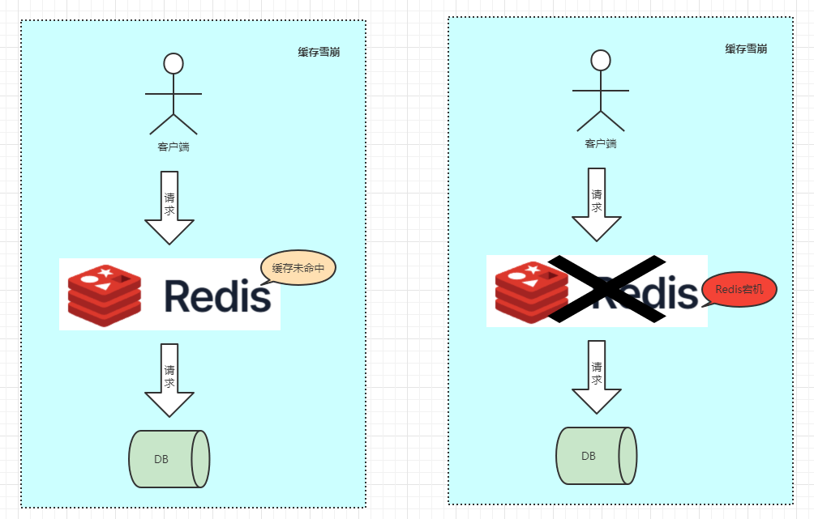

# 缓存雪崩

缓存雪崩：指在同一时间段内，大量的缓存key同时过期失效或Redis宕机。导致请求DB压力过大甚至宕机...

> 和缓存击穿不同的是，缓存击穿指并发查同一条数据，缓存雪崩是不同数据都过期了，很多数据都查不到从而查数据库。

> https://www.processon.com/view/63353254637689341d7e10d7

### 解决方案：

1. 缓存key的ttl过期时间添加随机值 =》 防止同一时间大量数据过期现象发生。
2. 设置热点数据永远不过期。
3. 搭建Redis集群。
4. 业务添加降级限流策略。
5. ...