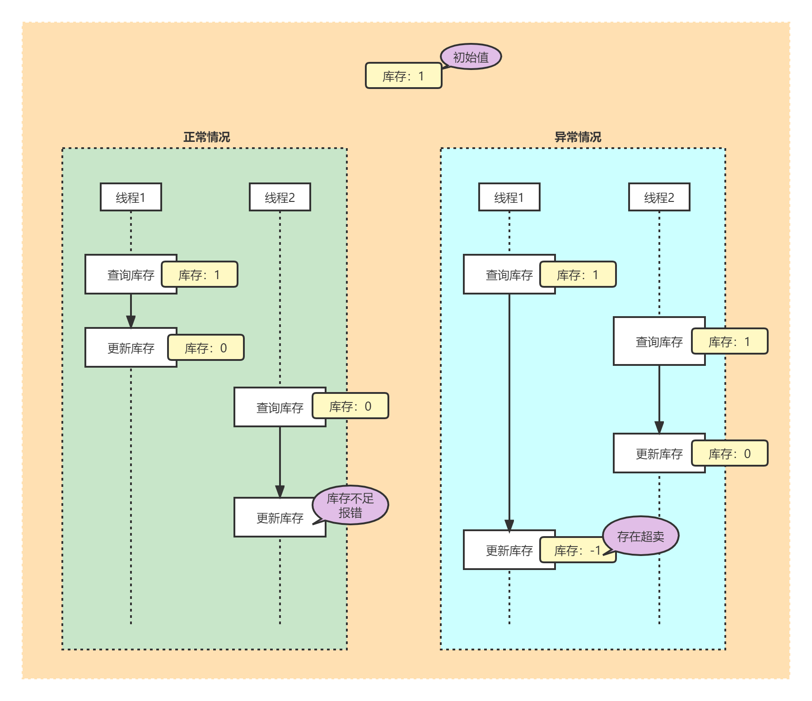
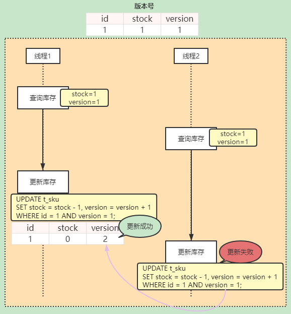
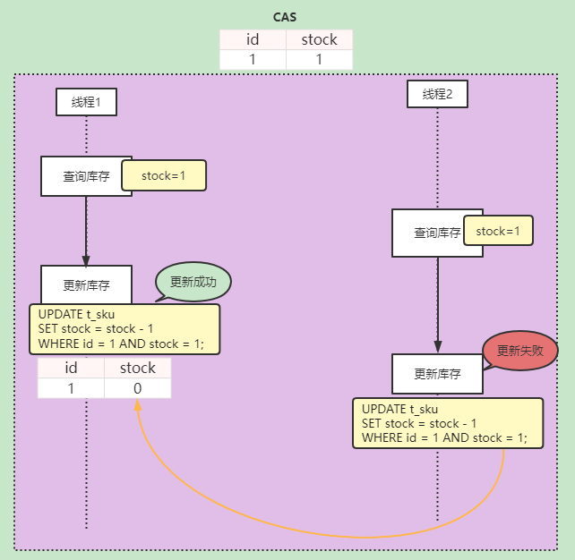
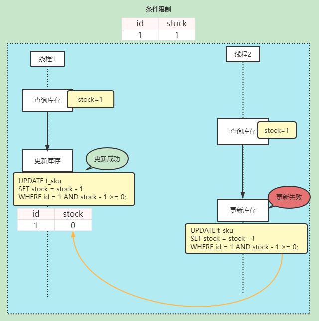

# 秒杀下单

### 库存超卖

#### 问题

> https://www.processon.com/view/6344c9826376891c6b4ce070

#### 解决 - 加锁

- 悲观锁：操作数据之前就拿到锁，让线程串行执行，`Synchronized`、`Lock`等
- 乐观锁：更新数据时判断数据有没有被其它线程修改

##### 乐观锁

###### 乐观锁 - `版本号`

| id  | stock | version |
|-----|-------|---------|
| 1   | 1     | 1       |

###### 乐观锁 - `CAS`

> 库存`stock`可作为特殊的版本号处理

乐观锁问题：总库存为10，当同时有多个人下单，A下单库存-1，B和C等人下单时判断现有库存已变化，即都无法正常下单。

因此可以通过下面的`stock > 0`去解决。

###### 乐观锁 - `条件限制`

> tips：`stock > 0` 这个情景适合不用版本号，更新时做数据安全校验，适合库存模型，性能更高。

