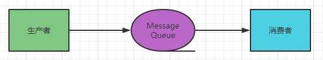
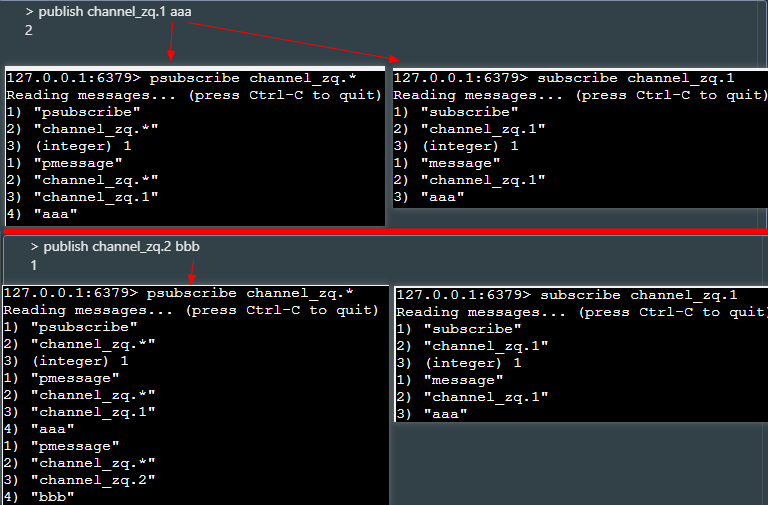
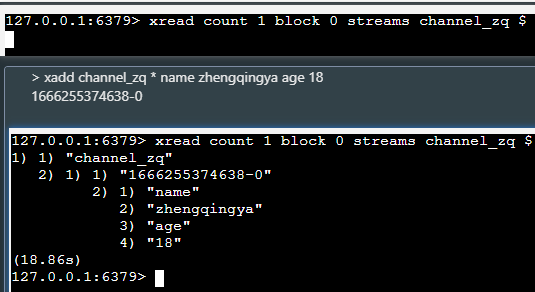
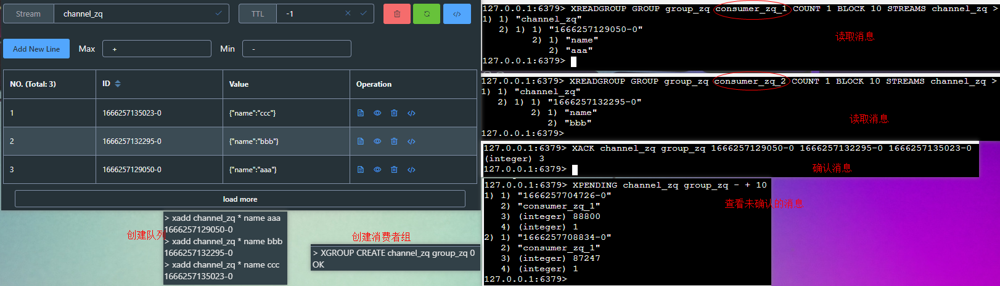

# 消息队列

消息队列：存放消息的队列。

最简单的消息队列模型包括3个角色：

1. 消息队列：存储和管理消息 => 消息代理(Message Broker)
2. 生产者：发送消息到消息队列
3. 消费者：从消息队列中获取消息并处理消息



Redis提供了三种不同的方式来实现消息队列：

1. `list结构`：基于List结构模拟消息队列
2. `PubSub`：基本的点对点消息模型
3. `Stream`：比较完善的消息队列模型

### list结构

> 双向链表

LPUSH 结合 RPOP、或者 RPUSH 结合 LPOP来实现。

不过要注意的是，当队列中没有消息时RPOP或LPOP操作会返回null，并不像JVM的阻塞队列那样会阻塞并等待消息。
因此这里应该使用BRPOP或者BLPOP来实现阻塞效果。

- 优点：
    - 利用Redis存储，不受限于JVM内存上限
    - 基于Redis的持久化机制，数据安全性有保证
    - 可以满足消息有序性
- 缺点：
    - 无法避免消息丢失
    - 只支持单消费者

```shell
# 存入数据 a b c
lpush zq_queue a b c

# 阻塞&等待消息10秒
brpop zq_queue 10
```


### PubSub

消费者可以订阅一个或多个channel，生产者向对应channel发送消息后，所有订阅者都能收到相关消息。

- 优点：
    - 采用发布订阅模型，支持多生产、多消费
- 缺点：
    - 不支持数据持久化
    - 无法避免消息丢失
    - 消息堆积有上限，超出时数据丢失

```shell
# 订阅一个或多个频道  
# SUBSCRIBE channel [channel]
# 向一个频道发送消息
# PUBLISH channel msg  
# 订阅与pattern格式匹配的所有频道
#   ？：匹配一个字符
#   *：匹配0或多个字符
#   [a,e]：匹配括号内存在的字符
# PSUBSCRIBE pattern[pattern] 


# ex:
# 订阅频道信息
psubscribe channel_zq.*
subscribe channel_zq.1

# 将msg发送到指定频道
publish channel_zq.1 aaa
publish channel_zq.2 bbb
```



### Stream

Stream是Redis5.0引入的一种新数据类型，可以实现一个功能非常完善的消息队列。

#### Stream - 单消费模式

STREAM类型消息队列的XREAD命令特点：

- 消息可回溯
- 一个消息可以被多个消费者读取
- 可以阻塞读取
- 有消息漏读的风险

> tips: 当我们指定起始ID为$时，代表读取最新的消息，如果我们处理一条消息的过程中，又有超过1条以上的消息到达队列，则下次获取时也只能获取到最新的一条，会出现漏读消息的问题。

```shell
# 创建队列`channel_zq`，使用redis自动生成ID，并发送消息`{name=zhengqingya, age=18}`
xadd channel_zq * name zhengqingya age 18
# 查看消息数量
xlen channel_zq

# 读取消息，读1条，指定读取队列`channel_zq`，从第1条消息开始读
xread count 1 streams channel_zq 0
# 读取消息，读1条，指定读取队列`channel_zq`，从最新消息开始读
xread count 1 streams channel_zq $
# 读取消息，读1条，阻塞读取，指定读取队列`channel_zq`，从最新消息开始读
xread count 1 block 0 streams channel_zq $
```



#### Stream - 消费者组模式

消费者组（Consumer Group）：将多个消费者划分到一个组中，监听同一个队列。

特点：

1. 消息分流：队列中的消息会分流给组内的不同消费者，而不是重复消费，从而加快消息处理的速度
2. 消息标示：消费者组会维护一个标示，记录最后一个被处理的消息，哪怕消费者宕机重启，还会从标示之后读取消息。确保每一个消息都会被消费
3. 消息确认：消费者获取消息后，消息处于pending状态，并存入一个pending-list。当处理完成后需要通过XACK来确认消息，标记消息为已处理，才会从pending-list移除。

```shell
# 创建消费者组
#    key：队列名称
#    groupName：消费者组名称
#    ID：起始ID标示，$代表队列中最后一个消息，0则代表队列中第一个消息
#    MKSTREAM：队列不存在时自动创建队列
XGROUP CREATE key groupname id|$ [MKSTREAM]

# 给指定的消费者组添加消费者
GROUP CREATECONSUMER key groupname consumername

# 删除指定的消费者组
XGROUP DESTROY key groupname

# 删除消费者组中的指定消费者
GROUP DELCONSUMER key groupname consumername

# 从消费者组读取消息
#     group：消费组名称
#     consumer：消费者名称，如果消费者不存在，会自动创建一个消费者
#     count：本次查询的最大数量
#     BLOCK milliseconds：当没有消息时最长等待时间
#     NOACK：无需手动ACK，获取到消息后自动确认
#     STREAMS key：指定队列名称
#     ID：获取消息的起始ID：
#         ">"：从下一个未消费的消息开始
#         其它：根据指定id从pending-list中获取已消费但未确认的消息，例如0，是从pending-list中的第一个消息开始 
XREADGROUP GROUP group consumer [COUNT count] [BLOCK milliseconds] [NOACK] STREAMS key [key ...] ID [ID ...]

# 查看未确认的消息
XPENDING key group [start end count] [consumer]

# 确认消息
XACK key group ID [ID ...]


# ex:
# 创建队列加数据
xadd channel_zq * name aaa
xadd channel_zq * name bbb
xadd channel_zq * name ccc
xadd channel_zq * name ddd
xadd channel_zq * name eee
# 创建消费者组
XGROUP CREATE channel_zq group_zq 0
# 读取消息
XREADGROUP GROUP group_zq consumer_zq_1 COUNT 1 BLOCK 10 STREAMS channel_zq > 
XREADGROUP GROUP group_zq consumer_zq_2 COUNT 1 BLOCK 10 STREAMS channel_zq > 
# 查看前10个未确认的消息
XPENDING channel_zq group_zq - + 10
# 确认消息
XACK channel_zq group_zq 1666257129050-0 1666257132295-0 1666257135023-0
```



STREAM类型消息队列的XREADGROUP命令特点：

- 消息可回溯
- 可以多消费者争抢消息，加快消费速度
- 可以阻塞读取
- 没有消息漏读的风险
- 有消息确认机制，保证消息至少被消费一次

|              | List                                     | PubSub             | Stream                                                 |
| ------------ | ---------------------------------------- | ------------------ | ------------------------------------------------------ |
| 消息持久化   | 支持                                     | 不支持             | 支持                                                   |
| 阻塞读取     | 支持                                     | 支持               | 支持                                                   |
| 消息堆积处理 | 受限于内存空间，可以利用多消费者加快处理 | 受限于消费者缓冲区 | 受限于队列长度，可以利用消费者组提高消费速度，减少堆积 |
| 消息确认机制 | 不支持                                   | 不支持             | 支持                                                   |
| 消息回溯     | 不支持                                   | 不支持             | 支持                                                   |

