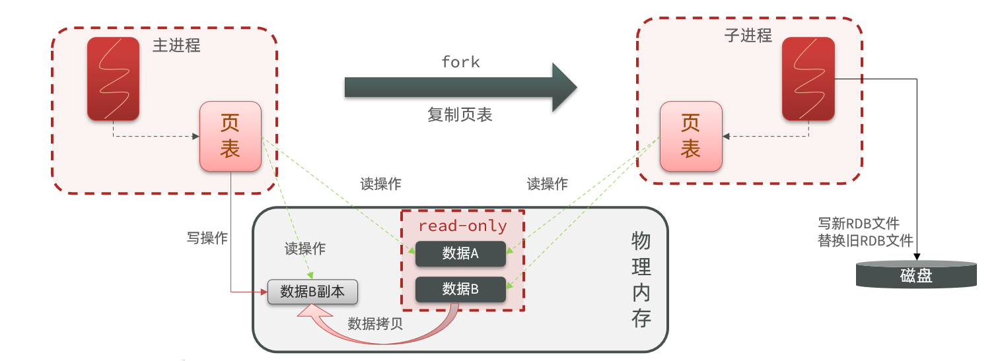

# 持久化

## RDB

内存快照，当redis因故障重启后，会去磁盘读取快照文件 -> 恢复数据
恢复速度快,持久化性能高.但是存在数据丢失风险
可每小时备份一次rdb文件数据到自己的数据中心防止数据丢失

### 执行时机

RDB持久化在四种情况下会执行：

1. 执行save命令
2. 执行bgsave命令
3. Redis停机时
4. 触发RDB条件时

### 启用快照 (rdb触发机制)

> RDB默认开启，可不用改

redis.conf

```shell
# 触发时间策略  
# 格式：save <seconds> <changes>
# 可设置多个
# 900秒内，如果超过1个key被修改，则发起快照保存  执行的是`bgsave`命令
save 900 1
# 300秒内，如果超过10个key被修改，则发起快照保存
save 300 10
# 60秒内，如果1万个key被修改，则发起快照保存
save 60 10000


# 文件名称
dbfilename dump.rdb

# 文件保存路径，AOF文件同样存放在此目录下。默认为当前工作目录。
dir ./

# 如果持久化出错，主进程是否停止写入操作，yes->停止 => 为了保护持久化的数据一致性问题
stop-writes-on-bgsave-error yes

# 是否压缩
rdbcompression yes

# 导入时是否检查
rdbchecksum yes
```

会产生一个`dump.rdb`文件

### 禁用快照

redis.conf

```shell
save ""
```

### 手动生成快照

#### SAVE

使用同步的方式生成RDB快照文件，在这个过程中会阻塞所有其他客户端的请求，直到RDB文件被创建完毕。 -- 线上应该禁止使用

```shell
save
```

#### BGSAVE

```shell
bgsave
# 查看操作是否成功
lastsave
```

- fork主进程得到一个子进程，共享内存空间
- 子进程读取内存数据并写入新的RDB文件
- 用新RDB文件替换旧的RDB文件

fork采用的是copy-on-write技术：

- 当主进程执行读操作时，访问共享内存；
- 当主进程执行写操作时，则会拷贝一份数据，执行写操作。



### RDB缺点？

- RDB执行间隔时间长，两次RDB之间写入数据有丢失的风险
- fork子进程、压缩、写出RDB文件都比较耗时
