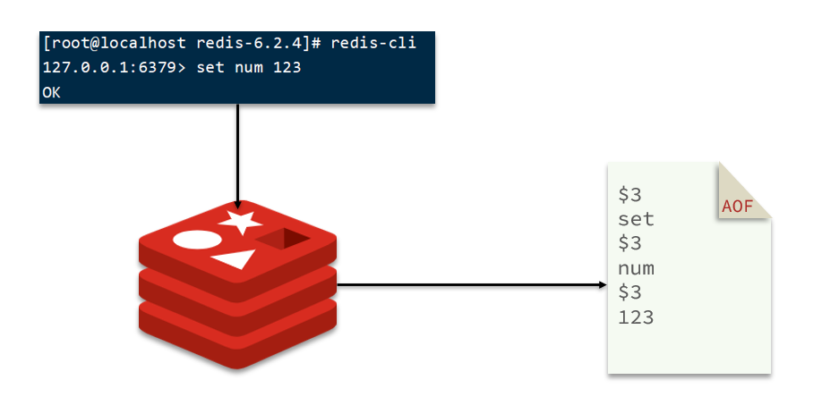
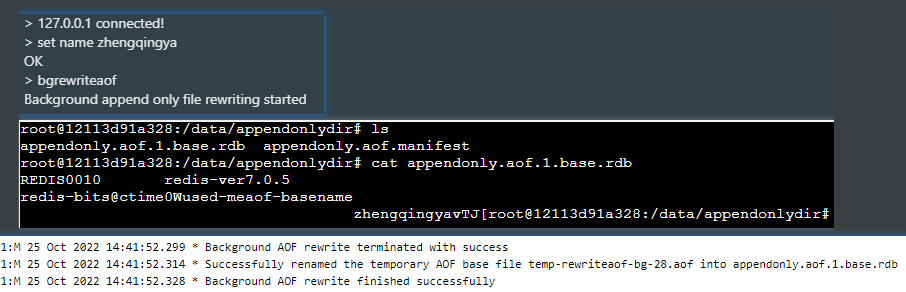

# 持久化

## AOF

日志文件追加记录
实时持久化,将处理的每一个写命令都记录在AOF文件中,数据安全性更高.持久化效率低
当aof文件过大时，会进行重写，即命令压缩(根据类型使用一条命令来替代之前的键值对多条命令)



### 启用AOF

> AOF默认关闭

redis.conf

```shell
# 是否开启aof
appendonly yes

# 文件存放目录，与RDB共用。默认为当前工作目录。
dir ./

# 7.0新版本新增的存放文件夹
appenddirname "appendonlydir"

# 文件名称
appendfilename "appendonly.aof"


# 同步方式
# always：   表示每执行一次写命令，立即记录到AOF文件
# everysec： 写命令执行完先放入AOF缓冲区，然后表示每隔1秒将缓冲区数据写到AOF文件 （默认方案）
# no：       写命令执行完先放入AOF缓冲区，由操作系统决定何时将缓冲区内容写回磁盘。一般而言为了提高效率，操作系统会等待缓存区被填满，才会开始同步数据到磁盘
appendfsync everysec
```

### AOF重写

> 将原来多条命令压缩成一条命令，减少aof文件大的问题
> `set name hello`&`set name zhengqingya`&`set age 18` => `mset set name zhengqingya age 18`

#### 自动重写触发配置

redis.conf

```shell
# Redis会记住自从上一次重写后AOF文件的大小（如果自Redis启动后还没重写过，则记住启动时使用的AOF文件的大小）。
# AOF文件对比上次文件 增长超过多少百分比则触发重写
auto-aof-rewrite-percentage 100
# 禁用自动的日志重写功能 -- 百分比设置为0
# auto-aof-rewrite-percentage 0
# AOF文件体积最小多大以上才触发重写 
auto-aof-rewrite-min-size 64mb

# aof重写期间是否同步
no-appendfsync-on-rewrite no
```

#### 手动触发AOF重写

```shell
bgrewriteaof
```


