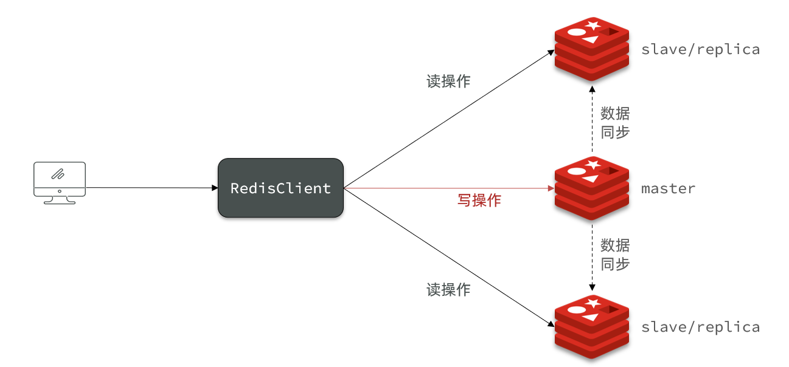
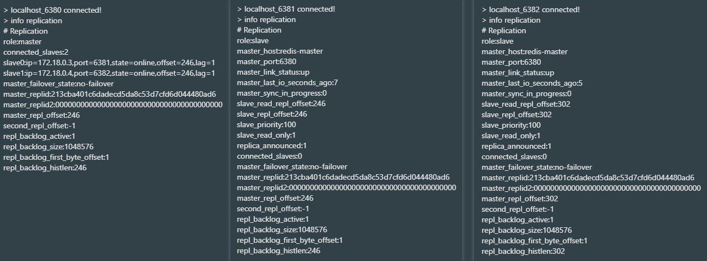
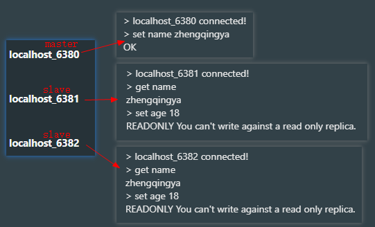

# 环境搭建

见 https://gitee.com/zhengqingya/docker-compose



### redis.conf

主要配置

```
# 连接并认证master节点
slaveof 127.0.0.1 6380
```

| 机器             | 说明           |
|----------------|--------------|
| 127.0.0.1:6380 | redis-master |
| 127.0.0.1:6381 | redis-slave1 |
| 127.0.0.1:6382 | redis-slave2 |

```shell
# 可在redis连接后执行如下命令查看
info replication
```



测试效果

