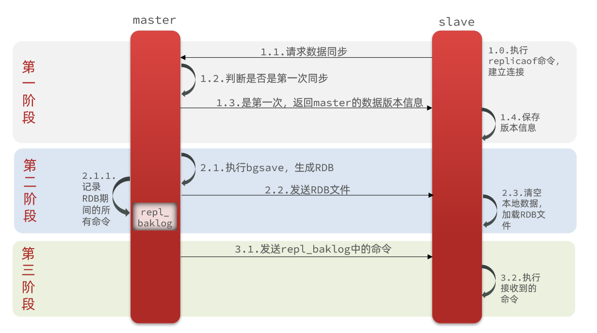
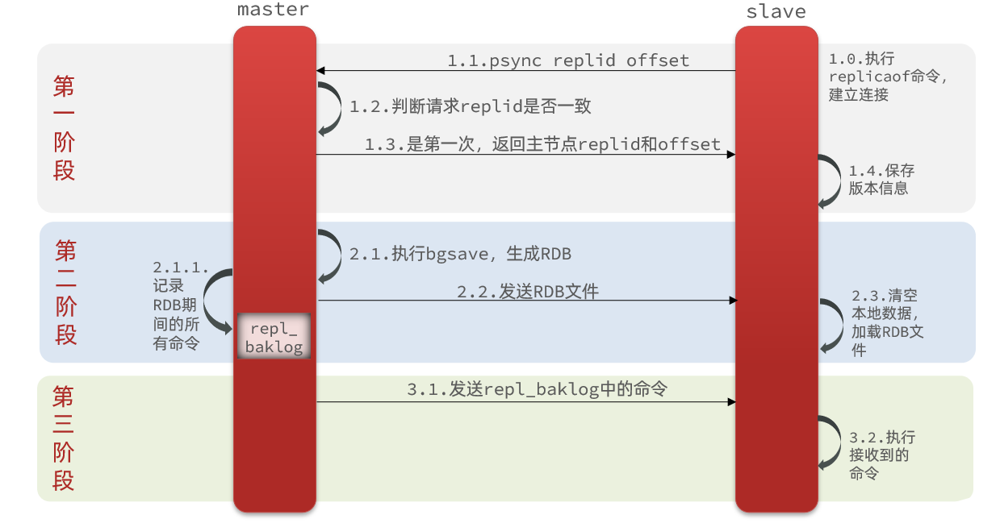

# 主从数据同步原理

### 全量同步

主从第一次建立连接时，会执行`全量同步`，将master节点的所有数据都拷贝给slave节点，流程：

这里有一个问题，master如何得知salve是第一次来连接呢？？

有几个概念，可以作为判断依据：

- `Replication Id`：简称replid，是数据集的标记，id一致则说明是同一数据集。每一个master都有唯一的replid，slave则会继承master节点的replid
- `offset`
  ：偏移量，随着记录在repl_baklog中的数据增多而逐渐增大。slave完成同步时也会记录当前同步的offset。如果slave的offset小于master的offset，说明slave数据落后于master，需要更新。

因此slave做数据同步，必须向master声明自己的replication id 和offset，master才可以判断到底需要同步哪些数据。

因为slave原本也是一个master，有自己的replid和offset，当第一次变成slave，与master建立连接时，发送的replid和offset是自己的replid和offset。
master判断发现slave发送来的replid与自己的不一致，说明这是一个全新的slave，就知道要做全量同步了。
master会将自己的replid和offset都发送给这个slave，slave保存这些信息。以后slave的replid就与master一致了。

因此，master判断一个节点是否是第一次同步的依据，就是看replid是否一致。

如图：

完整流程描述：

- slave节点请求增量同步
- master节点判断replid，发现不一致，拒绝增量同步
- master将完整内存数据生成RDB，发送RDB到slave
- slave清空本地数据，加载master的RDB
- master将RDB期间的命令记录在repl_baklog，并持续将log中的命令发送给slave
- slave执行接收到的命令，保持与master之间的同步
