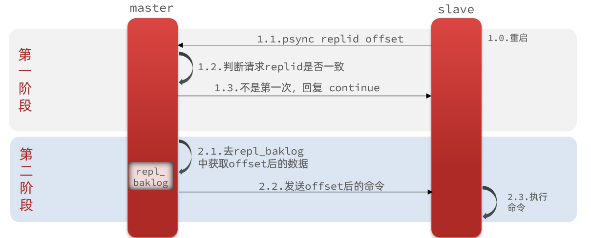
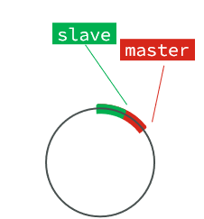
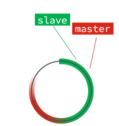
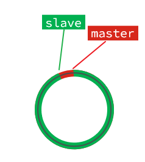
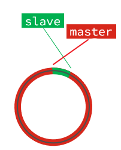
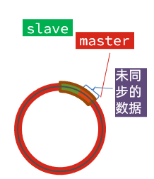

# 主从数据同步原理

### 增量同步

全量同步需要先做RDB，然后将RDB文件通过网络传输个slave，成本太高了。因此除了第一次做全量同步，其它大多数时候slave与master都是做`增量同步`。

什么是增量同步？就是只更新slave与master存在差异的部分数据。如图：

### 那么master怎么知道slave与自己的数据差异在哪里呢? => repl_backlog原理

这就要说到全量同步时的repl_baklog文件了。

这个文件是一个固定大小的数组，只不过数组是环形，也就是说`角标到达数组末尾后，会再次从0开始读写`，这样数组头部的数据就会被覆盖。

repl_baklog中会记录Redis处理过的命令日志及offset，包括master当前的offset，和slave已经拷贝到的offset：

slave与master的offset之间的差异，就是salve需要增量拷贝的数据了。

随着不断有数据写入，master的offset逐渐变大，slave也不断的拷贝，追赶master的offset：

直到数组被填满：

此时，如果有新的数据写入，就会覆盖数组中的旧数据。不过，旧的数据只要是绿色的，说明是已经被同步到slave的数据，即便被覆盖了也没什么影响。因为未同步的仅仅是红色部分。

但是，如果slave出现网络阻塞，导致master的offset远远超过了slave的offset：

如果master继续写入新数据，其offset就会覆盖旧的数据，直到将slave现在的offset也覆盖：

棕色框中的红色部分，就是尚未同步，但是却已经被覆盖的数据。此时如果slave恢复，需要同步，却发现自己的offset都没有了，无法完成增量同步了。只能做全量同步。

> tips: `repl_backlog`大小有上限，写满后会覆盖最早的数据。如果slave断开时间过久，导致尚未备份的数据被覆盖，则无法基于log做增量同步，只能再次全量同步。
