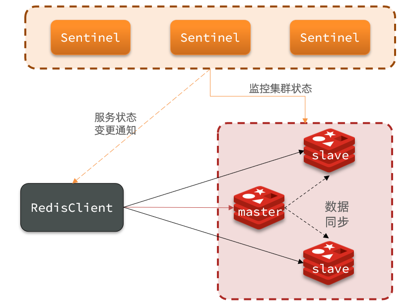
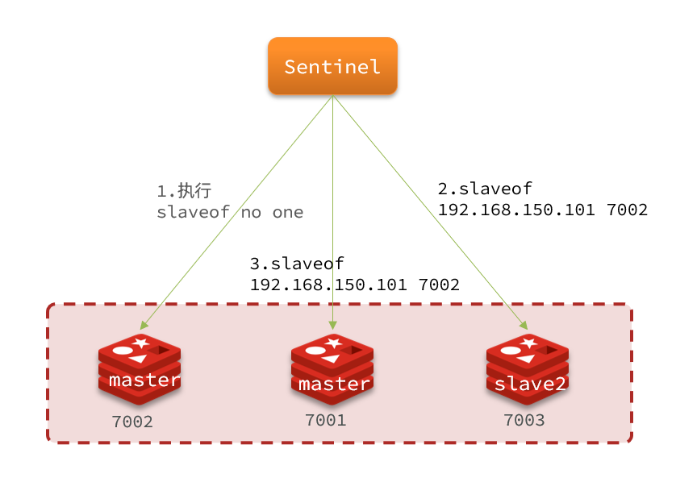

# Redis哨兵原理

Redis提供了哨兵（Sentinel）机制来实现主从集群的自动故障恢复。

### 集群结构和作用

哨兵的结构如图：

哨兵的作用如下：

- `监控`：Sentinel 会不断检查您的master和slave是否按预期工作
- `自动故障恢复`：如果master故障，Sentinel会将一个slave提升为master。当故障实例恢复后也以新的master为主
- `通知`：Sentinel充当Redis客户端的服务发现来源，当集群发生故障转移时，会将最新信息推送给Redis的客户端

### 集群监控原理

Sentinel基于心跳机制监测服务状态，每隔1秒向集群的每个实例发送ping命令：

- 主观下线：如果某sentinel节点发现某实例未在规定时间响应，则认为该实例`主观下线`。
- 客观下线：若超过指定数量（quorum）的sentinel都认为该实例主观下线，则该实例`客观下线`。quorum值最好超过Sentinel实例数量的一半。

### 集群故障恢复原理

一旦发现master故障，sentinel需要在salve中选择一个作为新的master，选择依据是这样的：

- 首先会判断slave节点与master节点断开时间长短，如果超过指定值（down-after-milliseconds * 10）则会排除该slave节点
- 然后判断slave节点的slave-priority值，越小优先级越高，如果是0则永不参与选举
- 如果slave-prority一样，则判断slave节点的offset值，越大说明数据越新，优先级越高
- 最后是判断slave节点的运行id大小，越小优先级越高。

当选出一个新的master后，该如何实现切换呢？

流程如下：

- sentinel给备选的slave1节点发送slaveof no one命令，让该节点成为master
- sentinel给所有其它slave发送slaveof 192.168.150.101 7002 命令，让这些slave成为新master的从节点，开始从新的master上同步数据。
- 最后，sentinel将故障节点标记为slave，当故障节点恢复后会自动成为新的master的slave节点

### 小结

Sentinel的三个作用是什么？

- 监控
- 故障转移
- 通知

Sentinel如何判断一个redis实例是否健康？

- 每隔1秒发送一次ping命令，如果超过一定时间没有相向则认为是主观下线
- 如果大多数sentinel都认为实例主观下线，则判定服务下线

故障转移步骤有哪些？

- 首先选定一个slave作为新的master，执行slaveof no one
- 然后让所有节点都执行slaveof 新master
- 修改故障节点配置，添加slaveof 新master

