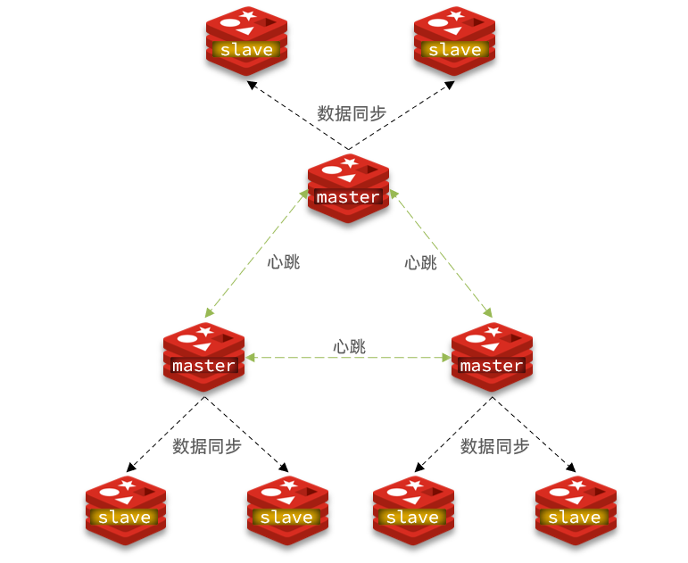

# 环境搭建

见 https://gitee.com/zhengqingya/docker-compose



分片集群特征：

- 集群中有多个master，每个master保存不同数据
- 每个master都可以有多个slave节点
- master之间通过ping监测彼此健康状态
- 客户端请求可以访问集群任意节点，最终都会被转发到正确节点

| 机器             | 说明         |
|----------------|------------|
| 127.0.0.1:6381 | redis-6381 |
| 127.0.0.1:6382 | redis-6382 |
| 127.0.0.1:6383 | redis-6383 |
| 127.0.0.1:6384 | redis-6384 |
| 127.0.0.1:6385 | redis-6385 |
| 127.0.0.1:6386 | redis-6386 |

### Redis Cluster 集群

redis.conf中主要新增了如下配置

```
cluster-enabled yes
cluster-config-file nodes-6379.conf
cluster-node-timeout 15000
```

创建集群

```shell
# `--cluster-replicas 1`: 指定集群中每个master的副本个数为1，此时`节点总数/(replicas+1)`得到的就是master的数量。前n个为master，其它节点为slave，随机分配到不同master
docker exec -it redis-6381 redis-cli -h 172.28.0.11 -p 6381 -a 123456 --cluster create --cluster-replicas 1 172.28.0.11:6381 redis-6382:6382 redis-6383:6383 redis-6384:6384 redis-6385:6385 redis-6386:6386
```

查看集群

```shell
# 连接集群某个节点
docker exec -it redis-6381 redis-cli -c -h redis-6381 -p 6381 -a 123456
# 查看集群信息
cluster info
# 查看集群节点信息
cluster nodes
# 查看slots分片
cluster slots
```
