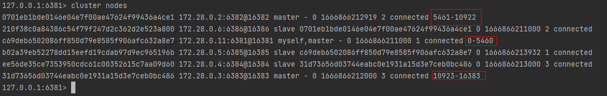

# 散列插槽

### 插槽原理

Redis会把每一个master节点映射到0~16383共16384个插槽（hash slot）上，查看集群信息时就能看到：

数据key不是与节点绑定，而是与插槽绑定。redis会根据key的有效部分计算插槽值，分两种情况：

- key中包含"{}"，且“{}”中至少包含1个字符，“{}”中的部分是有效部分
- key中不包含“{}”，整个key都是有效部分

例如：key是num，那么就根据num计算，如果是{it}num，则根据it计算。计算方式是利用CRC16算法得到一个hash值，然后对16384取余，得到的结果就是slot值。

在6381这个节点执行`set a 1`时，对a做hash运算，对16384取余，得到的结果是15495，因此要存储到6383节点。
到6381执行`get a`时，对a做hash运算，对16384取余，得到的结果是15495，因此需要切换到6383节点

### 小结

Redis如何判断某个key应该在哪个实例？

- 将16384个插槽分配到不同的实例
- 根据key的有效部分计算哈希值，对16384取余
- 余数作为插槽，寻找插槽所在实例即可

如何将同一类数据固定的保存在同一个Redis实例？

- 这一类数据使用相同的有效部分，例如key都以{typeId}为前缀
