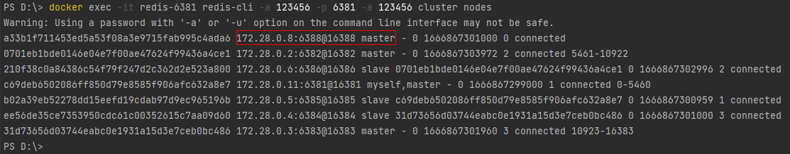
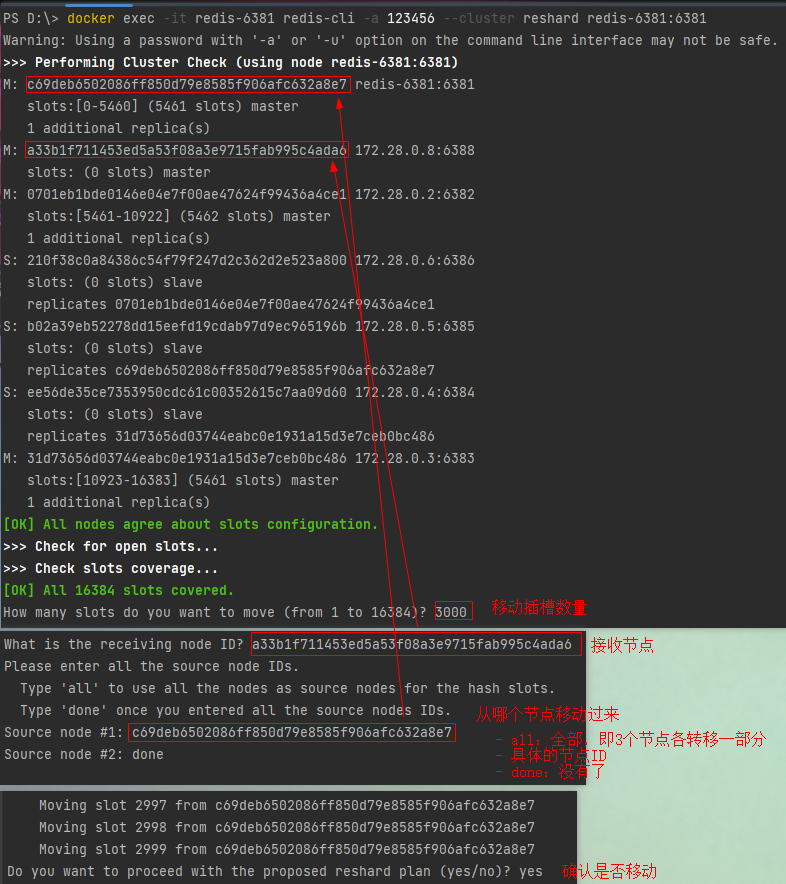
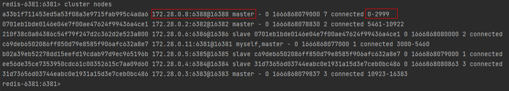

# 集群伸缩

```shell
# 查看相关命令
docker exec -it redis-6381 redis-cli --cluster help
```

### 实例操作

向集群中添加一个新的master节点，并向其中存储 num = 10

- 启动一个新的redis实例，端口为6388
- 添加6388到之前的集群，并作为一个master节点
- 给6388节点分配插槽，使得num这个key可以存储到6388实例

#### 1、添加新节点到集群中

```shell
# 需先创建一个新的redis实例哦
# docker-compose -f docker-compose-redis-cluster.yml -p redis up -d redis-6388

# 让6388加入集群，并且默认是一个master节点
docker exec -it redis-6381 redis-cli -a 123456 --cluster add-node redis-6388:6388 redis-6381:6381
```

查看集群状态：

```shell
docker exec -it redis-6381 redis-cli -p 6381 -a 123456 cluster nodes
```

此时6388节点的插槽数量为0 =》 没有任何数据可以存储到6388上



#### 2、转移插槽

> 将部分插槽分配到新插槽

我们要将num存储到6388节点，因此需要先看看num的插槽是多少


可以看到num的插槽为2765

我们可以将0~3000的插槽从6381转移到6388

```shell
docker exec -it redis-6381 redis-cli -a 123456 --cluster reshard redis-6381:6381
```



查看6388节点数据




---

### 删除集群某一个节点

> tips: 如果是删除master节点需要先将上面的插槽移动到其它master节点上 => 防止数据丢失
> 如果是删除slave节点则直接删除即可

```shell
# docker exec -it redis-6381 redis-cli -a 123456 --cluster del-node host:port node_id
docker exec -it redis-6381 redis-cli -a 123456 --cluster del-node redis-6388:6388 a33b1f711453ed5a53f08a3e9715fab995c4ada6
```

将6388节点数据转移到6381节点 & 删除6388节点 过程日志如下：

```shell
# 分配散列插槽
PS D:\> docker exec -it redis-6381 redis-cli -a 123456 --cluster reshard redis-6388:6388
Warning: Using a password with '-a' or '-u' option on the command line interface may not be safe.
>>> Performing Cluster Check (using node redis-6388:6388)   
M: a33b1f711453ed5a53f08a3e9715fab995c4ada6 redis-6388:6388 
   slots:[0-2999] (3000 slots) master                       
M: 31d73656d03744eabc0e1931a15d3e7ceb0bc486 172.28.0.3:6383 
   slots:[10923-16383] (5461 slots) master                  
   1 additional replica(s)                                  
S: 210f38c0a84386c54f79f247d2c362d2e523a800 172.28.0.6:6386 
   slots: (0 slots) slave                                   
   replicates 0701eb1bde0146e04e7f00ae47624f99436a4ce1      
M: c69deb6502086ff850d79e8585f906afc632a8e7 172.28.0.11:6381
   slots:[3000-5460] (2461 slots) master                    
   1 additional replica(s)                                  
S: b02a39eb52278dd15eefd19cdab97d9ec965196b 172.28.0.5:6385
   slots: (0 slots) slave                                  
   replicates c69deb6502086ff850d79e8585f906afc632a8e7     
S: ee56de35ce7353950cdc61c00352615c7aa09d60 172.28.0.4:6384
   slots: (0 slots) slave                                  
   replicates 31d73656d03744eabc0e1931a15d3e7ceb0bc486     
M: 0701eb1bde0146e04e7f00ae47624f99436a4ce1 172.28.0.2:6382
   slots:[5461-10922] (5462 slots) master                  
   1 additional replica(s)                                 
[OK] All nodes agree about slots configuration.
>>> Check for open slots...                    
>>> Check slots coverage...                    
[OK] All 16384 slots covered.                         
# 移动插槽数量
How many slots do you want to move (from 1 to 16384)? 3000
# 接收节点ID （这里是6381节点）
What is the receiving node ID? c69deb6502086ff850d79e8585f906afc632a8e7
# 从哪个节点移动过来 （这里是6388节点）
# all：全部，各节点插槽都转移一部分
# 指定具体节点ID
# done：没有了，结束
Please enter all the source node IDs.                                
  Type 'all' to use all the nodes as source nodes for the hash slots.
  Type 'done' once you entered all the source nodes IDs.             
Source node #1: a33b1f711453ed5a53f08a3e9715fab995c4ada6             
Source node #2: done

Ready to move 3000 slots.
  Source nodes:          
    M: a33b1f711453ed5a53f08a3e9715fab995c4ada6 redis-6388:6388
       slots:[0-2999] (3000 slots) master                      
  Destination node:
    M: c69deb6502086ff850d79e8585f906afc632a8e7 172.28.0.11:6381
       slots:[3000-5460] (2461 slots) master
       1 additional replica(s)
  Resharding plan:
    Moving slot 0 from a33b1f711453ed5a53f08a3e9715fab995c4ada6
    Moving slot 1 from a33b1f711453ed5a53f08a3e9715fab995c4ada6
    Moving slot 2 from a33b1f711453ed5a53f08a3e9715fab995c4ada6
    Moving slot 3 from a33b1f711453ed5a53f08a3e9715fab995c4ada6
    ......
    Moving slot 2998 from a33b1f711453ed5a53f08a3e9715fab995c4ada6
    Moving slot 2999 from a33b1f711453ed5a53f08a3e9715fab995c4ada6
# 确认是否移动
Do you want to proceed with the proposed reshard plan (yes/no)? yes
Moving slot 0 from redis-6388:6388 to 172.28.0.11:6381:
Moving slot 1 from redis-6388:6388 to 172.28.0.11:6381: 
...
Moving slot 2998 from 172.28.0.8:6388 to redis-6381:6381: 
Moving slot 2999 from 172.28.0.8:6388 to redis-6381:6381:
# 移动完成之后查看集群
PS D:\> docker exec -it redis-6381 redis-cli -p 6381 -a 123456 cluster nodes
Warning: Using a password with '-a' or '-u' option on the command line interface may not be safe.
a33b1f711453ed5a53f08a3e9715fab995c4ada6 172.28.0.8:6388@16388 slave c69deb6502086ff850d79e8585f906afc632a8e7 0 1666924100687 8 connected
0701eb1bde0146e04e7f00ae47624f99436a4ce1 172.28.0.2:6382@16382 master - 0 1666924104685 2 connected 5461-10922
210f38c0a84386c54f79f247d2c362d2e523a800 172.28.0.6:6386@16386 slave 0701eb1bde0146e04e7f00ae47624f99436a4ce1 0 1666924103698 2 connected
c69deb6502086ff850d79e8585f906afc632a8e7 172.28.0.11:6381@16381 myself,master - 0 1666924100000 8 connected 0-5460
b02a39eb52278dd15eefd19cdab97d9ec965196b 172.28.0.5:6385@16385 slave c69deb6502086ff850d79e8585f906afc632a8e7 0 1666924102000 8 connected
ee56de35ce7353950cdc61c00352615c7aa09d60 172.28.0.4:6384@16384 slave 31d73656d03744eabc0e1931a15d3e7ceb0bc486 0 1666924102682 3 connected
31d73656d03744eabc0e1931a15d3e7ceb0bc486 172.28.0.3:6383@16383 master - 0 1666924104000 3 connected 10923-16383
# 删除6388节点
PS D:\> docker exec -it redis-6381 redis-cli -a 123456 --cluster del-node redis-6388:6388 a33b1f711453ed5a53f08a3e9715fab995c4ada6
Warning: Using a password with '-a' or '-u' option on the command line interface may not be safe.
>>> Removing node a33b1f711453ed5a53f08a3e9715fab995c4ada6 from cluster redis-6388:6388          
>>> Sending CLUSTER FORGET messages to the cluster...
>>> Sending CLUSTER RESET SOFT to the deleted node.
# 查看集群
PS D:\> docker exec -it redis-6381 redis-cli -p 6381 -a 123456 cluster nodes
Warning: Using a password with '-a' or '-u' option on the command line interface may not be safe.
0701eb1bde0146e04e7f00ae47624f99436a4ce1 172.28.0.2:6382@16382 master - 0 1666924994000 2 connected 5461-10922                           
210f38c0a84386c54f79f247d2c362d2e523a800 172.28.0.6:6386@16386 slave 0701eb1bde0146e04e7f00ae47624f99436a4ce1 0 1666924995302 2 connected
c69deb6502086ff850d79e8585f906afc632a8e7 172.28.0.11:6381@16381 myself,master - 0 1666924993000 8 connected 0-5460                       
b02a39eb52278dd15eefd19cdab97d9ec965196b 172.28.0.5:6385@16385 slave c69deb6502086ff850d79e8585f906afc632a8e7 0 1666924994000 8 connected
ee56de35ce7353950cdc61c00352615c7aa09d60 172.28.0.4:6384@16384 slave 31d73656d03744eabc0e1931a15d3e7ceb0bc486 0 1666924993000 3 connected
31d73656d03744eabc0e1931a15d3e7ceb0bc486 172.28.0.3:6383@16383 master - 0 1666924994274 3 connected 10923-16383                          
# 删除6388容器
PS D:\> docker rm -f redis-6388
redis-6388
PS D:\> 
```