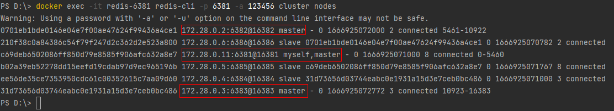
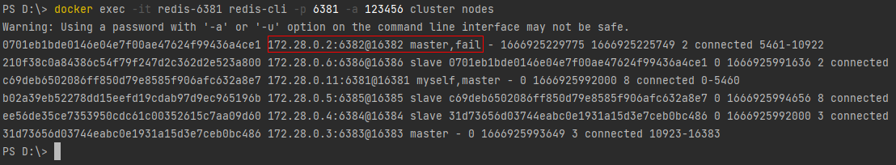
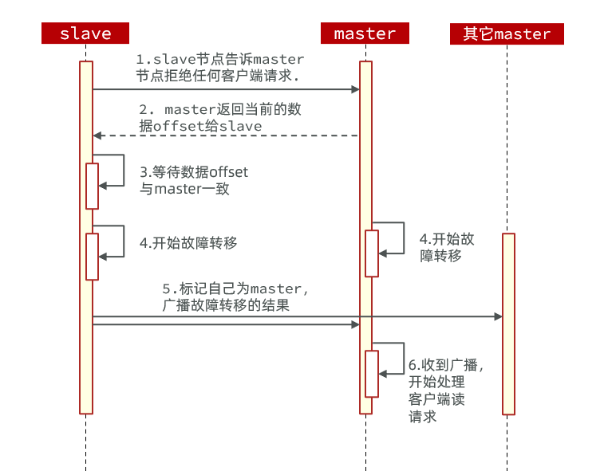
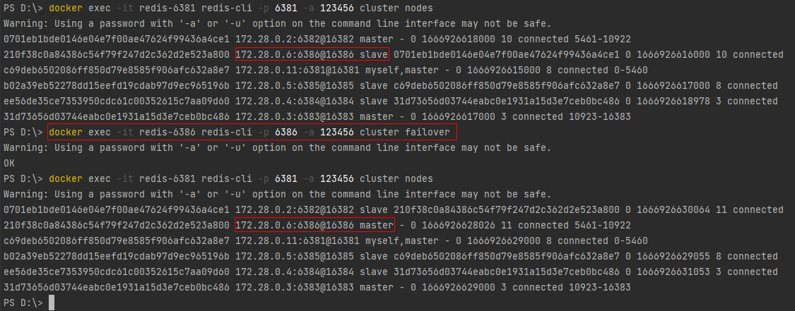

# 故障转移

```shell
docker exec -it redis-6381 redis-cli -p 6381 -a 123456 cluster nodes
```



其中6381、6382、6383都是master，我们计划让6382宕机。

### 一、自动故障转移

当集群中有一个master宕机会发生什么呢？

直接停止一个redis实例，例如6382：

```sh
# redis-cli -p 6382 shutdown
docker rm -f redis-6382
```

1. 首先是该实例与其它实例失去连接
2. 然后是疑似宕机：
3. 最后是确定下线，自动提升一个slave为新的master：
4. 当6382再次启动，就会变为一个slave节点了：



> tips: 我这里通过docker操作未成功实现自动故障转移效果，后期在Linux上直接安装redis再测试看看...

### 二、手动故障转移

利用`cluster failover`命令可以手动让集群中的某个master宕机，切换到执行`cluster failover`命令的这个slave节点，实现无感知的数据迁移。其流程如下：



这种failover命令可以指定三种模式：

- `缺省`：默认的流程，如图1~6歩
- `force`：省略了对offset的一致性校验
- `takeover`：直接执行第5歩，忽略数据一致性、忽略master状态和其它master的意见

###### 示例：在6386这个slave节点执行手动故障转移，上位master

```shell
# 查看集群
docker exec -it redis-6381 redis-cli -p 6381 -a 123456 cluster nodes
# 手动故障转移
docker exec -it redis-6386 redis-cli -p 6386 -a 123456 cluster failover
```

