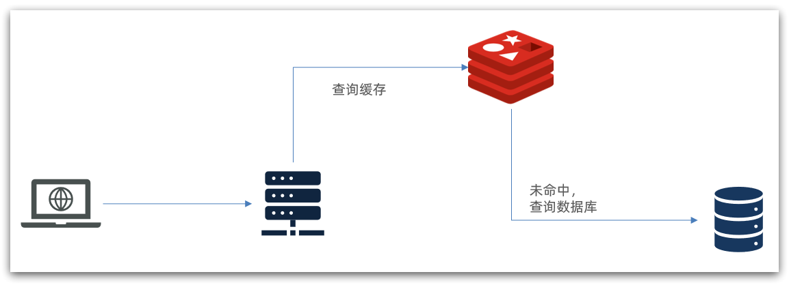
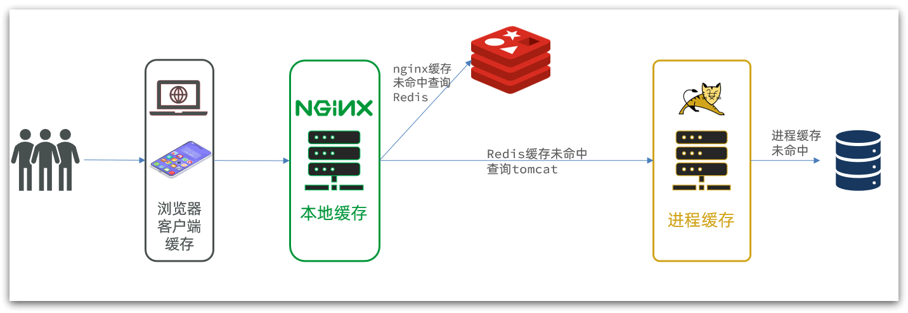
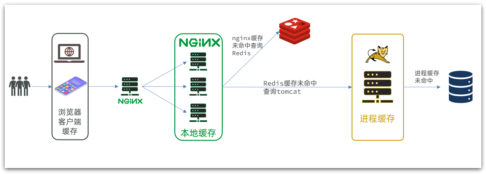
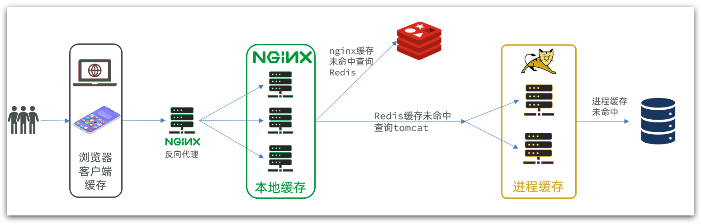

# 什么是多级缓存

传统的缓存策略一般是请求到达Tomcat后，先查询Redis，如果未命中则查询数据库，如图：

存在下面的问题：

- 请求要经过Tomcat处理，Tomcat的性能成为整个系统的瓶颈
- Redis缓存失效时，会对数据库产生冲击

多级缓存就是充分利用请求处理的每个环节，分别添加缓存，减轻Tomcat压力，提升服务性能：

- 浏览器访问静态资源时，优先读取浏览器本地缓存
- 访问非静态资源（ajax查询数据）时，访问服务端
- 请求到达Nginx后，优先读取Nginx本地缓存
- 如果Nginx本地缓存未命中，则去直接查询Redis（不经过Tomcat）
- 如果Redis查询未命中，则查询Tomcat
- 请求进入Tomcat后，优先查询JVM进程缓存
- 如果JVM进程缓存未命中，则查询数据库

在多级缓存架构中，Nginx内部需要编写本地缓存查询、Redis查询、Tomcat查询的业务逻辑，因此这样的nginx服务不再是一个**反向代理服务器**，而是一个编写**业务的Web服务器了**。

因此这样的业务Nginx服务也需要搭建集群来提高并发，再有专门的nginx服务来做反向代理，如图：

另外，我们的Tomcat服务将来也会部署为集群模式：

可见，多级缓存的关键有两个：

- 一个是在nginx中编写业务，实现nginx本地缓存、Redis、Tomcat的查询
- 另一个就是在Tomcat中实现JVM进程缓存

其中Nginx编程则会用到OpenResty框架结合Lua这样的语言。
