# 多级缓存

> tips: 仅对个人来说，了解一下即可，如果真有实战机会，再去细看吧...

多级缓存的实现离不开Nginx编程，而Nginx编程又离不开OpenResty。

### 1.安装OpenResty

> https://openresty.org/cn

OpenResty® 是一个基于 Nginx的高性能 Web 平台，用于方便地搭建能够处理超高并发、扩展性极高的动态 Web 应用、Web 服务和动态网关。具备下列特点：

- 具备Nginx的完整功能
- 基于Lua语言进行扩展，集成了大量精良的 Lua 库、第三方模块
- 允许使用Lua`自定义业务逻辑`、`自定义库`

安装见[04-多级缓存-安装OpenResty.md](04-多级缓存-安装OpenResty.md)

### 2.OpenResty快速入门

我们希望达到的多级缓存架构如图：

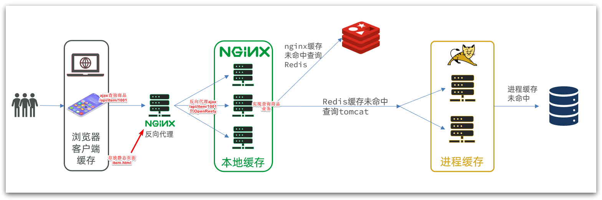

其中：

- windows上的nginx用来做反向代理服务，将前端的查询商品的ajax请求代理到OpenResty集群
- OpenResty集群用来编写多级缓存业务

#### 2.1.反向代理流程

现在，商品详情页使用的是假的商品数据。不过在浏览器中，可以看到页面有发起ajax请求查询真实商品数据。

这个请求如下：

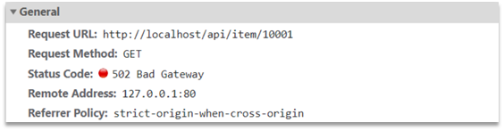

请求地址是localhost，端口是80，就被windows上安装的Nginx服务给接收到了。然后代理给了OpenResty集群：


我们需要在OpenResty中编写业务，查询商品数据并返回到浏览器。

但是这次，我们先在OpenResty接收请求，返回假的商品数据。

#### 2.2.OpenResty监听请求

OpenResty的很多功能都依赖于其目录下的Lua库，需要在nginx.conf中指定依赖库的目录，并导入依赖：

1）添加对OpenResty的Lua模块的加载

修改`/usr/local/openresty/nginx/conf/nginx.conf`文件，在其中的http下面，添加下面代码：

```nginx
#lua 模块
lua_package_path "/usr/local/openresty/lualib/?.lua;;";
#c模块     
lua_package_cpath "/usr/local/openresty/lualib/?.so;;";  
```

2）监听/api/item路径

修改`/usr/local/openresty/nginx/conf/nginx.conf`文件，在nginx.conf的server下面，添加对/api/item这个路径的监听：

```nginx
location  /api/item {
    # 默认的响应类型
    default_type application/json;
    # 响应结果由lua/item.lua文件来决定
    content_by_lua_file lua/item.lua;
}
```

这个监听，就类似于SpringMVC中的`@GetMapping("/api/item")`做路径映射。

而`content_by_lua_file lua/item.lua`则相当于调用item.lua这个文件，执行其中的业务，把结果返回给用户。相当于java中调用service。

#### 2.3.编写item.lua

1）在`/usr/loca/openresty/nginx`目录创建文件夹：lua

```shell
cd /usr/loca/openresty/nginx
mkdir lua
```

2）在`/usr/loca/openresty/nginx/lua`文件夹下，新建文件：item.lua

```shell
cd /usr/loca/openresty/nginx/lua
touch item.lua
```

3）编写item.lua，返回假数据

item.lua中，利用ngx.say()函数返回数据到Response中

```lua
ngx.say('{"id":10001,"name":"SALSA AIR","title":"RIMOWA 21寸托运箱拉杆箱 SALSA AIR系列果绿色 820.70.36.4","price":17900,"image":"https://m.360buyimg.com/mobilecms/s720x720_jfs/t6934/364/1195375010/84676/e9f2c55f/597ece38N0ddcbc77.jpg!q70.jpg.webp","category":"拉杆箱","brand":"RIMOWA","spec":"","status":1,"createTime":"2019-04-30T16:00:00.000+00:00","updateTime":"2019-04-30T16:00:00.000+00:00","stock":2999,"sold":31290}')
```

4）重新加载配置

```sh
nginx -s reload
```

刷新商品页面：http://localhost/item.html?id=1001，即可看到效果：

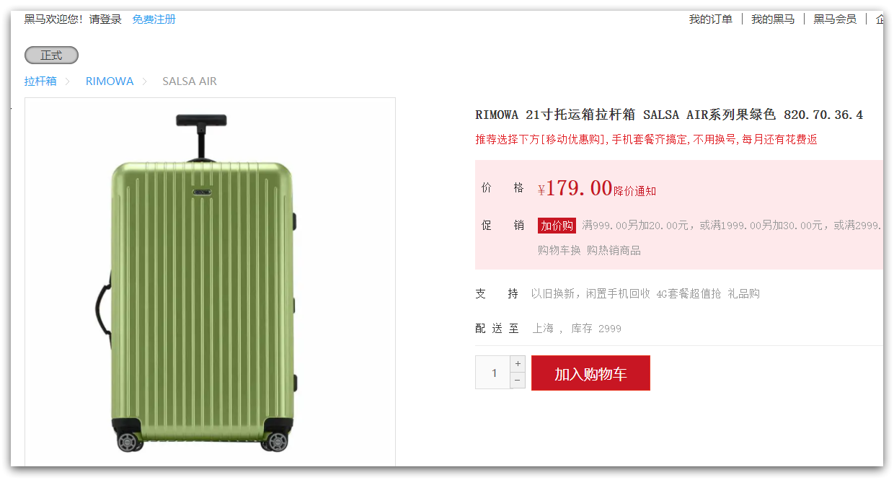

### 3.请求参数处理

上一节中，我们在OpenResty接收前端请求，但是返回的是假数据。

要返回真实数据，必须根据前端传递来的商品id，查询商品信息才可以。

那么如何获取前端传递的商品参数呢？

#### 3.1.获取参数的API

OpenResty中提供了一些API用来获取不同类型的前端请求参数：

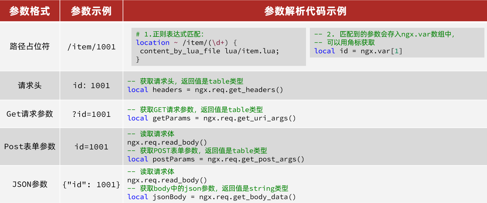

| `参数格式` | `参数示例` | `参数解析代码示例`                                         |
| ------------ | ------------ | ------------------------------------------------------------ |
| 路径占位符   | /item/1001   |                                                              |
| 请求头       | id：1001     | -- 获取请求头，返回值是table类型local headers = ngx.req.get_headers() |
| Get请求参数  | ?id=1001     | -- 获取GET请求参数，返回值是table类型local getParams = ngx.req.get_uri_args() |
| Post表单参数 | id=1001      | -- 读取请求体ngx.req.read_body()-- 获取POST表单参数，返回值是table类型local postParams = ngx.req.get_post_args() |
| JSON参数     | {"id": 1001} | -- 读取请求体ngx.req.read_body()-- 获取body中的json参数，返回值是string类型local jsonBody = ngx.req.get_body_data() |

#### 3.2.获取参数并返回

在前端发起的ajax请求如图：

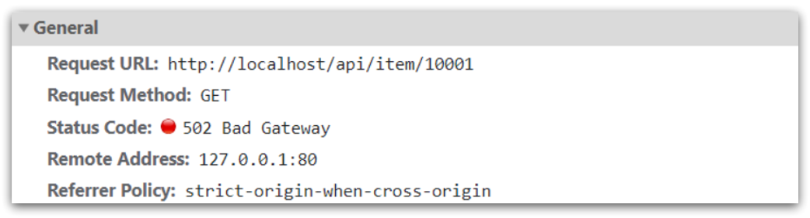

可以看到商品id是以路径占位符方式传递的，因此可以利用正则表达式匹配的方式来获取ID

1）获取商品id

修改`/usr/loca/openresty/nginx/nginx.conf`文件中监听/api/item的代码，利用正则表达式获取ID：

```nginx
location ~ /api/item/(\d+) {
    # 默认的响应类型
    default_type application/json;
    # 响应结果由lua/item.lua文件来决定
    content_by_lua_file lua/item.lua;
}
```

2）拼接ID并返回

修改`/usr/loca/openresty/nginx/lua/item.lua`文件，获取id并拼接到结果中返回：

```lua
-- 获取商品id
local id = ngx.var[1]
-- 拼接并返回
ngx.say('{"id":' .. id .. ',"name":"SALSA AIR","title":"RIMOWA 21寸托运箱拉杆箱 SALSA AIR系列果绿色 820.70.36.4","price":17900,"image":"https://m.360buyimg.com/mobilecms/s720x720_jfs/t6934/364/1195375010/84676/e9f2c55f/597ece38N0ddcbc77.jpg!q70.jpg.webp","category":"拉杆箱","brand":"RIMOWA","spec":"","status":1,"createTime":"2019-04-30T16:00:00.000+00:00","updateTime":"2019-04-30T16:00:00.000+00:00","stock":2999,"sold":31290}')
```

3）重新加载并测试

运行命令以重新加载OpenResty配置：

```sh
nginx -s reload
```

刷新页面可以看到结果中已经带上了ID：

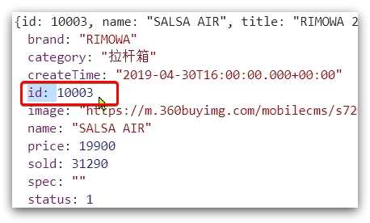

### 4.查询Tomcat

拿到商品ID后，本应去缓存中查询商品信息，不过目前我们还未建立nginx、redis缓存。因此，这里我们先根据商品id去tomcat查询商品信息。我们实现如图部分：

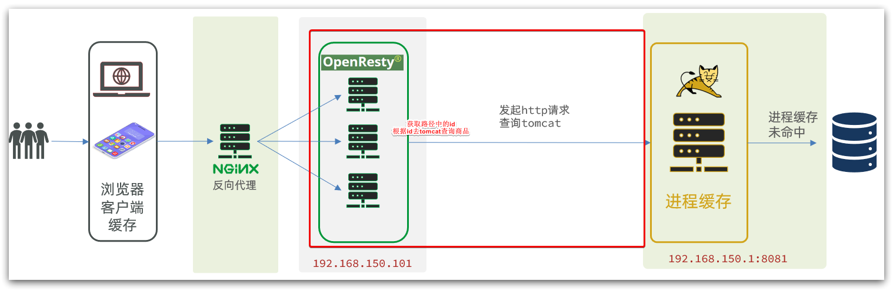

需要注意的是，我们的OpenResty是在虚拟机，Tomcat是在Windows电脑上。两者IP一定不要搞错了。

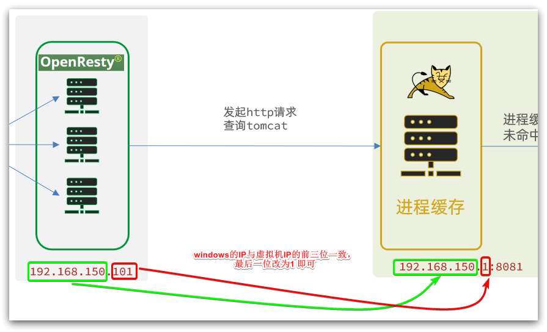

#### 4.1.发送http请求的API

nginx提供了内部API用以发送http请求：

```lua
local resp = ngx.location.capture("/path",{
    method = ngx.HTTP_GET,   -- 请求方式
    args = {a=1,b=2},  -- get方式传参数
})
```

返回的响应内容包括：

- resp.status：响应状态码
- resp.header：响应头，是一个table
- resp.body：响应体，就是响应数据

注意：这里的path是路径，并不包含IP和端口。这个请求会被nginx内部的server监听并处理。

但是我们希望这个请求发送到Tomcat服务器，所以还需要编写一个server来对这个路径做反向代理：

```nginx
 location /path {
     # 这里是windows电脑的ip和Java服务端口，需要确保windows防火墙处于关闭状态
     proxy_pass http://192.168.150.1:8081; 
 }
```

原理如图：

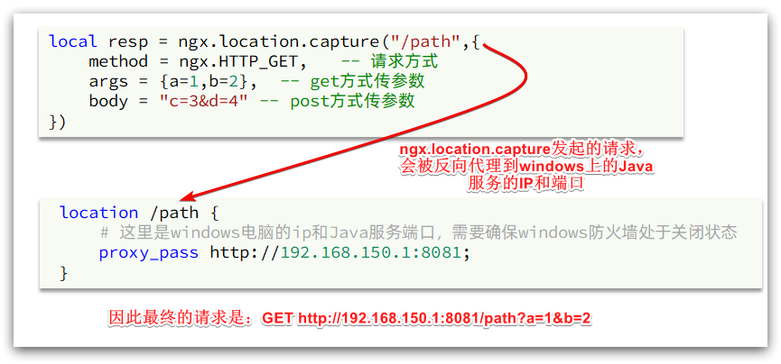

#### 4.2.封装http工具

下面，我们封装一个发送Http请求的工具，基于ngx.location.capture来实现查询tomcat。

1）添加反向代理，到windows的Java服务

因为item-service中的接口都是/item开头，所以我们监听/item路径，代理到windows上的tomcat服务。

修改 `/usr/local/openresty/nginx/conf/nginx.conf`文件，添加一个location：

```nginx
location /item {
    proxy_pass http://192.168.150.1:8081;
}
```

以后，只要我们调用`ngx.location.capture("/item")`，就一定能发送请求到windows的tomcat服务。

2）封装工具类

之前我们说过，OpenResty启动时会加载以下两个目录中的工具文件：

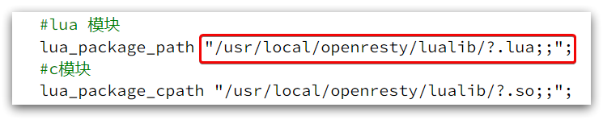

所以，自定义的http工具也需要放到这个目录下。

在`/usr/local/openresty/lualib`目录下，新建一个common.lua文件：

```sh
vi /usr/local/openresty/lualib/common.lua
```

内容如下:

```lua
-- 封装函数，发送http请求，并解析响应
local function read_http(path, params)
    local resp = ngx.location.capture(path,{
        method = ngx.HTTP_GET,
        args = params,
    })
    if not resp then
        -- 记录错误信息，返回404
        ngx.log(ngx.ERR, "http请求查询失败, path: ", path , ", args: ", args)
        ngx.exit(404)
    end
    return resp.body
end
-- 将方法导出
local _M = {  
    read_http = read_http
}  
return _M
```

这个工具将read_http函数封装到_M这个table类型的变量中，并且返回，这类似于导出。

使用的时候，可以利用`require('common')`来导入该函数库，这里的common是函数库的文件名。

3）实现商品查询

最后，我们修改`/usr/local/openresty/lua/item.lua`文件，利用刚刚封装的函数库实现对tomcat的查询：

```lua
-- 引入自定义common工具模块，返回值是common中返回的 _M
local common = require("common")
-- 从 common中获取read_http这个函数
local read_http = common.read_http
-- 获取路径参数
local id = ngx.var[1]
-- 根据id查询商品
local itemJSON = read_http("/item/".. id, nil)
-- 根据id查询商品库存
local itemStockJSON = read_http("/item/stock/".. id, nil)
```

这里查询到的结果是json字符串，并且包含商品、库存两个json字符串，页面最终需要的是把两个json拼接为一个json：

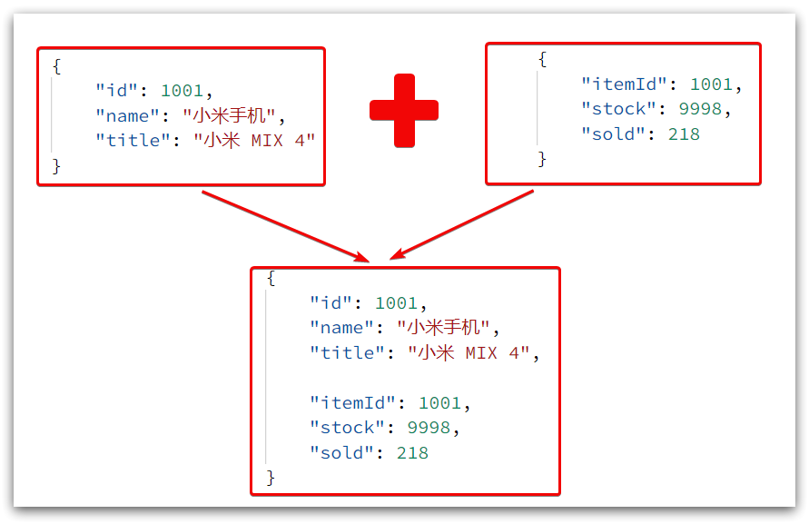

这就需要我们先把JSON变为lua的table，完成数据整合后，再转为JSON。

#### 4.3.CJSON工具类

OpenResty提供了一个cjson的模块用来处理JSON的序列化和反序列化。

> 官方地址： https://github.com/openresty/lua-cjson/

1）引入cjson模块：

```lua
local cjson = require "cjson"
```

2）序列化：

```lua
local obj = {
    name = 'jack',
    age = 21
}
-- 把 table 序列化为 json
local json = cjson.encode(obj)
```

3）反序列化：

```lua
local json = '{"name": "jack", "age": 21}'
-- 反序列化 json为 table
local obj = cjson.decode(json);
print(obj.name)
```

#### 4.4.实现Tomcat查询

下面，我们修改之前的item.lua中的业务，添加json处理功能：

```lua
-- 导入common函数库
local common = require('common')
local read_http = common.read_http
-- 导入cjson库
local cjson = require('cjson')

-- 获取路径参数
local id = ngx.var[1]
-- 根据id查询商品
local itemJSON = read_http("/item/".. id, nil)
-- 根据id查询商品库存
local itemStockJSON = read_http("/item/stock/".. id, nil)

-- JSON转化为lua的table
local item = cjson.decode(itemJSON)
local stock = cjson.decode(stockJSON)

-- 组合数据
item.stock = stock.stock
item.sold = stock.sold

-- 把item序列化为json 返回结果
ngx.say(cjson.encode(item))
```

#### 4.5.基于ID负载均衡

刚才的代码中，我们的tomcat是单机部署。而实际开发中，tomcat一定是集群模式：

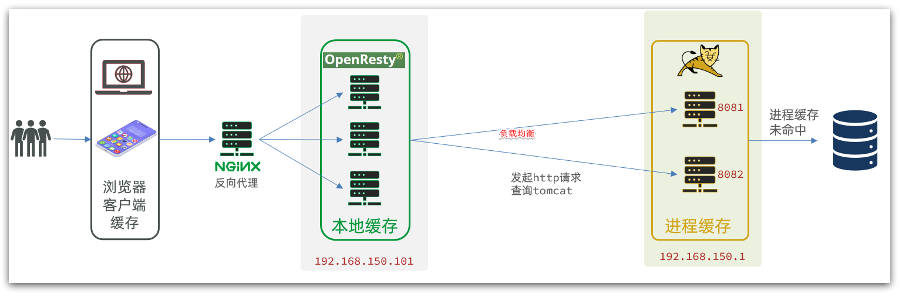

因此，OpenResty需要对tomcat集群做负载均衡。

而默认的负载均衡规则是轮询模式，当我们查询/item/10001时：

- 第一次会访问8081端口的tomcat服务，在该服务内部就形成了JVM进程缓存
- 第二次会访问8082端口的tomcat服务，该服务内部没有JVM缓存（因为JVM缓存无法共享），会查询数据库
- ...

你看，因为轮询的原因，第一次查询8081形成的JVM缓存并未生效，直到下一次再次访问到8081时才可以生效，缓存命中率太低了。

怎么办？

如果能让同一个商品，每次查询时都访问同一个tomcat服务，那么JVM缓存就一定能生效了。

也就是说，我们需要根据商品id做负载均衡，而不是轮询。

##### 1）原理

nginx提供了基于请求路径做负载均衡的算法：

nginx根据请求路径做hash运算，把得到的数值对tomcat服务的数量取余，余数是几，就访问第几个服务，实现负载均衡。

例如：

- 我们的请求路径是 /item/10001
- tomcat总数为2台（8081、8082）
- 对请求路径/item/1001做hash运算求余的结果为1
- 则访问第一个tomcat服务，也就是8081

只要id不变，每次hash运算结果也不会变，那就可以保证同一个商品，一直访问同一个tomcat服务，确保JVM缓存生效。

##### 2）实现

修改`/usr/local/openresty/nginx/conf/nginx.conf`文件，实现基于ID做负载均衡。

首先，定义tomcat集群，并设置基于路径做负载均衡：

```nginx 
upstream tomcat-cluster {
    hash $request_uri;
    server 192.168.150.1:8081;
    server 192.168.150.1:8082;
}
```

然后，修改对tomcat服务的反向代理，目标指向tomcat集群：

```nginx
location /item {
    proxy_pass http://tomcat-cluster;
}
```

重新加载OpenResty

```sh
nginx -s reload
```

##### 3）测试

1. 同时启动两台tomcat服务
2. 清空日志后，再次访问页面，可以看到不同id的商品，访问到了不同的tomcat服务

### 5.Redis缓存预热

Redis缓存会面临冷启动问题：

- `冷启动`：服务刚刚启动时，Redis中并没有缓存，如果所有商品数据都在第一次查询时添加缓存，可能会给数据库带来较大压力。
- `缓存预热`：在实际开发中，我们可以利用大数据统计用户访问的热点数据，在项目启动时将这些热点数据提前查询并保存到Redis中。

我们数据量较少，并且没有数据统计相关功能，目前可以在启动时将所有数据都放入缓存中。

### 6.查询Redis缓存

现在，Redis缓存已经准备就绪，我们可以再OpenResty中实现查询Redis的逻辑了。如下图红框所示：

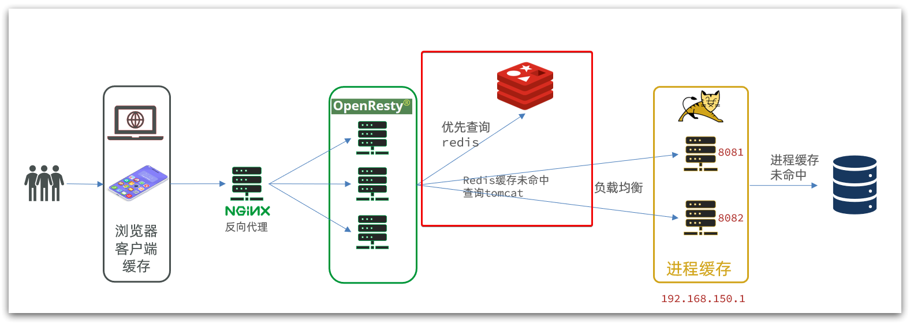

当请求进入OpenResty之后：

- 优先查询Redis缓存
- 如果Redis缓存未命中，再查询Tomcat

#### 6.1.封装Redis工具

OpenResty提供了操作Redis的模块，我们只要引入该模块就能直接使用。但是为了方便，我们将Redis操作封装到之前的common.lua工具库中。

修改`/usr/local/openresty/lualib/common.lua`文件：

1）引入Redis模块，并初始化Redis对象

```lua
-- 导入redis
local redis = require('resty.redis')
-- 初始化redis
local red = redis:new()
red:set_timeouts(1000, 1000, 1000)
```

2）封装函数，用来释放Redis连接，其实是放入连接池

```lua
-- 关闭redis连接的工具方法，其实是放入连接池
local function close_redis(red)
    local pool_max_idle_time = 10000 -- 连接的空闲时间，单位是毫秒
    local pool_size = 100 --连接池大小
    local ok, err = red:set_keepalive(pool_max_idle_time, pool_size)
    if not ok then
        ngx.log(ngx.ERR, "放入redis连接池失败: ", err)
    end
end
```

3）封装函数，根据key查询Redis数据

```lua
-- 查询redis的方法 ip和port是redis地址，key是查询的key
local function read_redis(ip, port, key)
    -- 获取一个连接
    local ok, err = red:connect(ip, port)
    if not ok then
        ngx.log(ngx.ERR, "连接redis失败 : ", err)
        return nil
    end
    -- 查询redis
    local resp, err = red:get(key)
    -- 查询失败处理
    if not resp then
        ngx.log(ngx.ERR, "查询Redis失败: ", err, ", key = " , key)
    end
    --得到的数据为空处理
    if resp == ngx.null then
        resp = nil
        ngx.log(ngx.ERR, "查询Redis数据为空, key = ", key)
    end
    close_redis(red)
    return resp
end
```

4）导出

```lua
-- 将方法导出
local _M = {  
    read_http = read_http,
    read_redis = read_redis
}  
return _M
```

完整的common.lua：

```lua
-- 导入redis
local redis = require('resty.redis')
-- 初始化redis
local red = redis:new()
red:set_timeouts(1000, 1000, 1000)

-- 关闭redis连接的工具方法，其实是放入连接池
local function close_redis(red)
    local pool_max_idle_time = 10000 -- 连接的空闲时间，单位是毫秒
    local pool_size = 100 --连接池大小
    local ok, err = red:set_keepalive(pool_max_idle_time, pool_size)
    if not ok then
        ngx.log(ngx.ERR, "放入redis连接池失败: ", err)
    end
end

-- 查询redis的方法 ip和port是redis地址，key是查询的key
local function read_redis(ip, port, key)
    -- 获取一个连接
    local ok, err = red:connect(ip, port)
    if not ok then
        ngx.log(ngx.ERR, "连接redis失败 : ", err)
        return nil
    end
    -- 查询redis
    local resp, err = red:get(key)
    -- 查询失败处理
    if not resp then
        ngx.log(ngx.ERR, "查询Redis失败: ", err, ", key = " , key)
    end
    --得到的数据为空处理
    if resp == ngx.null then
        resp = nil
        ngx.log(ngx.ERR, "查询Redis数据为空, key = ", key)
    end
    close_redis(red)
    return resp
end

-- 封装函数，发送http请求，并解析响应
local function read_http(path, params)
    local resp = ngx.location.capture(path,{
        method = ngx.HTTP_GET,
        args = params,
    })
    if not resp then
        -- 记录错误信息，返回404
        ngx.log(ngx.ERR, "http查询失败, path: ", path , ", args: ", args)
        ngx.exit(404)
    end
    return resp.body
end
-- 将方法导出
local _M = {  
    read_http = read_http,
    read_redis = read_redis
}  
return _M
```

#### 6.2.实现Redis查询

接下来，我们就可以去修改item.lua文件，实现对Redis的查询了。

查询逻辑是：

- 根据id查询Redis
- 如果查询失败则继续查询Tomcat
- 将查询结果返回

1）修改`/usr/local/openresty/lua/item.lua`文件，添加一个查询函数：

```lua
-- 导入common函数库
local common = require('common')
local read_http = common.read_http
local read_redis = common.read_redis
-- 封装查询函数
function read_data(key, path, params)
    -- 查询本地缓存
    local val = read_redis("127.0.0.1", 6379, key)
    -- 判断查询结果
    if not val then
        ngx.log(ngx.ERR, "redis查询失败，尝试查询http， key: ", key)
        -- redis查询失败，去查询http
        val = read_http(path, params)
    end
    -- 返回数据
    return val
end
```

2）而后修改商品查询、库存查询的业务：

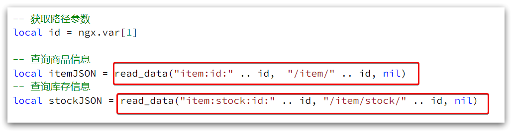

3）完整的item.lua代码：

```lua
-- 导入common函数库
local common = require('common')
local read_http = common.read_http
local read_redis = common.read_redis
-- 导入cjson库
local cjson = require('cjson')

-- 封装查询函数
function read_data(key, path, params)
    -- 查询本地缓存
    local val = read_redis("127.0.0.1", 6379, key)
    -- 判断查询结果
    if not val then
        ngx.log(ngx.ERR, "redis查询失败，尝试查询http， key: ", key)
        -- redis查询失败，去查询http
        val = read_http(path, params)
    end
    -- 返回数据
    return val
end

-- 获取路径参数
local id = ngx.var[1]

-- 查询商品信息
local itemJSON = read_data("item:id:" .. id,  "/item/" .. id, nil)
-- 查询库存信息
local stockJSON = read_data("item:stock:id:" .. id, "/item/stock/" .. id, nil)

-- JSON转化为lua的table
local item = cjson.decode(itemJSON)
local stock = cjson.decode(stockJSON)
-- 组合数据
item.stock = stock.stock
item.sold = stock.sold

-- 把item序列化为json 返回结果
ngx.say(cjson.encode(item))
```

### 7.Nginx本地缓存

现在，整个多级缓存中只差最后一环，也就是nginx的本地缓存了。如图：

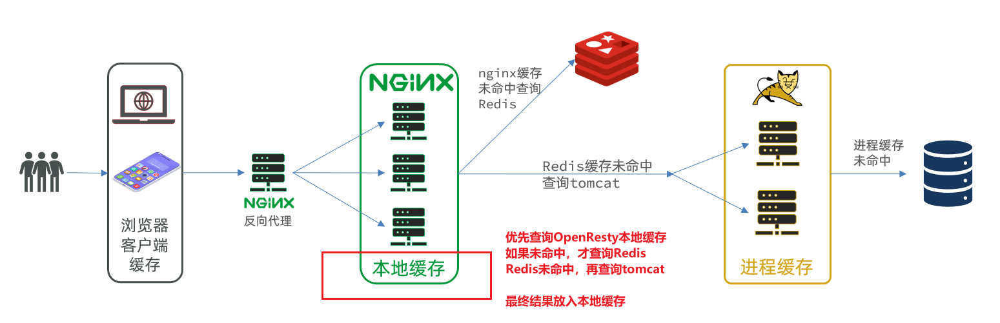

#### 7.1.本地缓存API

OpenResty为Nginx提供了`shard dict`的功能，可以在nginx的多个worker之间共享数据，实现缓存功能。

1）开启共享字典，在nginx.conf的http下添加配置：

```nginx
 # 共享字典，也就是本地缓存，名称叫做：item_cache，大小150m
 lua_shared_dict item_cache 150m; 
```

2）操作共享字典：

```lua
-- 获取本地缓存对象
local item_cache = ngx.shared.item_cache
-- 存储, 指定key、value、过期时间，单位s，默认为0代表永不过期
item_cache:set('key', 'value', 1000)
-- 读取
local val = item_cache:get('key')
```

#### 7.2.实现本地缓存查询

1）修改`/usr/local/openresty/lua/item.lua`文件，修改read_data查询函数，添加本地缓存逻辑：

```lua
-- 导入共享词典，本地缓存
local item_cache = ngx.shared.item_cache

-- 封装查询函数
function read_data(key, expire, path, params)
    -- 查询本地缓存
    local val = item_cache:get(key)
    if not val then
        ngx.log(ngx.ERR, "本地缓存查询失败，尝试查询Redis， key: ", key)
        -- 查询redis
        val = read_redis("127.0.0.1", 6379, key)
        -- 判断查询结果
        if not val then
            ngx.log(ngx.ERR, "redis查询失败，尝试查询http， key: ", key)
            -- redis查询失败，去查询http
            val = read_http(path, params)
        end
    end
    -- 查询成功，把数据写入本地缓存
    item_cache:set(key, val, expire)
    -- 返回数据
    return val
end
```

2）修改item.lua中查询商品和库存的业务，实现最新的read_data函数：

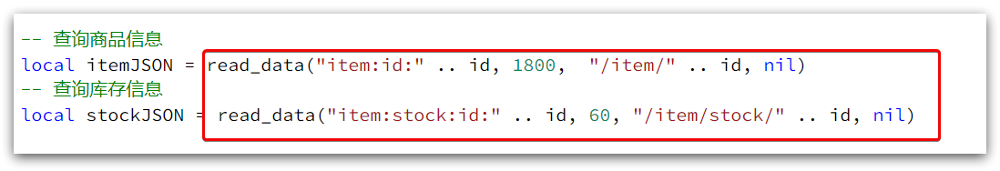

其实就是多了缓存时间参数，过期后nginx缓存会自动删除，下次访问即可更新缓存。

这里给商品基本信息设置超时时间为30分钟，库存为1分钟。

因为库存更新频率较高，如果缓存时间过长，可能与数据库差异较大。

3）完整的item.lua文件：

```lua
-- 导入common函数库
local common = require('common')
local read_http = common.read_http
local read_redis = common.read_redis
-- 导入cjson库
local cjson = require('cjson')
-- 导入共享词典，本地缓存
local item_cache = ngx.shared.item_cache

-- 封装查询函数
function read_data(key, expire, path, params)
    -- 查询本地缓存
    local val = item_cache:get(key)
    if not val then
        ngx.log(ngx.ERR, "本地缓存查询失败，尝试查询Redis， key: ", key)
        -- 查询redis
        val = read_redis("127.0.0.1", 6379, key)
        -- 判断查询结果
        if not val then
            ngx.log(ngx.ERR, "redis查询失败，尝试查询http， key: ", key)
            -- redis查询失败，去查询http
            val = read_http(path, params)
        end
    end
    -- 查询成功，把数据写入本地缓存
    item_cache:set(key, val, expire)
    -- 返回数据
    return val
end

-- 获取路径参数
local id = ngx.var[1]

-- 查询商品信息
local itemJSON = read_data("item:id:" .. id, 1800,  "/item/" .. id, nil)
-- 查询库存信息
local stockJSON = read_data("item:stock:id:" .. id, 60, "/item/stock/" .. id, nil)

-- JSON转化为lua的table
local item = cjson.decode(itemJSON)
local stock = cjson.decode(stockJSON)
-- 组合数据
item.stock = stock.stock
item.sold = stock.sold

-- 把item序列化为json 返回结果
ngx.say(cjson.encode(item))
```


