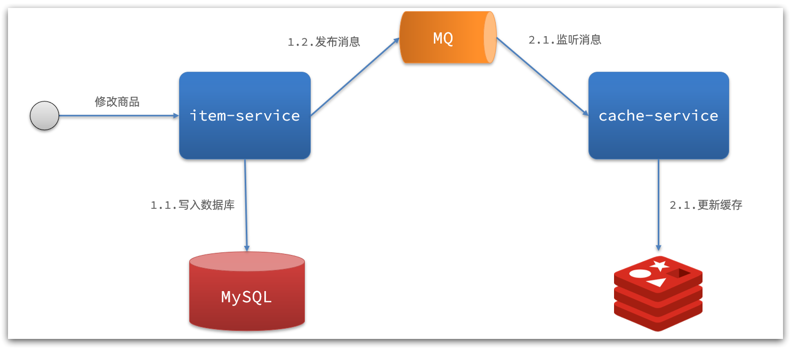
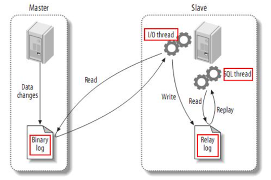
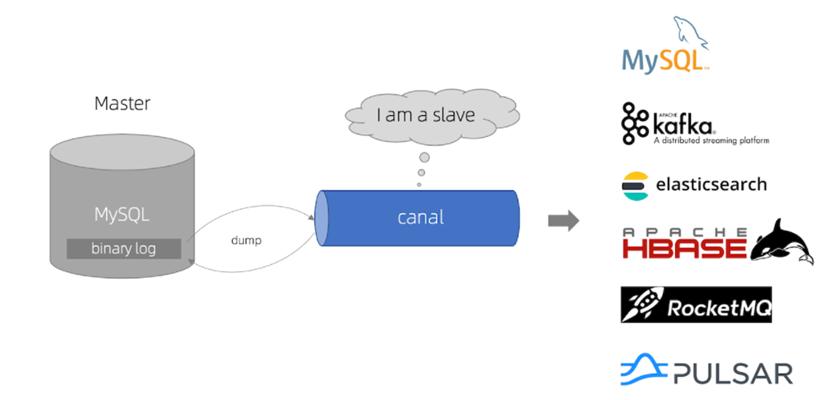
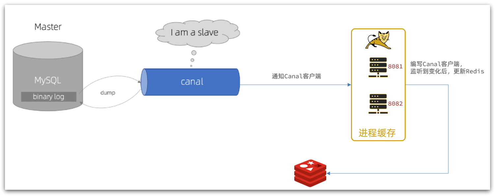

# 缓存同步

大多数情况下，浏览器查询到的都是缓存数据，如果缓存数据与数据库数据存在较大差异，可能会产生比较严重的后果。

所以我们必须保证数据库数据、缓存数据的一致性，这就是缓存与数据库的同步。

### 1、数据同步策略

缓存数据同步的常见方式有三种：

**设置有效期**：给缓存设置有效期，到期后自动删除。再次查询时更新

- 优势：简单、方便
- 缺点：时效性差，缓存过期之前可能不一致
- 场景：更新频率较低，时效性要求低的业务

**同步双写**：在修改数据库的同时，直接修改缓存

- 优势：时效性强，缓存与数据库强一致
- 缺点：有代码侵入，耦合度高；
- 场景：对一致性、时效性要求较高的缓存数据

**异步通知：**修改数据库时发送事件通知，相关服务监听到通知后修改缓存数据

- 优势：低耦合，可以同时通知多个缓存服务
- 缺点：时效性一般，可能存在中间不一致状态
- 场景：时效性要求一般，有多个服务需要同步

而异步实现又可以基于MQ或者Canal来实现：

1）基于MQ的异步通知：

解读：

- 商品服务完成对数据的修改后，只需要发送一条消息到MQ中。
- 缓存服务监听MQ消息，然后完成对缓存的更新

依然有少量的代码侵入。

2）基于Canal的通知

解读：

- 商品服务完成商品修改后，业务直接结束，没有任何代码侵入
- Canal监听MySQL变化，当发现变化后，立即通知缓存服务
- 缓存服务接收到canal通知，更新缓存

代码零侵入

### 2、安装Canal

#### 2.1.认识Canal

**Canal [kə'næl]**
，译意为水道/管道/沟渠，canal是阿里巴巴旗下的一款开源项目，基于Java开发。基于数据库增量日志解析，提供增量数据订阅&消费。GitHub的地址：https://github.com/alibaba/canal

Canal是基于mysql的主从同步来实现的，MySQL主从同步的原理如下：

- 1）MySQL master 将数据变更写入二进制日志( binary log），其中记录的数据叫做binary log events
- 2）MySQL slave 将 master 的 binary log events拷贝到它的中继日志(relay log)
- 3）MySQL slave 重放 relay log 中事件，将数据变更反映它自己的数据

而Canal就是把自己伪装成MySQL的一个slave节点，从而监听master的binary log变化。再把得到的变化信息通知给Canal的客户端，进而完成对其它数据库的同步。

#### 2.2.安装Canal

见[05-缓存同步策略-安装Canal.md](05-缓存同步策略-安装Canal.md)
或 https://gitee.com/zhengqingya/docker-compose

### 3、监听Canal

Canal提供了各种语言的客户端，当Canal监听到binlog变化时，会通知Canal的客户端。

我们可以利用Canal提供的Java客户端，监听Canal通知消息。当收到变化的消息时，完成对缓存的更新。

不过这里我们会使用GitHub上的第三方开源的canal-starter客户端。地址：https://github.com/NormanGyllenhaal/canal-client

`canal-spring-boot-starter`与SpringBoot完美整合，自动装配，比官方客户端要简单好用很多。

> 案例见: https://gitee.com/zhengqingya/java-workspace
