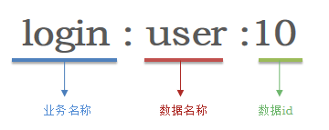
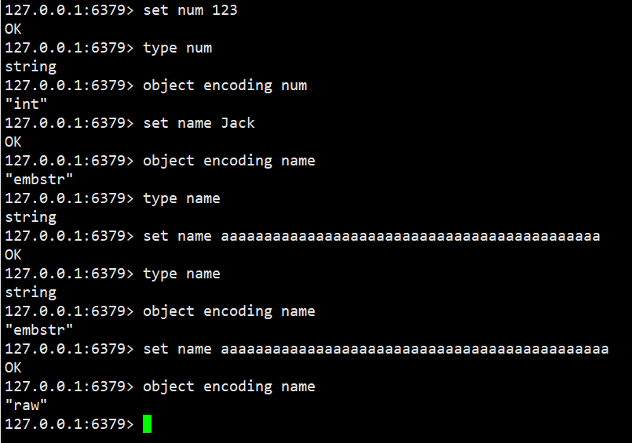
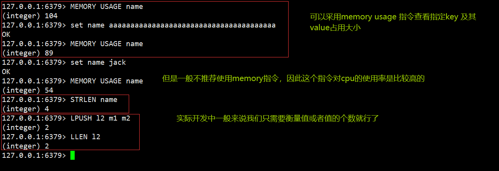
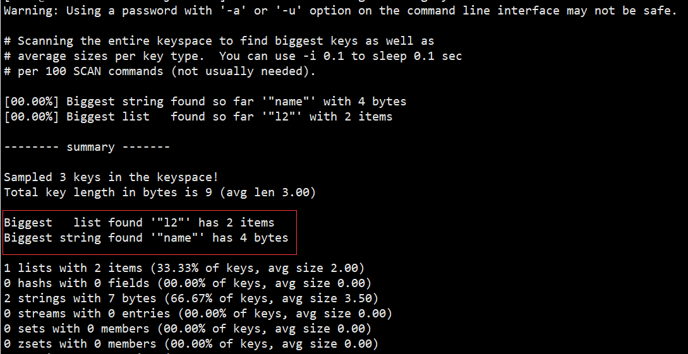
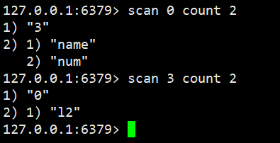
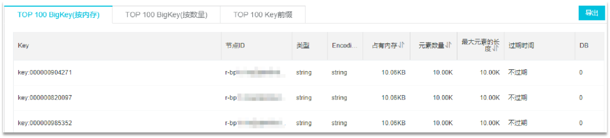
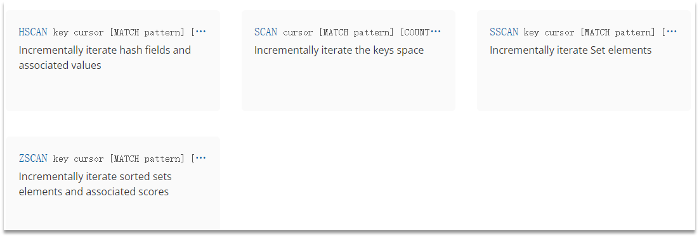
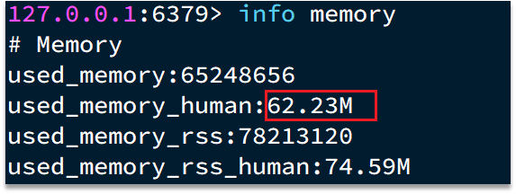
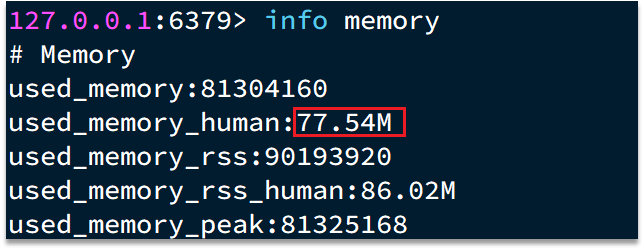
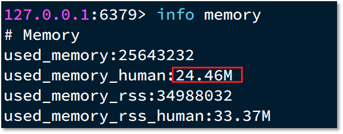

## Redis键值设计

### 1、优雅的key结构

Redis的Key虽然可以自定义，但最好遵循下面的几个最佳实践约定：

- 遵循基本格式：[业务名称]:[数据名]:[id]
- 长度不超过44字节
- 不包含特殊字符

例如：我们的登录业务，保存用户信息，其key可以设计成如下格式：



这样设计的好处：

- 可读性强
- 避免key冲突
- 方便管理
- 更节省内存：
  key是string类型，底层编码包含`int`、`embstr`和`raw`
  三种。embstr在小于44字节使用，采用连续内存空间，内存占用更小。当字节数大于44字节时，会转为raw模式存储，在raw模式下，内存空间不是连续的，而是采用一个指针指向了另外一段内存空间，在这段空间里存储SDS内容，这样空间不连续，访问的时候性能也就会收到影响，还有可能产生内存碎片



### 2、拒绝BigKey

BigKey通常以Key的大小和Key中成员的数量来综合判定，例如：

- Key本身的数据量过大：一个String类型的Key，它的值为5 MB
- Key中的成员数过多：一个ZSET类型的Key，它的成员数量为10,000个
- Key中成员的数据量过大：一个Hash类型的Key，它的成员数量虽然只有1,000个但这些成员的Value（值）总大小为100 MB

那么如何判断元素的大小呢？redis也给我们提供了命令



推荐值：

- 单个key的value小于10KB
- 对于集合类型的key，建议元素数量小于1000

#### 2.1、BigKey的危害

- 网络阻塞
    - 对BigKey执行读请求时，少量的QPS就可能导致带宽使用率被占满，导致Redis实例，乃至所在物理机变慢
- 数据倾斜
    - BigKey所在的Redis实例内存使用率远超其他实例，无法使数据分片的内存资源达到均衡
- Redis阻塞
    - 对元素较多的hash、list、zset等做运算会耗时较旧，使主线程被阻塞
- CPU压力
    - 对BigKey的数据序列化和反序列化会导致CPU的使用率飙升，影响Redis实例和本机其它应用

#### 2.2、如何发现BigKey

##### ①redis-cli --bigkeys

利用redis-cli提供的--bigkeys参数，可以遍历分析所有key，并返回Key的整体统计信息与每个数据的Top1的big key

命令：`redis-cli -a 密码 --bigkeys`



##### ②scan扫描

自己编程，利用scan扫描Redis中的所有key，利用strlen、hlen等命令判断key的长度（此处不建议使用MEMORY USAGE）



scan 命令调用完后每次会返回2个元素，第一个是下一次迭代的光标，第一次光标会设置为0，当最后一次scan 返回的光标等于0时，表示整个scan遍历结束了，第二个返回的是List，一个匹配的key的数组

```java
import com.zhengqingya.jedis.util.JedisConnectionFactory;
import org.junit.jupiter.api.AfterEach;
import org.junit.jupiter.api.BeforeEach;
import org.junit.jupiter.api.Test;
import redis.clients.jedis.Jedis;
import redis.clients.jedis.ScanResult;

import java.util.HashMap;
import java.util.List;
import java.util.Map;

public class JedisTest {
    private Jedis jedis;

    @BeforeEach
    void setUp() {
        // 1.建立连接
        // jedis = new Jedis("192.168.150.101", 6379);
        jedis = JedisConnectionFactory.getJedis();
        // 2.设置密码
        jedis.auth("123321");
        // 3.选择库
        jedis.select(0);
    }

    final static int STR_MAX_LEN = 10 * 1024;
    final static int HASH_MAX_LEN = 500;

    @Test
    void testScan() {
        int maxLen = 0;
        long len = 0;

        String cursor = "0";
        do {
            // 扫描并获取一部分key
            ScanResult<String> result = jedis.scan(cursor);
            // 记录cursor
            cursor = result.getCursor();
            List<String> list = result.getResult();
            if (list == null || list.isEmpty()) {
                break;
            }
            // 遍历
            for (String key : list) {
                // 判断key的类型
                String type = jedis.type(key);
                switch (type) {
                    case "string":
                        len = jedis.strlen(key);
                        maxLen = STR_MAX_LEN;
                        break;
                    case "hash":
                        len = jedis.hlen(key);
                        maxLen = HASH_MAX_LEN;
                        break;
                    case "list":
                        len = jedis.llen(key);
                        maxLen = HASH_MAX_LEN;
                        break;
                    case "set":
                        len = jedis.scard(key);
                        maxLen = HASH_MAX_LEN;
                        break;
                    case "zset":
                        len = jedis.zcard(key);
                        maxLen = HASH_MAX_LEN;
                        break;
                    default:
                        break;
                }
                if (len >= maxLen) {
                    System.out.printf("Found big key : %s, type: %s, length or size: %d %n", key, type, len);
                }
            }
        } while (!cursor.equals("0"));
    }

    @AfterEach
    void tearDown() {
        if (jedis != null) {
            jedis.close();
        }
    }

}
```

##### ③第三方工具

- 利用第三方工具，如 Redis-Rdb-Tools 分析RDB快照文件，全面分析内存使用情况
- https://github.com/sripathikrishnan/redis-rdb-tools

##### ④网络监控

- 自定义工具，监控进出Redis的网络数据，超出预警值时主动告警
- 一般阿里云搭建的云服务器就有相关监控页面



#### 2.3、如何删除BigKey

BigKey内存占用较多，即便时删除这样的key也需要耗费很长时间，导致Redis主线程阻塞，引发一系列问题。

- redis 3.0 及以下版本
    - 如果是集合类型，则遍历BigKey的元素，先逐个删除子元素，最后删除BigKey



- Redis 4.0以后
    - Redis在4.0后提供了异步删除的命令：unlink

### 3、恰当的数据类型

#### 例1：比如存储一个User对象，我们有三种存储方式：

##### ①方式一：json字符串

| user:1 | {"name": "Jack", "age": 21} |
| :----: | :-------------------------: |

优点：实现简单粗暴

缺点：数据耦合，不够灵活

##### ②方式二：字段打散

| user:1:name | Jack |
| :---------: | :--: |
| user:1:age | 21 |

优点：可以灵活访问对象任意字段

缺点：占用空间大、没办法做统一控制

##### ③方式三：hash（推荐）

<table>
	<tr>
		<td rowspan="2">user:1</td>
        <td>name</td>
        <td>jack</td>
	</tr>
	<tr>
		<td>age</td>
		<td>21</td>
	</tr>
</table>

优点：底层使用ziplist，空间占用小，可以灵活访问对象的任意字段

缺点：代码相对复杂

#### 例2：假如有hash类型的key，其中有100万对field和value，field是自增id，这个key存在什么问题？如何优化？

<table>
	<tr style="color:red">
		<td>key</td>
        <td>field</td>
        <td>value</td>
	</tr>
	<tr>
		<td rowspan="3">someKey</td>
		<td>id:0</td>
        <td>value0</td>
	</tr>
    <tr>
		<td>.....</td>
        <td>.....</td>
	</tr>
    <tr>
        <td>id:999999</td>
        <td>value999999</td>
    </tr>
</table>

存在的问题：

- hash的entry数量超过500时，会使用哈希表而不是ZipList，内存占用较多
    - 
- 可以通过hash-max-ziplist-entries配置entry上限。但是如果entry过多就会导致BigKey问题

##### 方案一

拆分为string类型

<table>
	<tr style="color:red">
		<td>key</td>
        <td>value</td>
	</tr>
	<tr>
		<td>id:0</td>
        <td>value0</td>
	</tr>
    <tr>
		<td>.....</td>
        <td>.....</td>
	</tr>
    <tr>
        <td>id:999999</td>
        <td>value999999</td>
    </tr>
</table>

存在的问题：

- string结构底层没有太多内存优化，内存占用较多



- 想要批量获取这些数据比较麻烦

##### 方案二

拆分为小的hash，将 id / 100 作为key， 将id % 100 作为field，这样每100个元素为一个Hash

<table>
	<tr style="color:red">
		<td>key</td>
        <td>field</td>
        <td>value</td>
	</tr>
	<tr>
        <td rowspan="3">key:0</td>
		<td>id:00</td>
        <td>value0</td>
	</tr>
    <tr>
		<td>.....</td>
        <td>.....</td>
	</tr>
    <tr>
        <td>id:99</td>
        <td>value99</td>
    </tr>
    <tr>
        <td rowspan="3">key:1</td>
		<td>id:00</td>
        <td>value100</td>
	</tr>
    <tr>
		<td>.....</td>
        <td>.....</td>
	</tr>
    <tr>
        <td>id:99</td>
        <td>value199</td>
    </tr>
    <tr>
    	<td colspan="3">....</td>
    </tr>
    <tr>
        <td rowspan="3">key:9999</td>
		<td>id:00</td>
        <td>value999900</td>
	</tr>
    <tr>
		<td>.....</td>
        <td>.....</td>
	</tr>
    <tr>
        <td>id:99</td>
        <td>value999999</td>
    </tr>
</table>



```java
import com.zhengqingya.jedis.util.JedisConnectionFactory;
import org.junit.jupiter.api.AfterEach;
import org.junit.jupiter.api.BeforeEach;
import org.junit.jupiter.api.Test;
import redis.clients.jedis.Jedis;
import redis.clients.jedis.Pipeline;
import redis.clients.jedis.ScanResult;

import java.util.HashMap;
import java.util.List;
import java.util.Map;

public class JedisTest {
    private Jedis jedis;

    @BeforeEach
    void setUp() {
        // 1.建立连接
        // jedis = new Jedis("192.168.150.101", 6379);
        jedis = JedisConnectionFactory.getJedis();
        // 2.设置密码
        jedis.auth("123321");
        // 3.选择库
        jedis.select(0);
    }

    @Test
    void testSetBigKey() {
        Map<String, String> map = new HashMap<>();
        for (int i = 1; i <= 650; i++) {
            map.put("hello_" + i, "world!");
        }
        jedis.hmset("m2", map);
    }

    @Test
    void testBigHash() {
        Map<String, String> map = new HashMap<>();
        for (int i = 1; i <= 100000; i++) {
            map.put("key_" + i, "value_" + i);
        }
        jedis.hmset("test:big:hash", map);
    }

    @Test
    void testBigString() {
        for (int i = 1; i <= 100000; i++) {
            jedis.set("test:str:key_" + i, "value_" + i);
        }
    }

    @Test
    void testSmallHash() {
        int hashSize = 100;
        Map<String, String> map = new HashMap<>(hashSize);
        for (int i = 1; i <= 100000; i++) {
            int k = (i - 1) / hashSize;
            int v = i % hashSize;
            map.put("key_" + v, "value_" + v);
            if (v == 0) {
                jedis.hmset("test:small:hash_" + k, map);
            }
        }
    }

    @AfterEach
    void tearDown() {
        if (jedis != null) {
            jedis.close();
        }
    }
}
```

### 4、总结

- Key的最佳实践
    - 固定格式：[业务名]:[数据名]:[id]
    - 足够简短：不超过44字节
    - 不包含特殊字符
- Value的最佳实践：
    - 合理的拆分数据，拒绝BigKey
    - 选择合适数据结构
    - Hash结构的entry数量不要超过1000
    - 设置合理的超时时间
