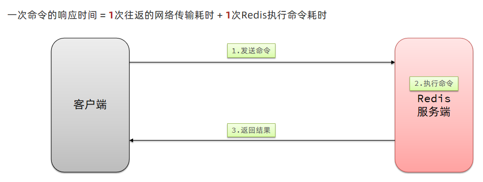
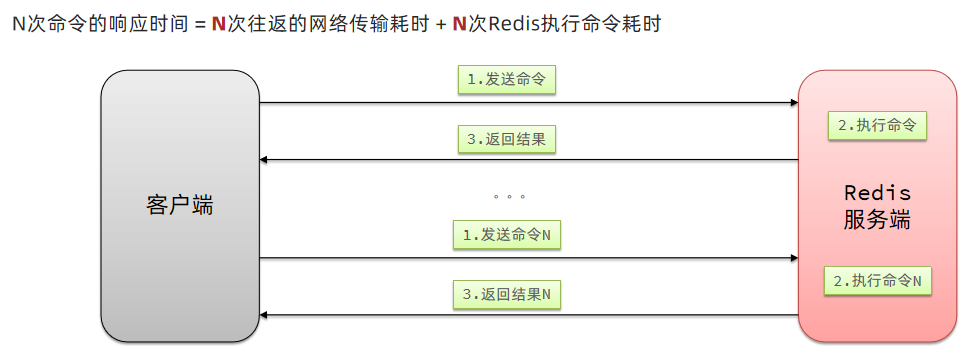
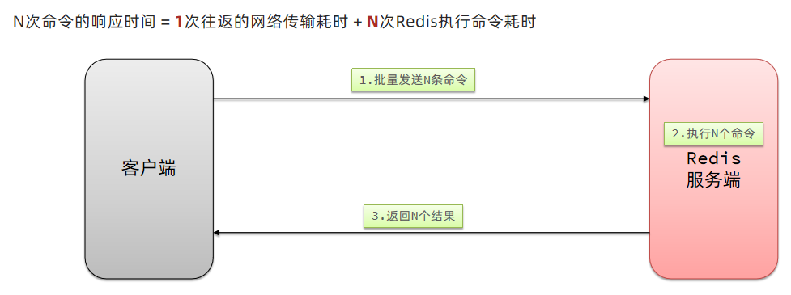

# 批处理优化

### 1、Pipeline

#### 1.1、我们的客户端与redis服务器是这样交互的

单个命令的执行流程



N条命令的执行流程



redis处理指令是很快的，主要花费的时候在于网络传输。于是乎很容易想到将多条指令批量的传输给redis



#### 1.2、MSet

Redis提供了很多Mxxx这样的命令，可以实现批量插入数据，例如：

- mset
- hmset

利用mset批量插入10万条数据

```java
public class Test {
    @Test
    void testMxx() {
        String[] arr = new String[2000];
        int j;
        long b = System.currentTimeMillis();
        for (int i = 1; i <= 100000; i++) {
            j = (i % 1000) << 1;
            arr[j] = "test:key_" + i;
            arr[j + 1] = "value_" + i;
            if (j == 0) {
                jedis.mset(arr);
            }
        }
        long e = System.currentTimeMillis();
        System.out.println("time: " + (e - b));
    }
}
```

#### 1.3、Pipeline

MSET虽然可以批处理，但是却只能操作部分数据类型，因此如果有对复杂数据类型的批处理需要，建议使用Pipeline

```java
public class Test {
    @Test
    void testPipeline() {
        // 创建管道
        Pipeline pipeline = jedis.pipelined();
        long b = System.currentTimeMillis();
        for (int i = 1; i <= 100000; i++) {
            // 放入命令到管道
            pipeline.set("test:key_" + i, "value_" + i);
            if (i % 1000 == 0) {
                // 每放入1000条命令，批量执行
                pipeline.sync();
            }
        }
        long e = System.currentTimeMillis();
        System.out.println("time: " + (e - b));
    }
}
```

### 2、集群下的批处理

如MSET或Pipeline这样的批处理需要在一次请求中携带多条命令，而此时如果Redis是一个集群，那批处理命令的多个key必须落在一个插槽中，否则就会导致执行失败。大家可以想一想这样的要求其实很难实现，因为我们在批处理时，可能一次要插入很多条数据，这些数据很有可能不会都落在相同的节点上，这就会导致报错了

这个时候，我们可以找到4种解决方案

|     | `串行命令`                  | `串行slot                                             | `并行slot`                                             | `hash_tag`                                         |
| --- | ----------------------------- | ---------------------------------------------------------- | -------------------------------------------------------- | ---------------------------------------------------- |
| 实现思路 | for循环遍历，依次执行每个命令 | 在客户端计算每个key的slot，将slot一致分为一组，每组都利用Pipeline批处理。`串行`执行各组命令 | 在客户端计算每个key的slot，将slot一致分为一组，每组都利用Pipeline批处理。`并行`执行各组命令 | 将所有key设置相同的hash_tag，则所有key的slot一定相同 |
| 耗时  | N次网络耗时 + N次命令耗时     | m次网络耗时 + N次命令耗时m = key的slot个数                   | 1次网络耗时 + N次命令耗时                                    | 1次网络耗时 + N次命令耗时                            |
| 优点  | 实现简单                      | 耗时较短                                                   | 耗时非常短                                                 | 耗时非常短、实现简单                                 |
| 缺点  | 耗时非常久                    | 实现稍复杂slot越多，耗时越久                                 | 实现复杂                                                  | 容易出现数据倾斜                                     |

第一种方案：串行执行，所以这种方式没有什么意义，当然，执行起来就很简单了，缺点就是耗时过久。

第二种方案：串行slot，简单来说，就是执行前，客户端先计算一下对应的key的slot，一样slot的key就放到一个组里边，不同的，就放到不同的组里边，然后对每个组执行pipeline的批处理，他就能串行执行各个组的命令，这种做法比第一种方法耗时要少，但是缺点呢，相对来说复杂一点，所以这种方案还需要优化一下

第三种方案：并行slot，相较于第二种方案，在分组完成后串行执行，第三种方案，就变成了并行执行各个命令，所以他的耗时就非常短，但是实现呢，也更加复杂。

第四种：hash_tag，redis计算key的slot的时候，其实是根据key的有效部分来计算的，通过这种方式就能一次处理所有的key，这种方式耗时最短，实现也简单，但是如果通过操作key的有效部分，那么就会导致所有的key都落在一个节点上，产生数据倾斜的问题，所以我们推荐使用第三种方式。

#### 2.1 串行化执行代码实践

```java
public class JedisClusterTest {

    private JedisCluster jedisCluster;

    @BeforeEach
    void setUp() {
        // 配置连接池
        JedisPoolConfig poolConfig = new JedisPoolConfig();
        poolConfig.setMaxTotal(8);
        poolConfig.setMaxIdle(8);
        poolConfig.setMinIdle(0);
        poolConfig.setMaxWaitMillis(1000);
        HashSet<HostAndPort> nodes = new HashSet<>();
        nodes.add(new HostAndPort("192.168.150.101", 7001));
        nodes.add(new HostAndPort("192.168.150.101", 7002));
        nodes.add(new HostAndPort("192.168.150.101", 7003));
        nodes.add(new HostAndPort("192.168.150.101", 8001));
        nodes.add(new HostAndPort("192.168.150.101", 8002));
        nodes.add(new HostAndPort("192.168.150.101", 8003));
        jedisCluster = new JedisCluster(nodes, poolConfig);
    }

    @Test
    void testMSet() {
        jedisCluster.mset("name", "Jack", "age", "21", "sex", "male");

    }

    @Test
    void testMSet2() {
        Map<String, String> map = new HashMap<>(3);
        map.put("name", "Jack");
        map.put("age", "21");
        map.put("sex", "Male");
        //对Map数据进行分组。根据相同的slot放在一个分组
        //key就是slot，value就是一个组
        Map<Integer, List<Map.Entry<String, String>>> result = map.entrySet()
                .stream()
                .collect(Collectors.groupingBy(
                        entry -> ClusterSlotHashUtil.calculateSlot(entry.getKey()))
                );
        //串行的去执行mset的逻辑
        for (List<Map.Entry<String, String>> list : result.values()) {
            String[] arr = new String[list.size() * 2];
            int j = 0;
            for (int i = 0; i < list.size(); i++) {
                j = i << 2;
                Map.Entry<String, String> e = list.get(0);
                arr[j] = e.getKey();
                arr[j + 1] = e.getValue();
            }
            jedisCluster.mset(arr);
        }
    }

    @AfterEach
    void tearDown() {
        if (jedisCluster != null) {
            jedisCluster.close();
        }
    }
}
```

#### 2.2 Spring集群环境下批处理代码

```java
public class Test {
    @Test
    void testMSetInCluster() {
        Map<String, String> map = new HashMap<>(3);
        map.put("name", "Rose");
        map.put("age", "21");
        map.put("sex", "Female");
        stringRedisTemplate.opsForValue().multiSet(map);

        List<String> strings = stringRedisTemplate.opsForValue().multiGet(Arrays.asList("name", "age", "sex"));
        strings.forEach(System.out::println);
    }
}
```

`原理分析`

在RedisAdvancedClusterAsyncCommandsImpl 类中

首先根据slotHash算出来一个partitioned的map，map中的key就是slot，而他的value就是对应的对应相同slot的key对应的数据

通过 RedisFuture<String> mset = super.mset(op);进行异步的消息发送

```Java
public class Test {
    @Override
    public RedisFuture<String> mset(Map<K, V> map) {

        Map<Integer, List<K>> partitioned = SlotHash.partition(codec, map.keySet());

        if (partitioned.size() < 2) {
            return super.mset(map);
        }

        Map<Integer, RedisFuture<String>> executions = new HashMap<>();

        for (Map.Entry<Integer, List<K>> entry : partitioned.entrySet()) {

            Map<K, V> op = new HashMap<>();
            entry.getValue().forEach(k -> op.put(k, map.get(k)));

            RedisFuture<String> mset = super.mset(op);
            executions.put(entry.getKey(), mset);
        }

        return MultiNodeExecution.firstOfAsync(executions);
    }
}
```
