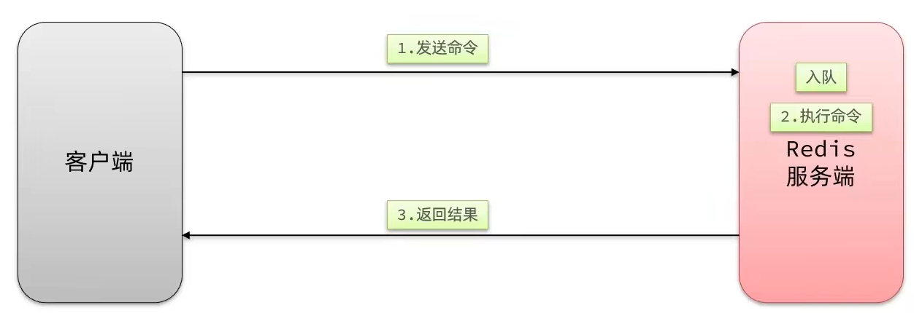
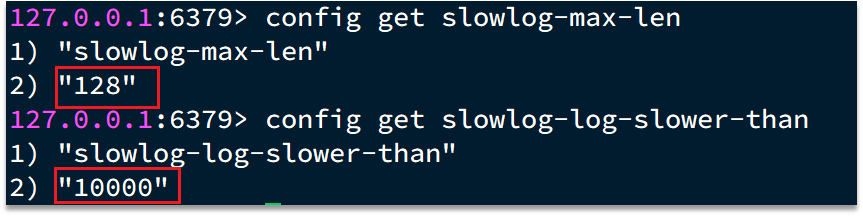
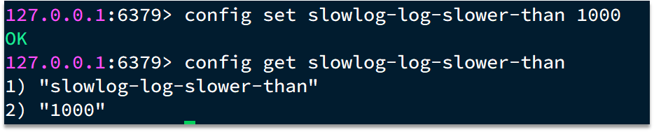
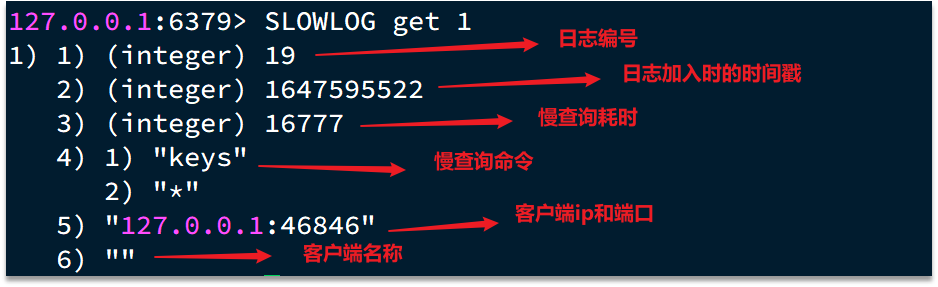
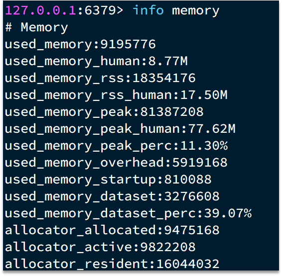
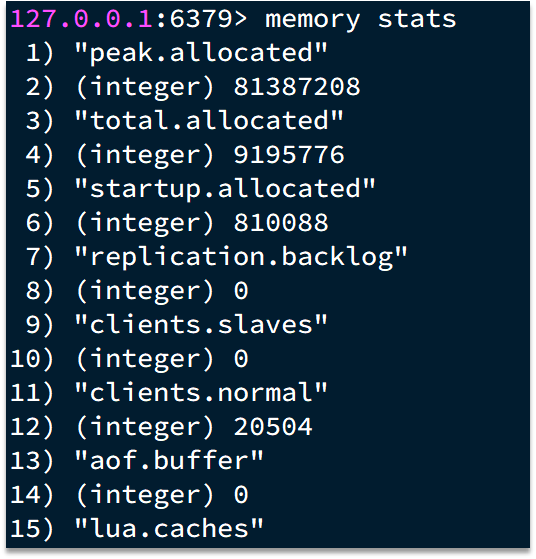
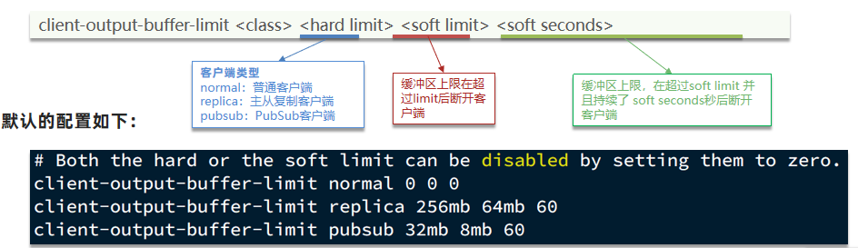

### 1、服务器端优化-持久化配置

Redis的持久化虽然可以保证数据安全，但也会带来很多额外的开销，因此持久化请遵循下列建议：

* 用来做缓存的Redis实例尽量不要开启持久化功能
* 建议关闭RDB持久化功能，使用AOF持久化
* 利用脚本定期在slave节点做RDB，实现数据备份
* 设置合理的rewrite阈值，避免频繁的bgrewrite
* 配置no-appendfsync-on-rewrite = yes，禁止在rewrite期间做aof，避免因AOF引起的阻塞
* 部署有关建议：
    * Redis实例的物理机要预留足够内存，应对fork和rewrite
    * 单个Redis实例内存上限不要太大，例如4G或8G。可以加快fork的速度、减少主从同步、数据迁移压力
    * 不要与CPU密集型应用部署在一起
    * 不要与高硬盘负载应用一起部署。例如：数据库、消息队列

### 2、服务器端优化-慢查询优化

#### 2.1 什么是慢查询

并不是很慢的查询才是慢查询，而是：在Redis执行时耗时超过某个阈值的命令，称为慢查询。

慢查询的危害：由于Redis是单线程的，所以当客户端发出指令后，他们都会进入到redis底层的queue来执行，如果此时有一些慢查询的数据，就会导致大量请求阻塞，从而引起报错，所以我们需要解决慢查询问题。

慢查询的阈值可以通过配置指定：

slowlog-log-slower-than：慢查询阈值，单位是微秒。默认是10000，建议1000

慢查询会被放入慢查询日志中，日志的长度有上限，可以通过配置指定：

slowlog-max-len：慢查询日志（本质是一个队列）的长度。默认是128，建议1000

修改这两个配置可以使用：config set命令：

#### 2.2 如何查看慢查询

知道了以上内容之后，那么咱们如何去查看慢查询日志列表呢：

* slowlog len：查询慢查询日志长度
* slowlog get [n]：读取n条慢查询日志
* slowlog reset：清空慢查询列表

### 3、服务器端优化-命令及安全配置

安全可以说是服务器端一个非常重要的话题，如果安全出现了问题，那么一旦这个漏洞被一些坏人知道了之后，并且进行攻击，那么这就会给咱们的系统带来很多的损失，所以我们这节课就来解决这个问题。

Redis会绑定在0.0.0.0:6379，这样将会将Redis服务暴露到公网上，而Redis如果没有做身份认证，会出现严重的安全漏洞.
漏洞重现方式：https://cloud.tencent.com/developer/article/1039000

为什么会出现不需要密码也能够登录呢，主要是Redis考虑到每次登录都比较麻烦，所以Redis就有一种ssh免秘钥登录的方式，生成一对公钥和私钥，私钥放在本地，公钥放在redis端，当我们登录时服务器，再登录时候，他会去解析公钥和私钥，如果没有问题，则不需要利用redis的登录也能访问，这种做法本身也很常见，但是这里有一个前提，前提就是公钥必须保存在服务器上，才行，但是Redis的漏洞在于在不登录的情况下，也能把秘钥送到Linux服务器，从而产生漏洞

漏洞出现的核心的原因有以下几点：

* Redis未设置密码
* 利用了Redis的config set命令动态修改Redis配置
* 使用了Root账号权限启动Redis

所以：如何解决呢？我们可以采用如下几种方案

为了避免这样的漏洞，这里给出一些建议：

* Redis一定要设置密码
* 禁止线上使用下面命令：keys、flushall、flushdb、config set等命令。可以利用rename-command禁用。
* bind：限制网卡，禁止外网网卡访问
* 开启防火墙
* 不要使用Root账户启动Redis
* 尽量不是有默认的端口

### 4、服务器端优化-Redis内存划分和内存配置

当Redis内存不足时，可能导致Key频繁被删除、响应时间变长、QPS不稳定等问题。当内存使用率达到90%以上时就需要我们警惕，并快速定位到内存占用的原因。

`有关碎片问题分析`

Redis底层分配并不是这个key有多大，他就会分配多大，而是有他自己的分配策略，比如8,16,20等等，假定当前key只需要10个字节，此时分配8肯定不够，那么他就会分配16个字节，多出来的6个字节就不能被使用，这就是我们常说的 碎片问题

`进程内存问题分析：`

这片内存，通常我们都可以忽略不计

`缓冲区内存问题分析：`

一般包括客户端缓冲区、AOF缓冲区、复制缓冲区等。客户端缓冲区又包括输入缓冲区和输出缓冲区两种。这部分内存占用波动较大，所以这片内存也是我们需要重点分析的内存问题。

| `内存占用` | `说明`                                                     |
| ------------ | ------------------------------------------------------------ |
| 数据内存     | 是Redis最主要的部分，存储Redis的键值信息。主要问题是BigKey问题、内存碎片问题 |
| 进程内存     | Redis主进程本身运⾏肯定需要占⽤内存，如代码、常量池等等；这部分内存⼤约⼏兆，在⼤多数⽣产环境中与Redis数据占⽤的内存相⽐可以忽略。 |
| 缓冲区内存   | 一般包括客户端缓冲区、AOF缓冲区、复制缓冲区等。客户端缓冲区又包括输入缓冲区和输出缓冲区两种。这部分内存占用波动较大，不当使用BigKey，可能导致内存溢出。 |

于是我们就需要通过一些命令，可以查看到Redis目前的内存分配状态：

* info memory：查看内存分配的情况

* memory xxx：查看key的主要占用情况

接下来我们看到了这些配置，最关键的缓存区内存如何定位和解决呢？

内存缓冲区常见的有三种：

* 复制缓冲区：主从复制的repl_backlog_buf，如果太小可能导致频繁的全量复制，影响性能。通过replbacklog-size来设置，默认1mb
* AOF缓冲区：AOF刷盘之前的缓存区域，AOF执行rewrite的缓冲区。无法设置容量上限
* 客户端缓冲区：分为输入缓冲区和输出缓冲区，输入缓冲区最大1G且不能设置。输出缓冲区可以设置

以上复制缓冲区和AOF缓冲区 不会有问题，最关键就是客户端缓冲区的问题

客户端缓冲区：指的就是我们发送命令时，客户端用来缓存命令的一个缓冲区，也就是我们向redis输入数据的输入端缓冲区和redis向客户端返回数据的响应缓存区，输入缓冲区最大1G且不能设置，所以这一块我们根本不用担心，如果超过了这个空间，redis会直接断开，因为本来此时此刻就代表着redis处理不过来了，我们需要担心的就是输出端缓冲区

我们在使用redis过程中，处理大量的big value，那么会导致我们的输出结果过多，如果输出缓存区过大，会导致redis直接断开，而默认配置的情况下，
其实他是没有大小的，这就比较坑了，内存可能一下子被占满，会直接导致咱们的redis断开，所以解决方案有两个

1、设置一个大小
2、增加我们带宽的大小，避免我们出现大量数据从而直接超过了redis的承受能力

