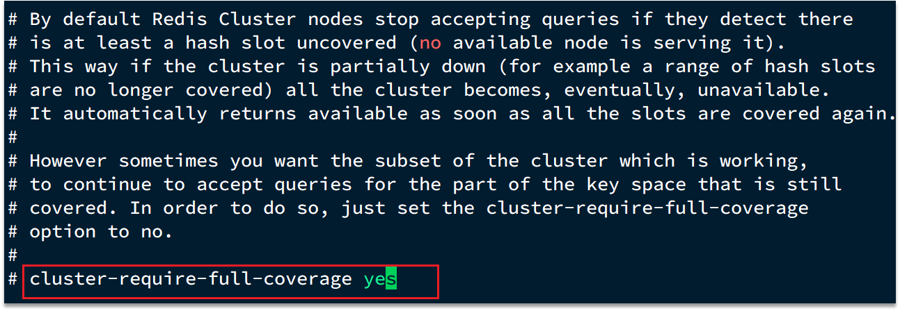

# 服务器端集群优化-集群还是主从

集群虽然具备高可用特性，能实现自动故障恢复，但是如果使用不当，也会存在一些问题：

* 集群完整性问题
* 集群带宽问题
* 数据倾斜问题
* 客户端性能问题
* 命令的集群兼容性问题
* lua和事务问题

### 问题1、在Redis的默认配置中，如果发现任意一个插槽不可用，则整个集群都会停止对外服务：

大家可以设想一下，如果有几个slot不能使用，那么此时整个集群都不能用了，我们在开发中，其实最重要的是可用性，所以需要把如下配置修改成no，即有slot不能使用时，我们的redis集群还是可以对外提供服务

### 问题2、集群带宽问题

集群节点之间会不断的互相Ping来确定集群中其它节点的状态。每次Ping携带的信息至少包括：

* 插槽信息
* 集群状态信息

集群中节点越多，集群状态信息数据量也越大，10个节点的相关信息可能达到1kb，此时每次集群互通需要的带宽会非常高，这样会导致集群中大量的带宽都会被ping信息所占用，这是一个非常可怕的问题，所以我们需要去解决这样的问题

解决途径：

* 避免大集群，集群节点数不要太多，最好少于1000，如果业务庞大，则建立多个集群。
* 避免在单个物理机中运行太多Redis实例
* 配置合适的cluster-node-timeout值

### 问题3、命令的集群兼容性问题

当我们使用批处理的命令时，redis要求我们的key必须落在相同的slot上，然后大量的key同时操作时，是无法完成的，
所以客户端必须要对这样的数据进行处理。

### 问题4、lua和事务的问题

lua和事务都是要保证原子性问题，如果你的key不在一个节点，那么是无法保证lua的执行和事务的特性的，所以在集群模式是没有办法执行lua和事务的

那我们到底是集群还是主从？

单体Redis（主从Redis）已经能达到万级别的QPS，并且也具备很强的高可用特性。如果主从能满足业务需求的情况下，所以如果不是在万不得已的情况下，尽量不搭建Redis集群
