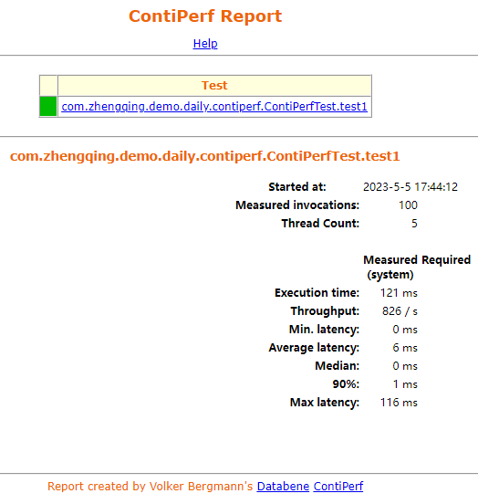

# ContiPerf - 压测工具

一个轻量级的测试工具，基于JUnit 4 开发。
可以指定在线程数量和执行次数，通过限制最大时间和平均执行时间来进行性能测试，并且可以生成report，帮助做性能分析。

### 一、SpringBoot中使用

```xml
<!-- 性能测试 -->
<dependency>
    <groupId>org.databene</groupId>
    <artifactId>contiperf</artifactId>
    <version>2.3.4</version>
    <scope>test</scope>
</dependency>
```

```java
package com.zhengqing.demo.daily.contiperf;

import cn.hutool.core.date.DateUtil;
import com.zhengqing.demo.util.HttpUtil;
import lombok.extern.slf4j.Slf4j;
import org.databene.contiperf.PerfTest;
import org.databene.contiperf.junit.ContiPerfRule;
import org.junit.Rule;
import org.junit.Test;

/**
 * <p> springboot压力测试 </p>
 *
 * @author zhengqingya
 * @description
 * @date 2022/4/13 17:27
 */
@Slf4j
public class ContiPerfTest {

    @Rule
    public ContiPerfRule i = new ContiPerfRule();


    /**
     * `@PerfTest @Required` 可以加在类上面，表示所有方法的默认配置
     *
     * @PerfTest 指定调用次/线程数
     * invocations：执行次数n，与线程数量无关，默认值为1
     * threads：线程池数量n，并发执行n个线程
     * duration：重复地执行时间n，测试至少执行n毫秒
     * @Required 指定每次执行的最长时间/平均时间/总时间
     * throughput：吞吐要求n，要求每秒至少执行n个测试
     * average：平均执行时间n，要求平均执行时间不超过n毫秒
     * max：最大执行时间n，要求最大的执行时间不超过n毫秒
     * totalTime：总执行时间n，要求总的执行时间不超过n毫秒
     * median：50%平均执行时间n，要求所有执行的50%测试平均执行时间不超过n毫秒
     * percentile90：90%平均执行时间n，要求所有执行的90%测试平均执行时间不超过n毫秒
     * percentile95：95%平均执行时间n，要求所有执行的95%测试平均执行时间不超过n毫秒
     * percentile99：99%平均执行时间n，要求所有执行的99%测试平均执行时间不超过n毫秒
     * percentiles：表达式"a:n,b:m"，要求a%的测试不超过n毫秒，b%的测试不超过m毫秒
     * <p>
     * 在测完之后，在本地的target下生成`contiperf-report`目录，里面有个index.html文件，即为测试结果。
     */
    @Test
    @PerfTest(invocations = 10, threads = 5
//            , duration = 1000 * 5  // 持续 5 秒
    )
//    @Required(max = 1200, average = 250)
    public void test1() throws Exception {
//        TimeUnit.SECONDS.sleep(1);
        log.info("time: {}", DateUtil.now());
        String url = "http://127.0.0.1:80/api/test/contiperf?key=666";
        String result = HttpUtil.getUrl(url);
        log.info("result: {}", result);
    }

}
```

### 二、报告查看

`target/contiperf-report/index.html`



指标说明：

| 指标                | 说明       |
|-------------------|----------|
| Execution time    | 执行总时间    |
| Total invocations | 总请求数     |
| Throughput        | 每秒效率 TPS |
| Min. latency      | 最短响应时间   |
| Average latency   | 平均响应时间   |
| Median            | TP50响应时间 |
| 90%               | TP90响应时间 |
| Max latency       | 最长响应时间   |

### 三、其它：也可以在测试完后控制台直接输出tps结果方便查看

```
<!-- WebMagic：爬虫 -->
<dependency>
    <groupId>us.codecraft</groupId>
    <artifactId>webmagic-core</artifactId>
    <version>0.7.3</version>
    <exclusions>
        <exclusion>
            <artifactId>slf4j-reload4j</artifactId>
            <groupId>org.slf4j</groupId>
        </exclusion>
        <exclusion>
            <artifactId>slf4j-log4j12</artifactId>
            <groupId>org.slf4j</groupId>
        </exclusion>
    </exclusions>
</dependency>
<dependency>
    <groupId>us.codecraft</groupId>
    <artifactId>webmagic-extension</artifactId>
    <version>0.7.3</version>
</dependency>
```

```java
package com.zhengqing.demo.daily.contiperf;

import ch.qos.logback.classic.Level;
import cn.hutool.core.date.DateUtil;
import cn.hutool.core.io.FileUtil;
import com.zhengqing.demo.util.HttpUtil;
import com.zhengqing.demo.util.LogLevelUtil;
import lombok.extern.slf4j.Slf4j;
import org.databene.contiperf.PerfTest;
import org.databene.contiperf.junit.ContiPerfRule;
import org.junit.AfterClass;
import org.junit.BeforeClass;
import org.junit.Rule;
import org.junit.Test;
import us.codecraft.webmagic.selector.Html;

@Slf4j
public class SeckillTest {

    @Rule
    public ContiPerfRule i = new ContiPerfRule();
    static long START_TIME;

    @Test
    @PerfTest(invocations = 2000, threads = 2000
//            , duration = 1000 * 5  // 持续?秒
    )
    public void test() throws Exception {
        LogLevelUtil.update("com.zhengqing.demo", Level.ERROR);
        String url = "http://127.0.0.1:888/api/test/seckill/01";
        HttpUtil.getUrl(url);
    }

    @BeforeClass
    public static void beforeClass() {
        System.out.println("开始时间： " + DateUtil.now());
        START_TIME = System.currentTimeMillis();
    }

    @AfterClass
    public static void afterClass() {
        System.out.println("结束时间： " + DateUtil.now());
        System.out.println(String.format("耗时为: %s毫秒", (System.currentTimeMillis() - START_TIME)));
//        ReportContext reportContext = new ContiPerfRule().getContext();
//        reportContext.getReportModules().add(new ConsoleReportModule());
//        System.out.println(reportContext.getReportFolder().toString());
        getTps();
    }

    public static void getTps() {
        String contiperfReport = FileUtil.readString("D:\\zhengqingya\\code\\demo-everyday\\target\\contiperf-report\\index.html", "UTF-8");
        Html html = new Html(contiperfReport);
        String tps = html.xpath("/html/body/center/table[2]/tbody/tr/td[2]/table/tbody/tr[7]/td[1]").toString();
        System.err.println("tps:   " + tps);
    }

}
```
