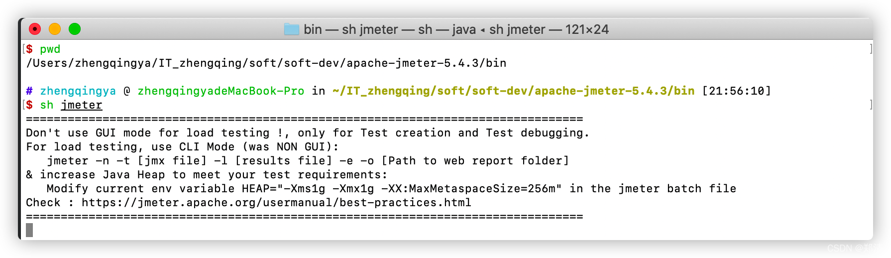
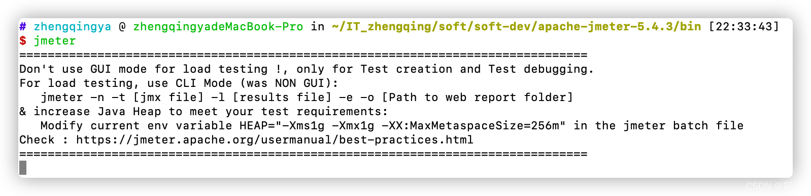

### 一、安装

#### 1、JDK8

下载 [https://www.oracle.com/java/technologies/javase-downloads.html](https://www.oracle.com/java/technologies/javase-downloads.html)

```shell
# 配置环境变量
open ~/.bash_profile


############################## ↓↓↓↓↓↓ set java environment ↓↓↓↓↓↓ #############################
JAVA_HOME=/Library/Java/JavaVirtualMachines/jdk1.8.0_271.jdk/Contents/Home
CLASSPATH=.:$JAVA_HOME/lib/dt.jar:$JAVA_HOME/lib/tools.jar:$JAVA_HOME/jre/lib/rt.jar
PATH=$PATH:$JAVA_HOME/bin
export JAVA_HOME CLASSPATH PATH
###############################################################################################

# 使配置生效
source ~/.bash_profile

# 验证
java
javac
java -version
```

#### 2、JMeter

下载 [https://jmeter.apache.org/download_jmeter.cgi](https://jmeter.apache.org/download_jmeter.cgi)


运行

```shell
cd apache-jmeter-5.4.3/bin
sh jmeter
```



### 二、配置环境变量快捷启动jmeter

```shell
# 配置环境变量
open ~/.bash_profile


############################## ↓↓↓↓↓↓ set jmeter environment ↓↓↓↓↓↓ #############################
JMETER_HOME=/zhengqingya/soft/soft-dev/apache-jmeter-5.4.3
CLASSPATH=.:$JMETER_HOME/lib/ext/ApacheJMeter_core.jar:$JMETER_HOME/lib/jorphan.jar
PATH=$PATH:$JMETER_HOME/bin
export JMETER_HOME CLASSPATH PATH
###############################################################################################


# 使配置生效
source ~/.bash_profile

# 验证 => 在任意地方执行jmeter即可运行程序
jmeter
```



