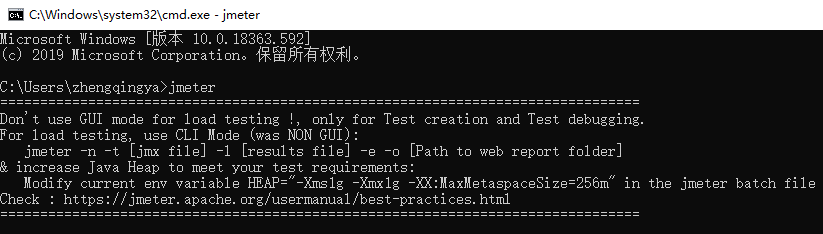

# JMeter 安装

下载 [https://jmeter.apache.org/download_jmeter.cgi](https://jmeter.apache.org/download_jmeter.cgi)

> ex: `apache-jmeter-5.5.zip`

双击运行`jmeter.bat`


### 配置环境变量快捷启动jmeter

> `此电脑` -> `属性` -> `高级系统设置` -> `环境变量`

```
# 新建系统环境变量
JMETER_HOME -> D:\zhengqingya\soft\soft-dev\apache-jmeter-5.5

# 编辑PATH环境变量，新增
%JMETER_HOME%\bin
```

cmd运行`jmeter`


