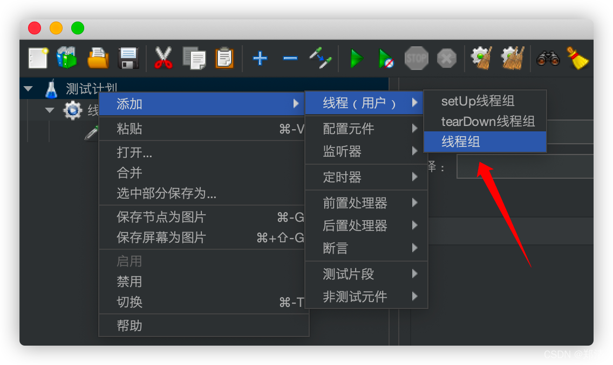
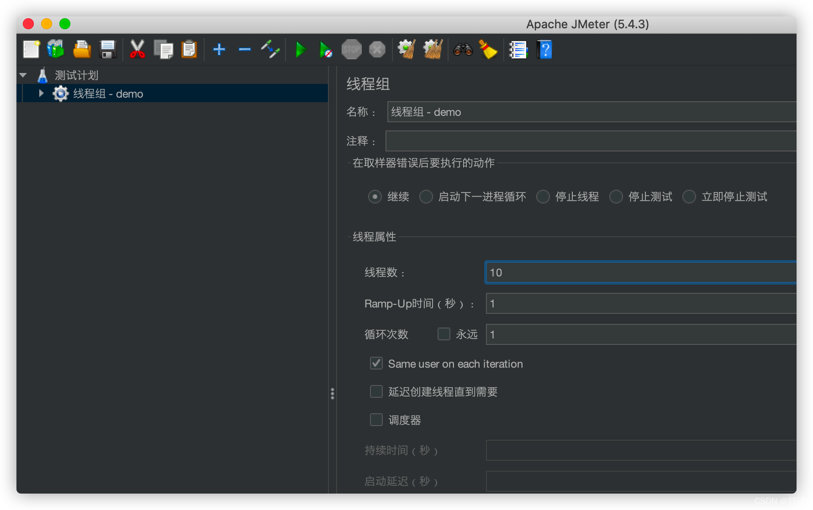
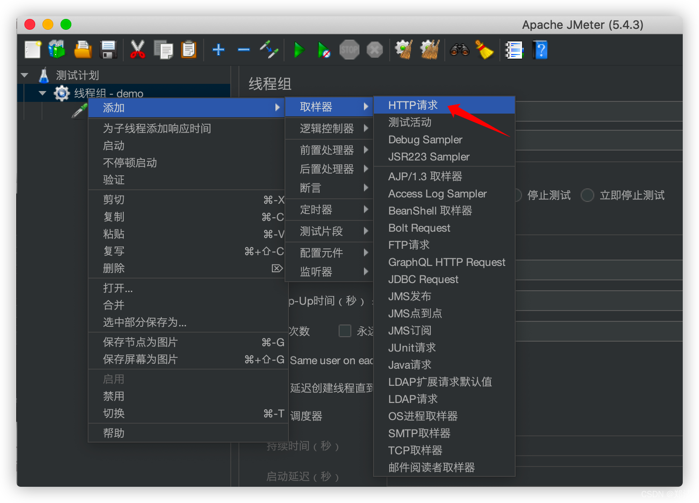
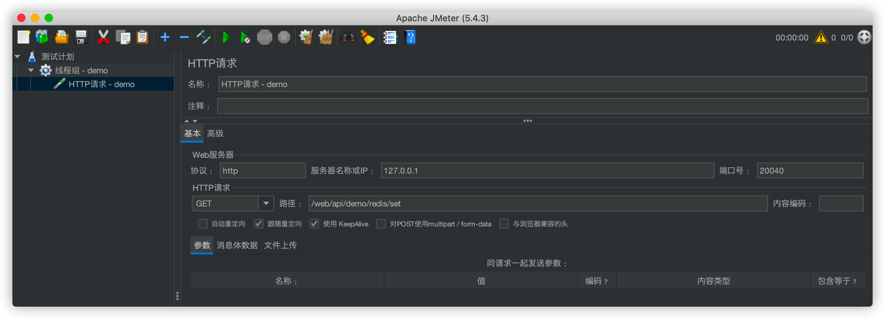
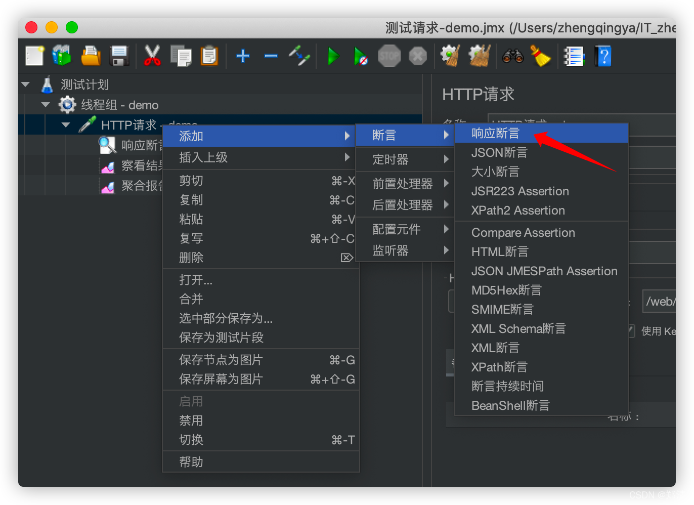
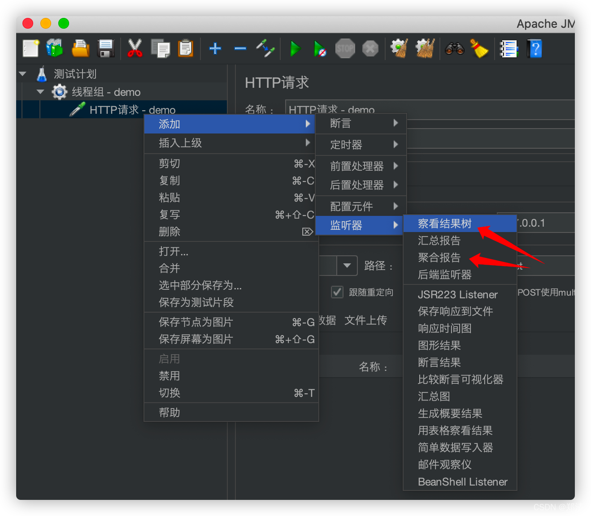
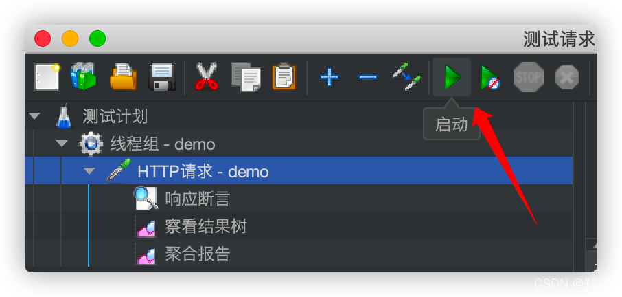
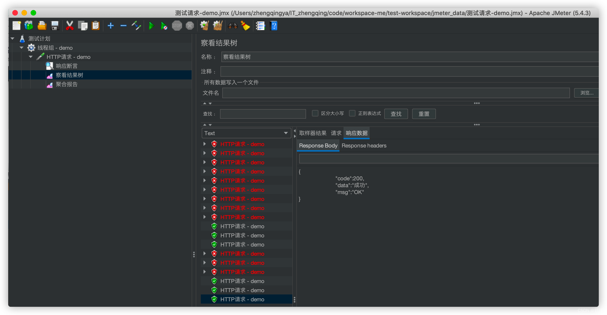
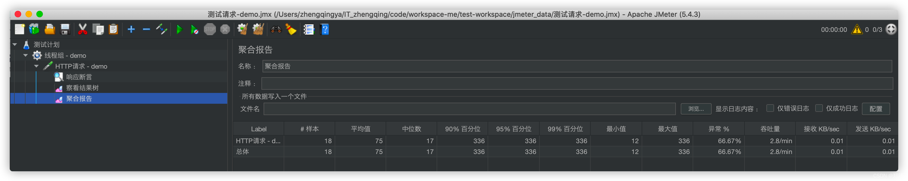

# 简单测试

> 测试https请求，1秒并发请求10次

#### 1、右击`测试计划` -> `添加` -> `线程(用户)` -> `线程组`

#### 2、右击`线程组` -> `添加` -> `取样器` -> `HTTP请求`

#### 3、右击`HTTP请求` -> `添加` -> `断言` -> `响应断言`

> tips: 即对响应码作判断，如果响应码code等于200标识这次请求正常，否则算异常

#### 4、右击`HTTP请求` -> `添加` -> `监听器` -> `察看结果树`/`聚合报告`

#### 5、运行

> tips: 运行的时候会让保存测试文件
> 

