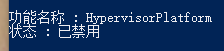
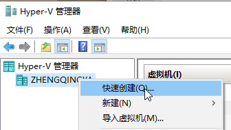
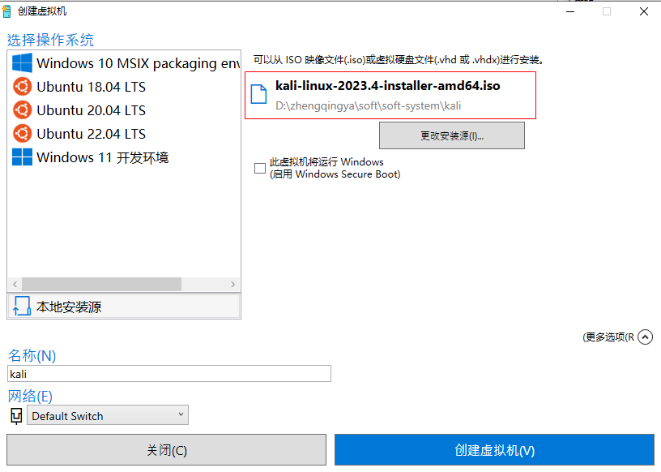
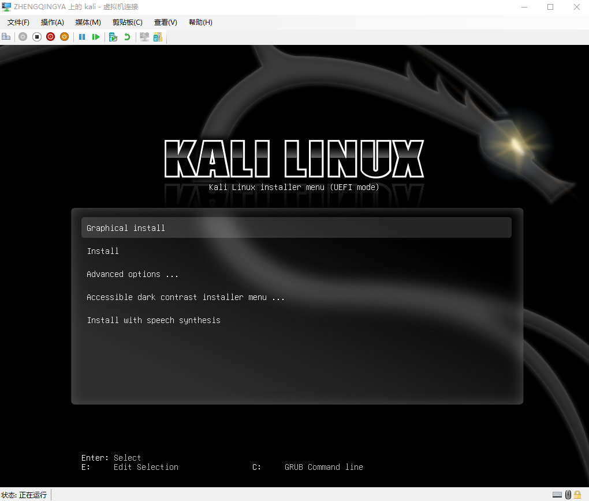
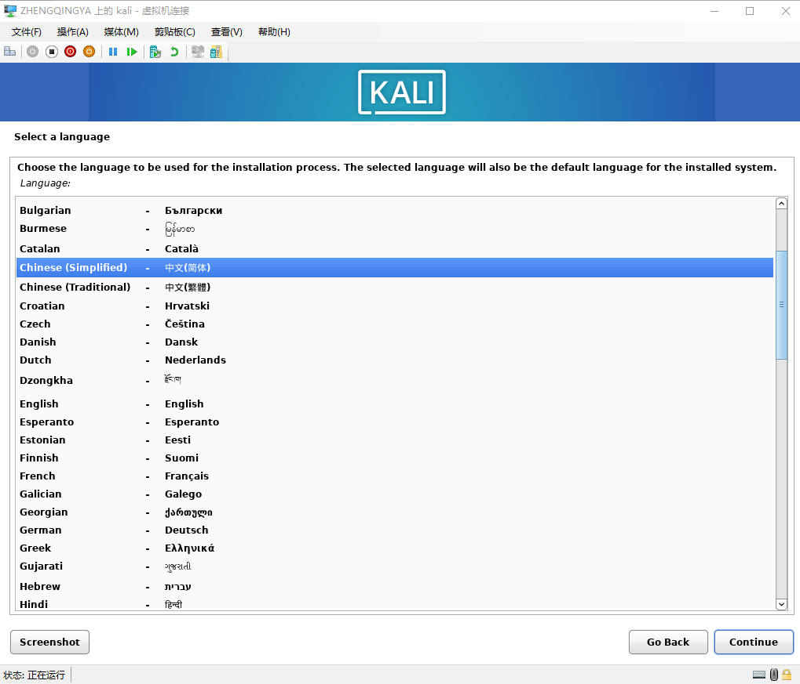
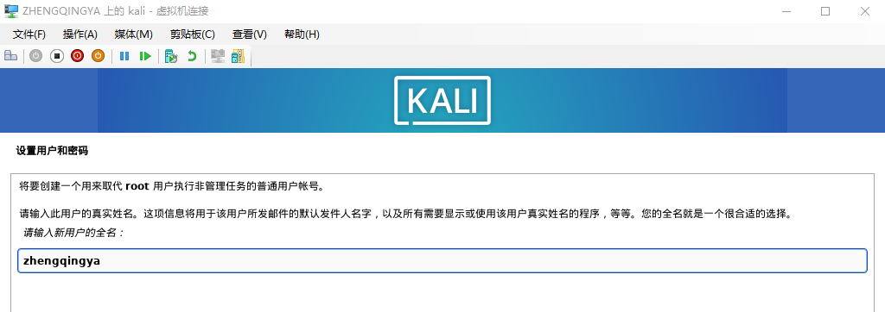
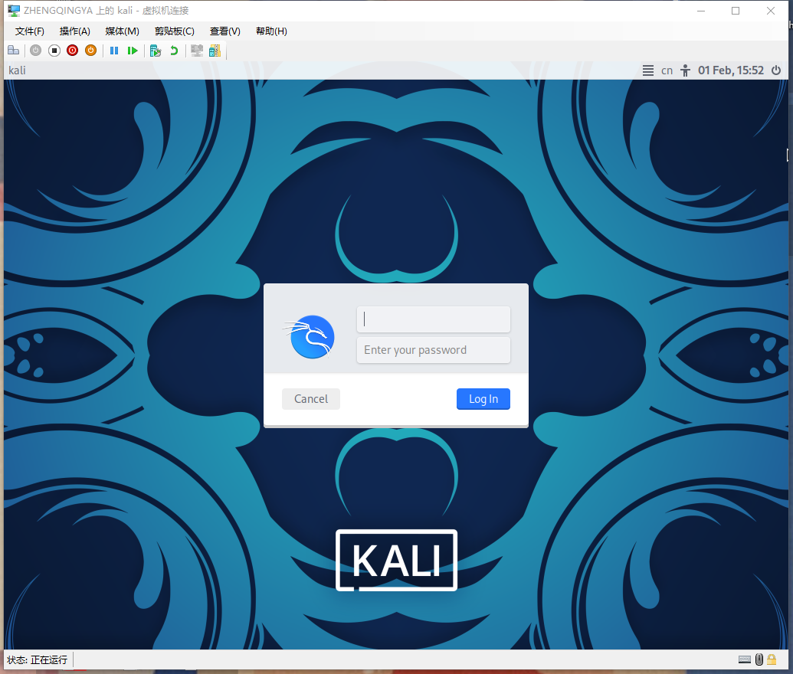
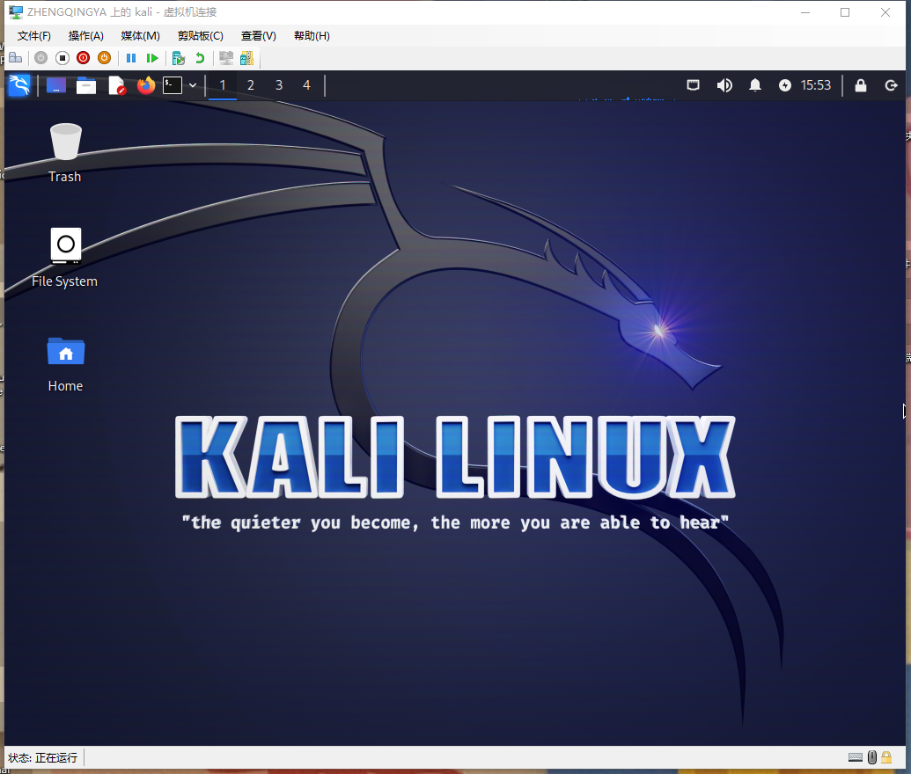
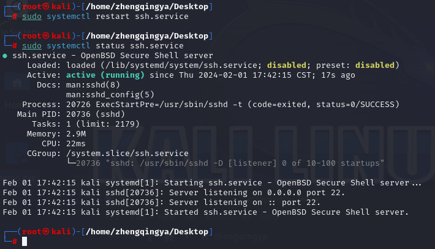
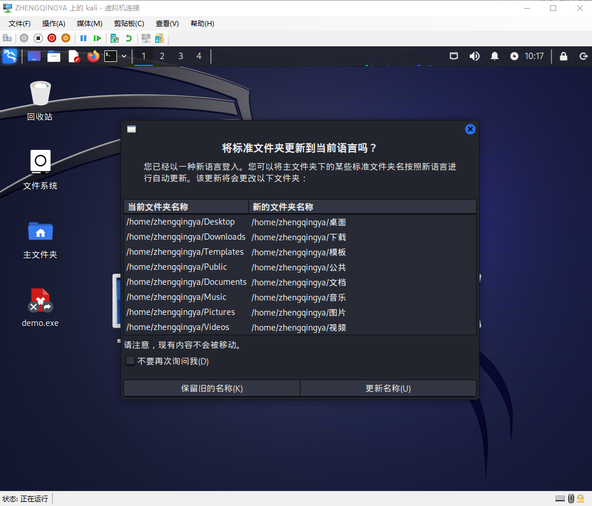

# Kali

https://www.kali.org/

### 一、安装

#### 方式一：虚拟机

下载虚拟机版本 https://www.kali.org/get-kali/#kali-virtual-machines


> tips: 个人实践后，`Hyper-V`和`VMware`方式安装都失败了... 于是最后使用iso镜像方式安装

##### `VMware`


双击`kali-linux-2023.4-vmware-amd64.vmx`


运行


###### 问题

https://kb.vmware.com/s/article/76918?lang=zh_cn


`Hyper-V`和`VMware`无法共存...

###### 解决

网上有说这种方式可以解决，但测试无效...

```shell
# 查看服务状态
Dism /online /Get-Features
# 开启
Enable-WindowsOptionalFeature -Online -FeatureName HypervisorPlatform -All
# 禁用
Disable-WindowsOptionalFeature -Online -FeatureName HypervisorPlatform
```





---

#### 方式二：`Hyper-V` + `iso` 镜像

通过`kali-linux-2023.4-installer-amd64.iso`镜像安装


> tips：如果官网下载不了，可使用阿里云镜像源下载 https://mirrors.aliyun.com/kali-images/current/

打开 Hyper-V 管理器


快速创建虚拟机



启动&连接




设置账号密码


之后的一些配置默认或根据自己的情况设置即可

安装完成后，登录



### 二、配置

#### 配置ssh远程连接

```shell
sudo vim /etc/ssh/sshd_config
# 修改下面2个参数
permitRootLogin yes
pubkeyAuthentication yes

# 重启
sudo systemctl restart ssh
# 查询服务状态
sudo systemctl status ssh
# 开机自启动 -- 保证系统重启之后还可以远程连接
systemctl enable ssh
```




然后就可以远程连接了

```shell
ssh zhengqingya@192.168.137.194
```

#### 中文

```shell
sudo su
sudo dpkg-reconfigure locales
```

`zh_CN.UTF-8 UTF-8`

`zh_CN.UTF-8`


重启

```shell
reboot
```

然后就看见系统变成中文了...


