# 苹果个人开发者账号申请

注册苹果账号 & 打开苹果开发者中心登录账号： https://developer.apple.com/account
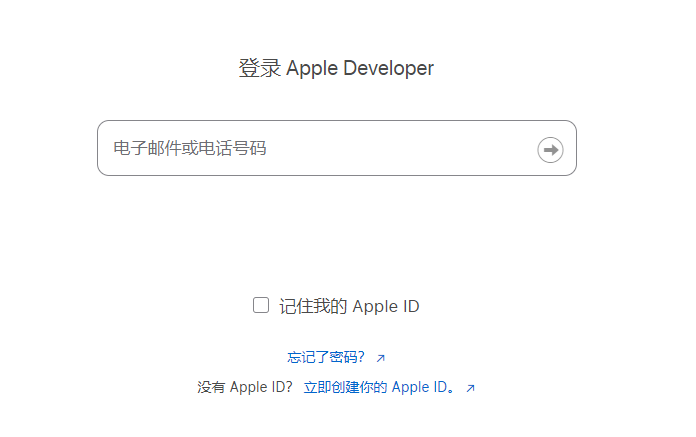
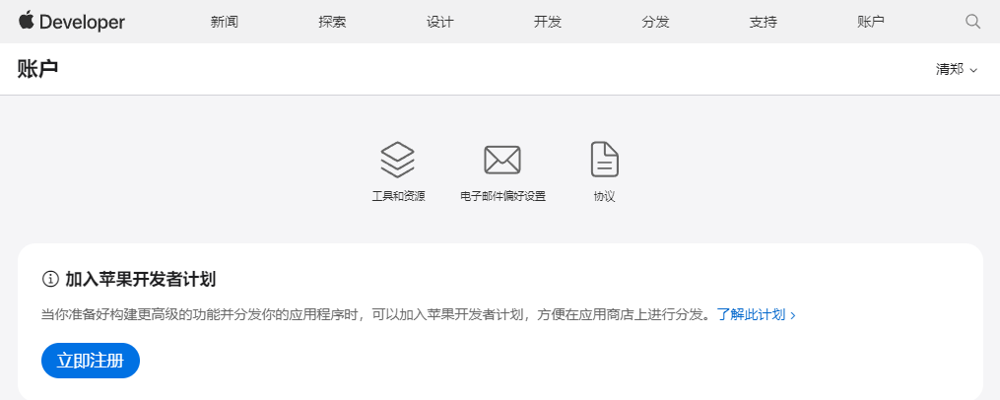

在iPhone、iPad 或 Mac 上打开苹果开发者App（`Apple Developer`） -> `账户` -> `登陆` 
然后在`账户`中点击`立即注册`，填写相关信息即可
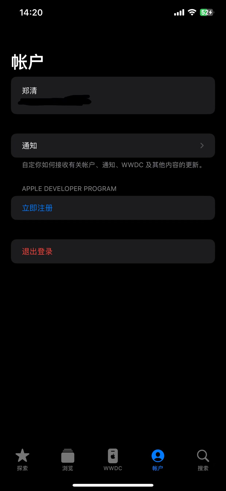
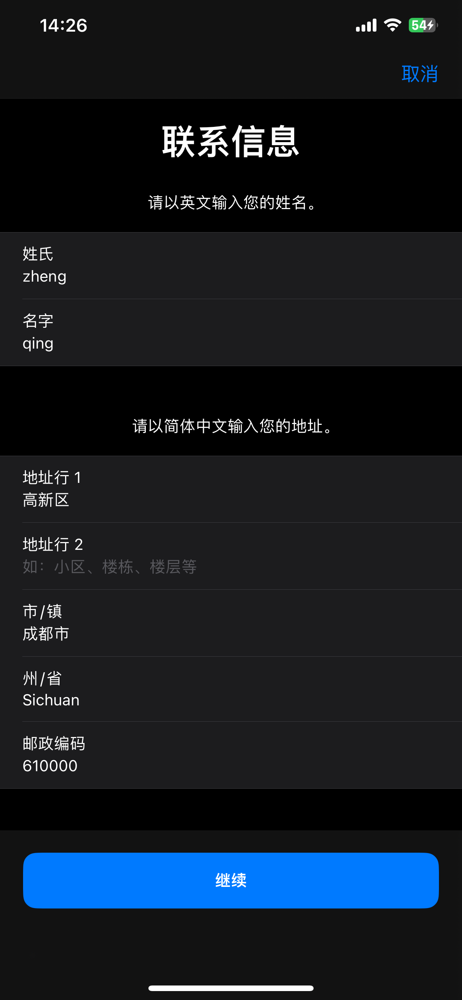
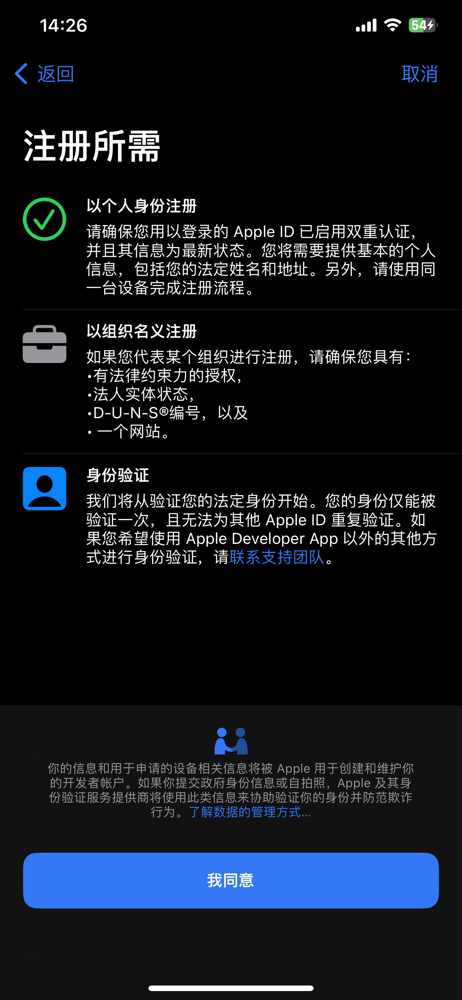
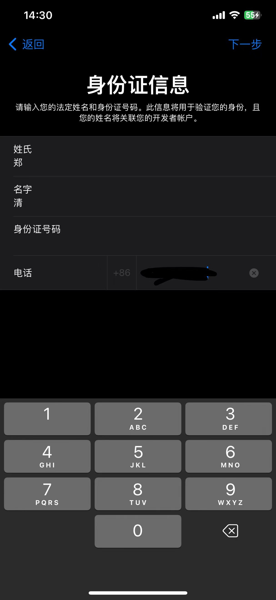
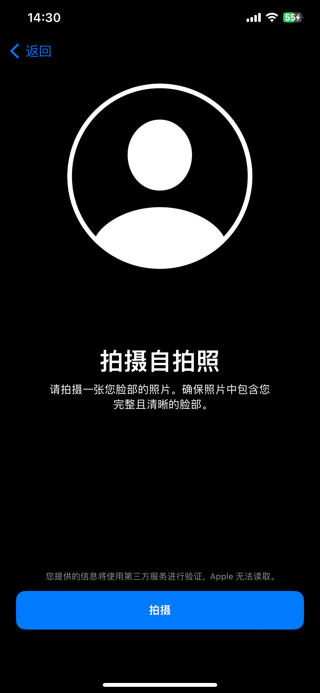
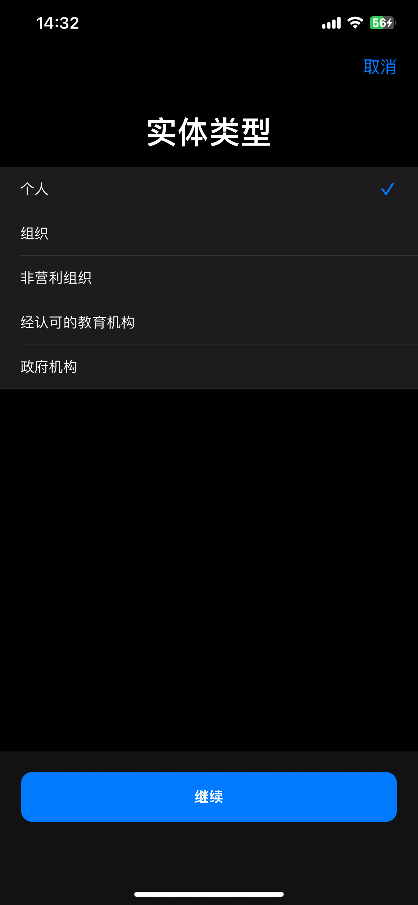
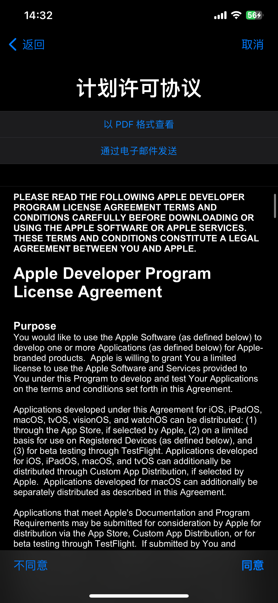
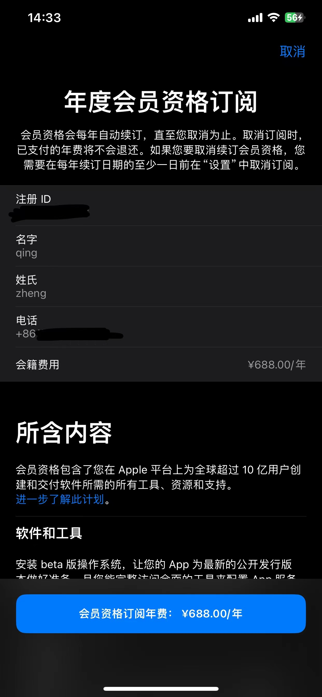
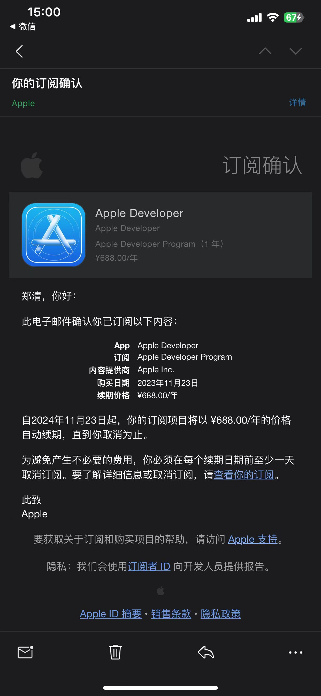
如果不需要续费，可以取消订阅
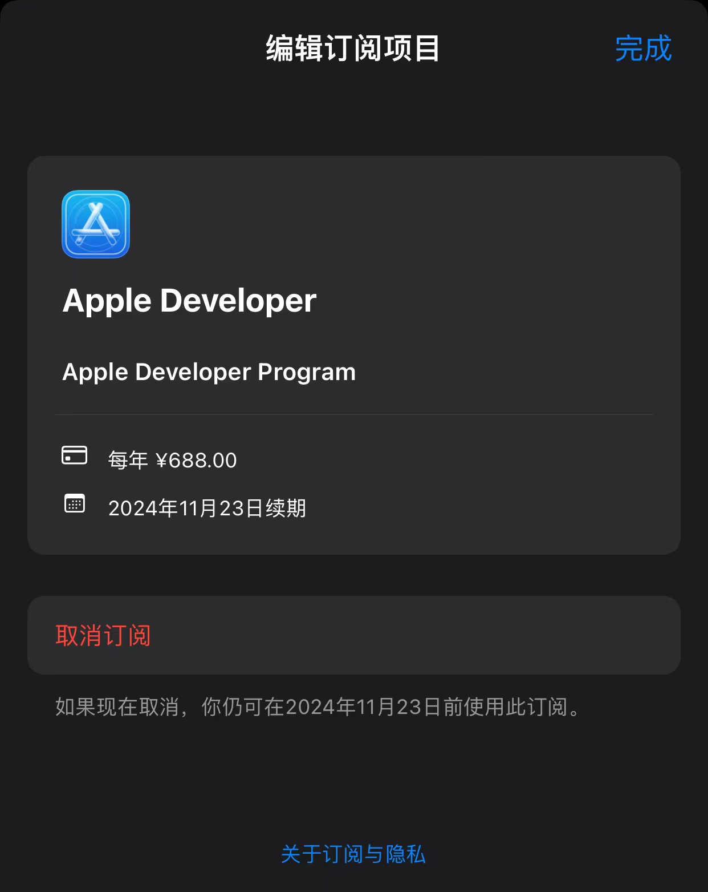
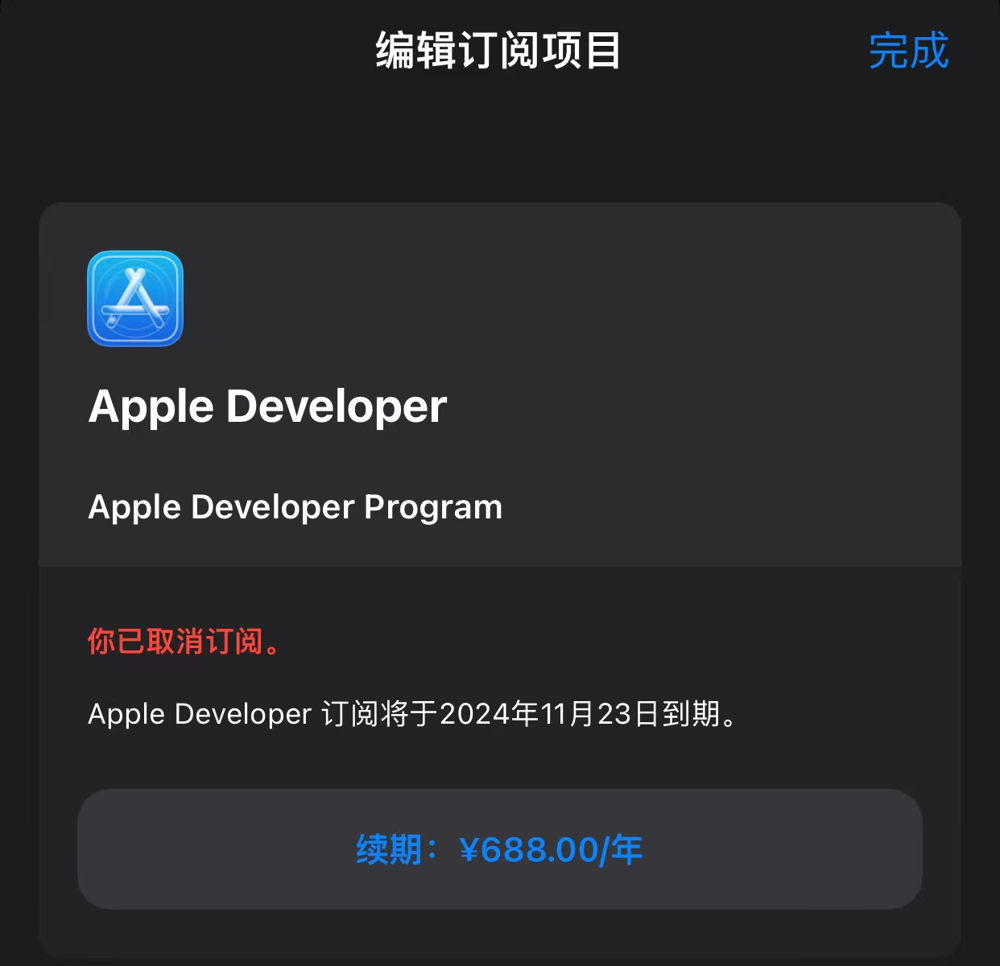

付款成功后，需要等到48小时，然后再去后台看下

> https://developer.apple.com/account

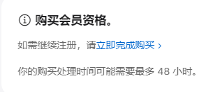

成功后会发邮件通知
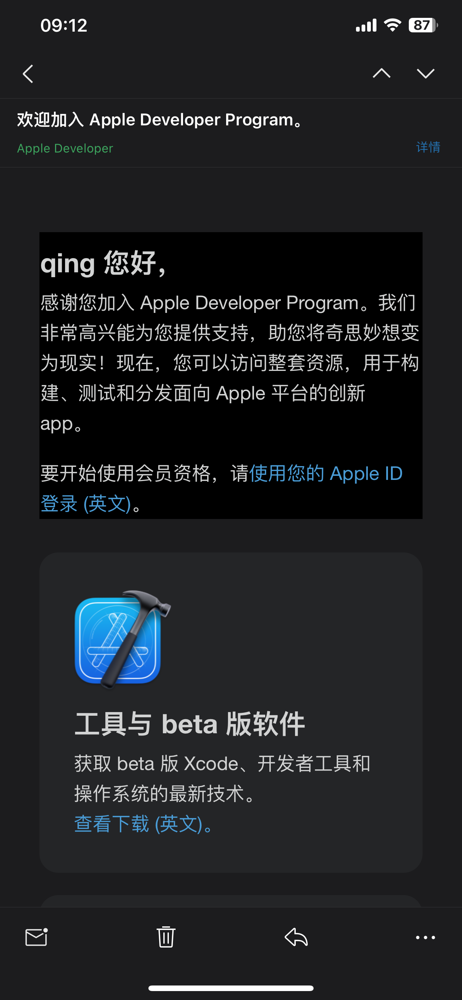
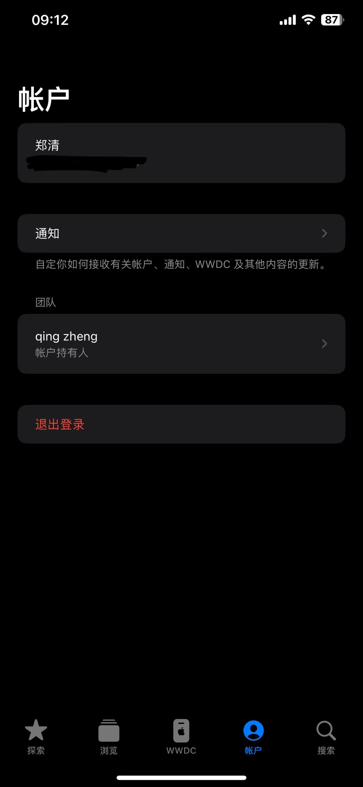

最后就可以使用了。