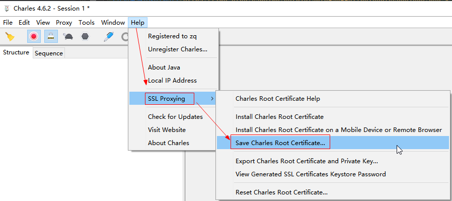

@[TOC](文章目录)

### 一、前言

1.

Charles请求转发可参考 [https://zhengqing.blog.csdn.net/article/details/111597213](https://zhengqing.blog.csdn.net/article/details/111597213)

2. Charles下载地址 [https://www.charlesproxy.com/download](https://www.charlesproxy.com/download)
3. 解决半小时使用 [https://www.zzzmode.com/mytools/charles](https://www.zzzmode.com/mytools/charles)

本文将基于`Charlesv4.6.2`版本进行iPhone的https请求抓包 `^_^`

### 二、Charles代理开启

`Proxy` -> `Proxy Settings`

`Proxy` -> `SSL Proxying Settings...`

### 三、iPhone手机代理配置

`设置` -> `无线局域网` -> `WiFi配置`

服务器填写自己的电脑ip地址，端口即上面Charles中配置的

接下来Charles会收到下面的连接消息，允许即可

手机再次访问网络时，Charles便会获取到手机上的网络请求。
但对于https请求，会出现如下情况，抓取不到...

下面来解决这个问题

### 四、iPhone手机ssl证书安装

手机浏览器中访问 [http://chls.pro/ssl](http://chls.pro/ssl) 下载ssl证书

`设置`

`设置` -> `通用` -> `关于本机` -> `证书信任设置`

手机证书到这里已经处理完成，再次发起https请求测试抓包，发现正常了。

### 五、其它

如果出现无法抓取手机https的时候，可尝试保存电脑的证书提供给手机下载使用

---

> 今日分享语句：
> 征服畏惧、建立自信的最快最确实的方法，就是去做你害怕的事，直到你获得成功的经验。
