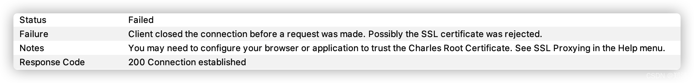
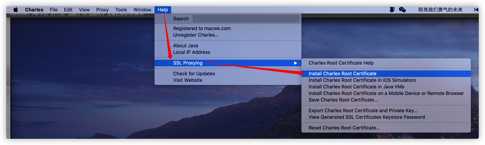
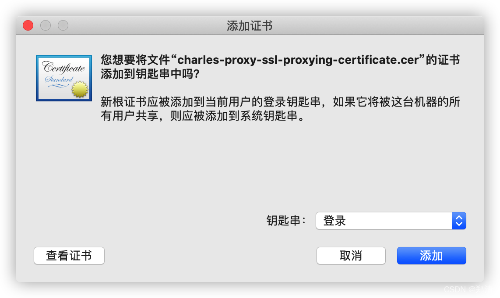
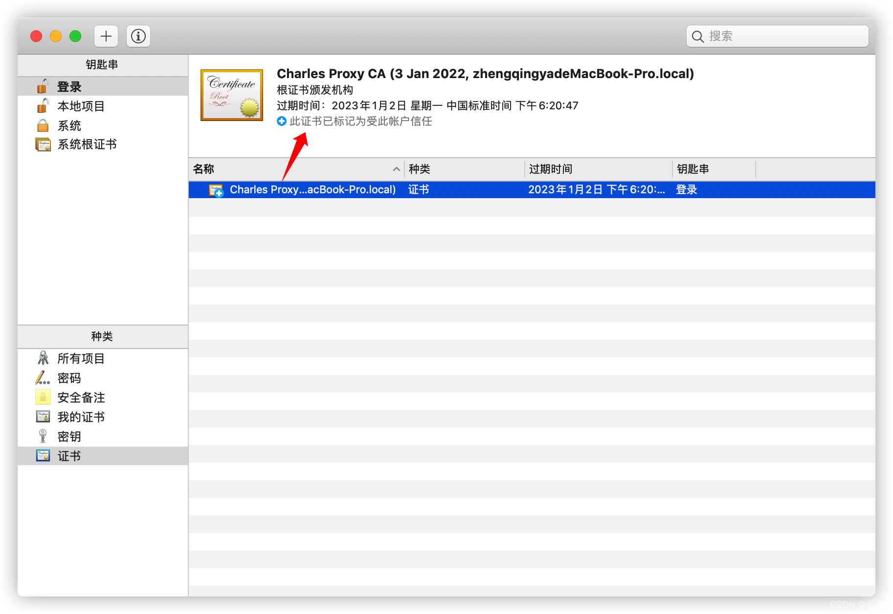
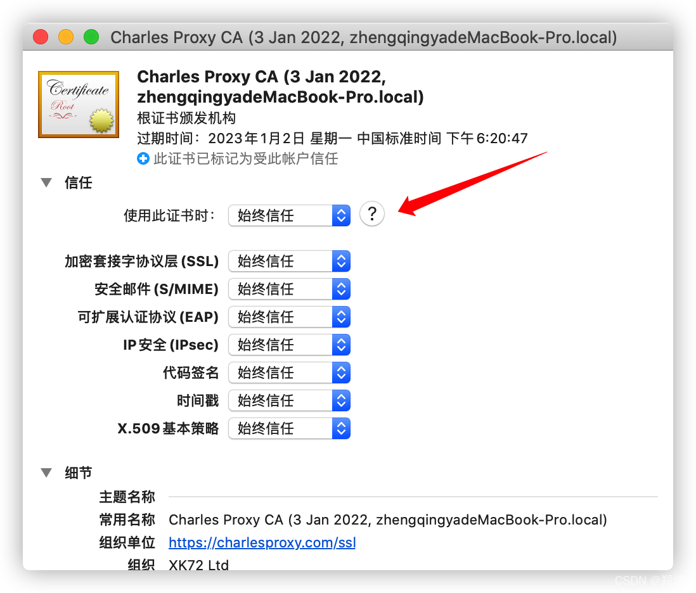
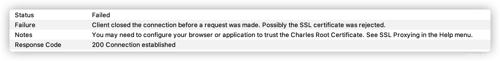
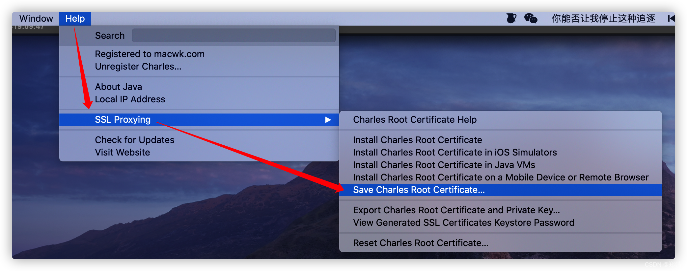
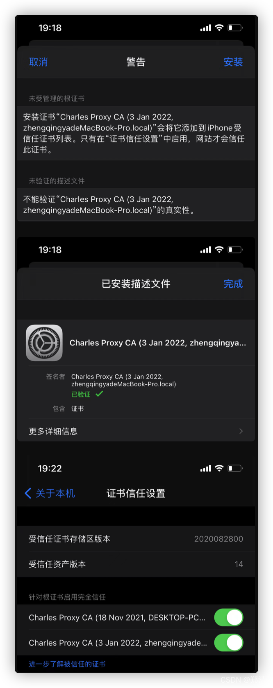

@[TOC](文章目录)

### 一、前言

1. Charles请求转发  [https://zhengqing.blog.csdn.net/article/details/111597213](https://zhengqing.blog.csdn.net/article/details/111597213)
2. Charles之iPhone手机https请求抓包 [https://blog.csdn.net/qq_38225558/article/details/120318641](https://blog.csdn.net/qq_38225558/article/details/120318641)
3. Charles下载地址 [https://www.charlesproxy.com/download](https://www.charlesproxy.com/download)
4. 解决半小时使用 [https://www.zzzmode.com/mytools/charles](https://www.zzzmode.com/mytools/charles)

### 二、https抓包问题 -- 浏览器

> Failure: Client closed the connection before a request was made. Possibly the SSL certificate was rejected.
> Notes: You may need to configure your browser or application to trust the Charles Root Certificate. See SSL Proxying in the Help menu.

##### 安装证书 `Help` -> `SSL Proxying` -> `Install Charles Root Certificate`

> tips: 这里的证书一定要是被信任的！

##### 信任证书操作

如果此证书不被信任的话，可双击证书进行操作。

信任证书之后，重启一下Charles吧`^_^`

### 三、https抓包问题 -- iPhone手机

> tips: 之前解决此问题是通过在手机浏览器中访问 [http://chls.pro/ssl](http://chls.pro/ssl) 下载ssl证书，然后安装信任即可；
> 但后面发现这种方案对小编目前的环境不可行了，于是采用下面的方案

##### 保存证书 `Help` -> `SSL Proxying` -> `Save Charles Root Certificate ...`

先保存到电脑的某一个位置，然后将此证书文件上传到其它三方平台，提供给iPhone手机在浏览器中对链接地址进行下载安装；

> 为什么不支持通过微信发送此文件安装呢？ 
> 因为iPhone手机无法直接安装此文件，只能通过第三方链接在浏览器中进行安装操作！
> ex: 使用七牛云
> 

之后就可以正常抓包了 `^_^`

---

> 今日分享语句：
> 一点一点去靠近梦想,不抱侥幸的奢望,用踏实浇灌,用努力证明,你可以!
