### 一、前言

Jenkins是一款开源 CI&CD 软件，用于自动化各种任务，包括构建、测试和部署软件。
Jenkins 支持各种运行方式，可通过系统包、Docker 或者通过一个独立的 Java 程序。

> 了解更多可参考Jenkins官方文档：https://jenkins.io/zh/doc/

### 二、基本环境

1. windows-x64
2. apache-tomcat-8.5.41
3. jdk1.8
4. maven3.3.9

### 三、安装 Jenkins

#### 1、官网下载Jenkins：https://jenkins.io/zh/download/

这里小编下载的是LTS版中的war包形式 【将war直接放在tomcat里跑，入门相对简单一点】

#### 2、运行访问

直接将war包丢在tomcat中的webapps目录下

然后进入bin目录下双击 `startup.bat` 启动即可
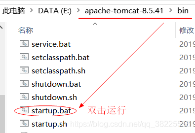
访问 http://localhost:8080/jenkin 【注：这里8080是我的tomcat默认端口哦】
这里根据提示去找自己的密码填上即可~
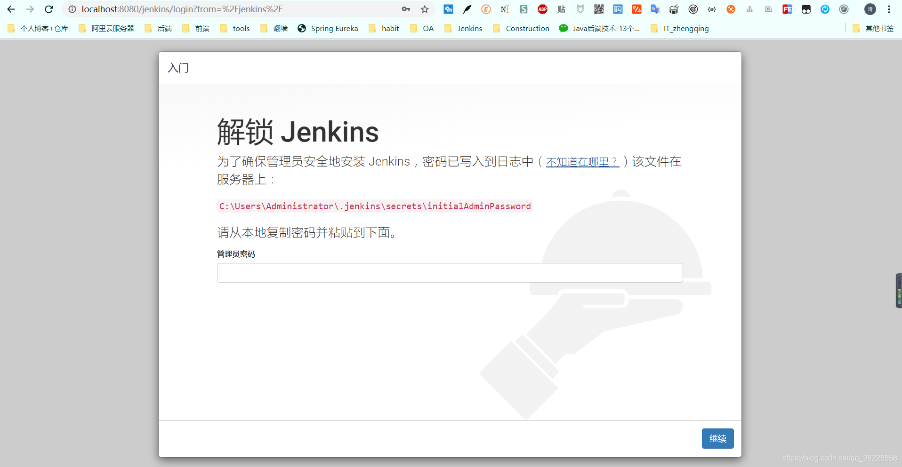
下一步选择安装推荐的插件

等待安装完...
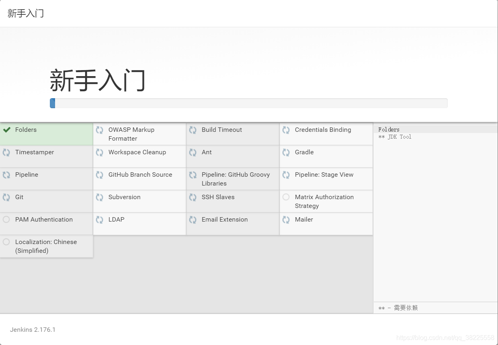
如果出现安装失败点击继续即可... 也可重试，或者进入之后手动安装

#### 3、创建一个管理员

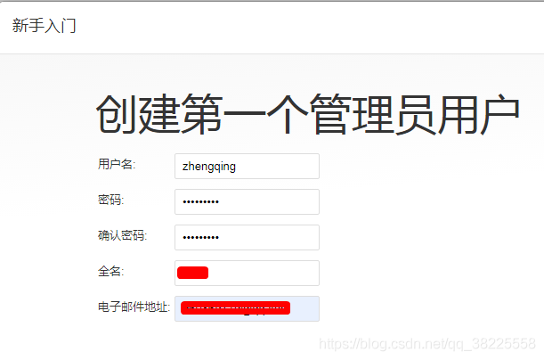
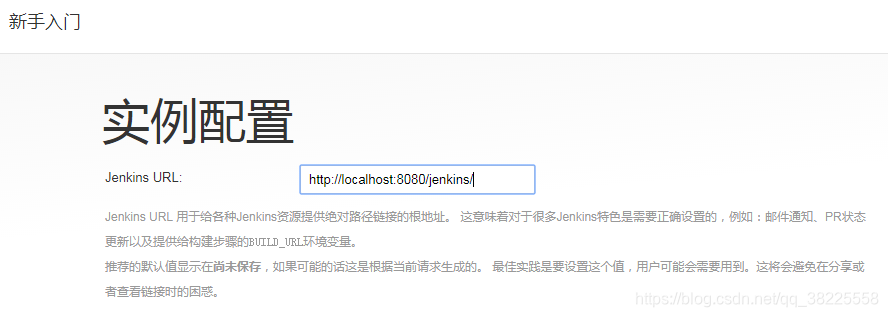

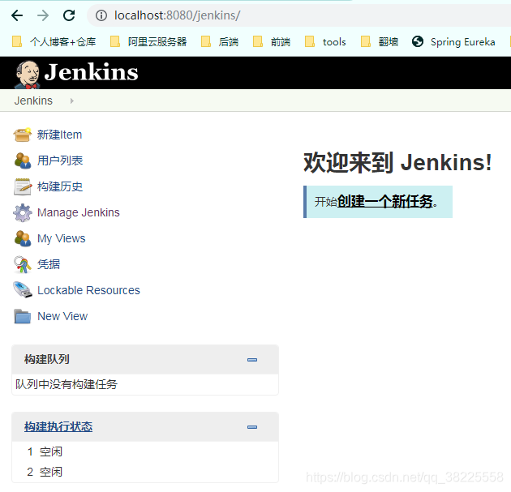

### 四、配置Jenkins

#### 1、全局配置

##### （1）全局安全配置

http://localhost:8080/jenkins/configureSecurity/
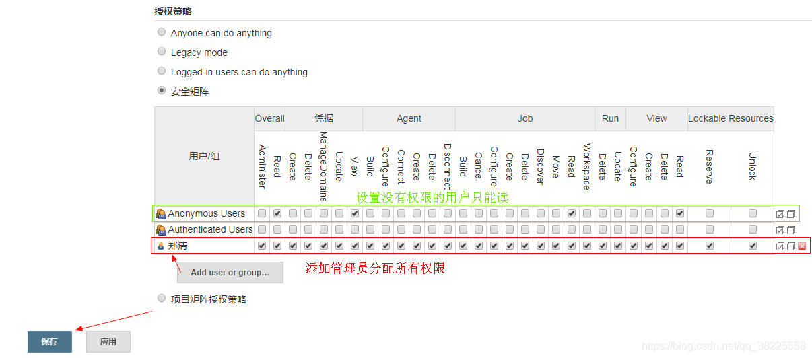

##### （2）全局工具配置

http://localhost:8080/jenkins/configureTools/

###### ①JDK配置

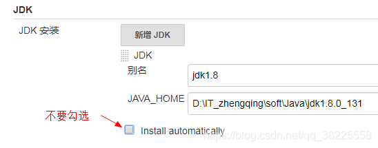

###### ②Maven配置

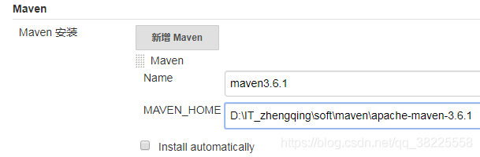

###### ③Git配置

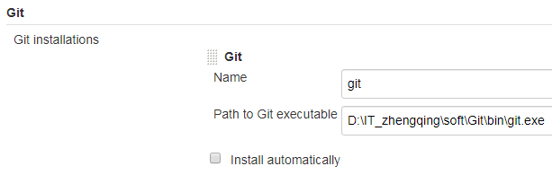
还有一些Ant、Docker... 如果有这些环境可以自己配上~

#### 2、系统配置

http://localhost:8080/jenkins/configure
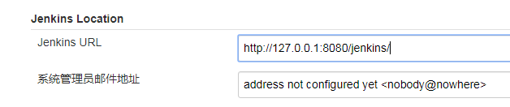

#### 3、插件安装

http://localhost:8080/jenkins/pluginManager/available

> 温馨小提示：这里根据自己的环境选择性安装哦

##### ①Maven Integration

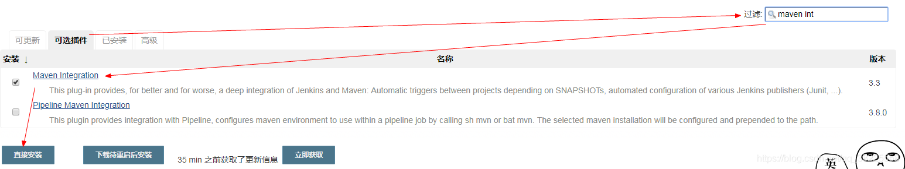

##### ②GitLab

这里根据自己的环境选择svn、github、gitee或gitlab...

##### ③SonarQube Scanner For Jenkins

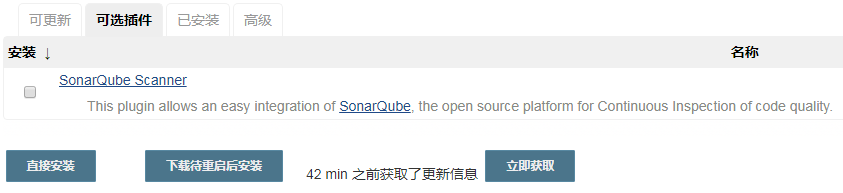

##### ④Publish Over SSH / SSH plugin

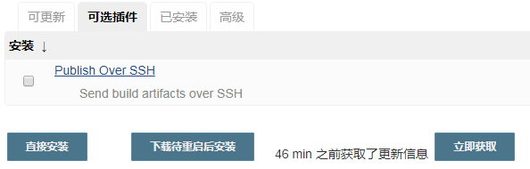
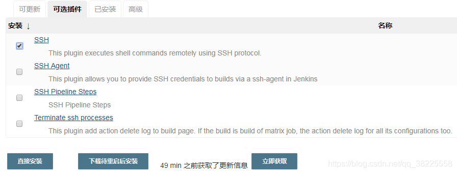

### 五、实际使用 -> 构建部署maven项目

#### 1、在工作台中创建一个新任务

http://localhost:8080/jenkins/newJob
①
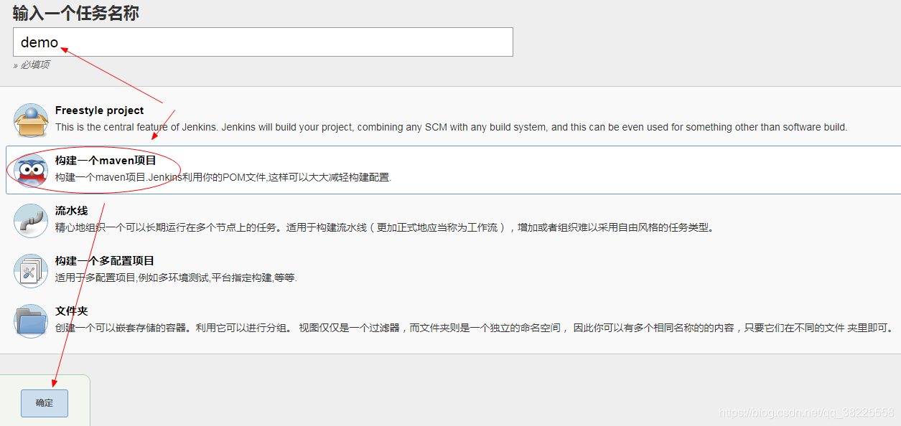
②

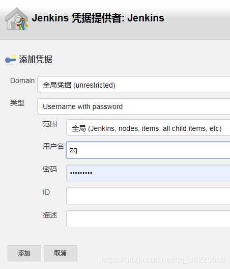
③配置maven打包命令
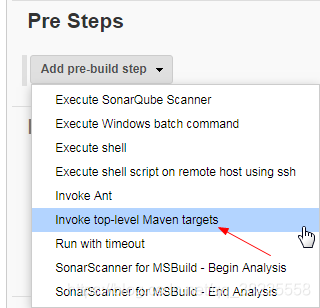
> 这里maven是小编之前步骤中已经配置过环境，因此直接选择版本，然后输入执行命令即可

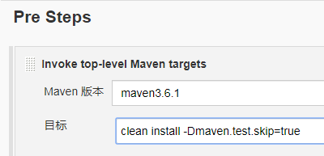
④配置项目运行命令
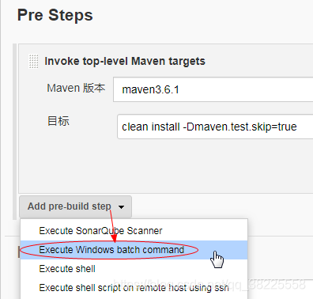
> `温馨小提示`：maven执行后所打的jar包或者war包一般情况下是放在C:\Users\xxx\.jenkins\workspace目录下 【xx：你的电脑用户名】
> 小编因为是云桌面，所以在D盘下去了
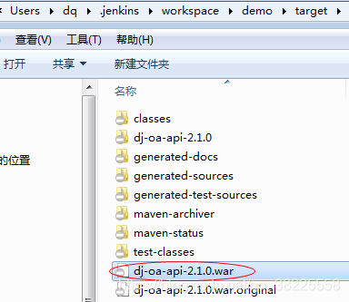

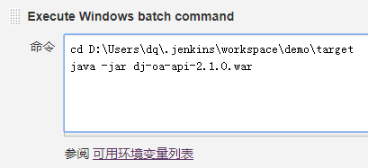

其它配置根据自己的情况选择配置 ... 最后保存

#### 2、立即构建

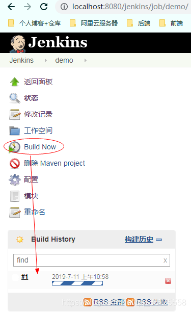

#### 3、查看控制台输出信息

> 小编第一次构建时失败了，原因是在windows系统无法执行sh脚本... 后来取消相应配置，于是第二次构建成功~

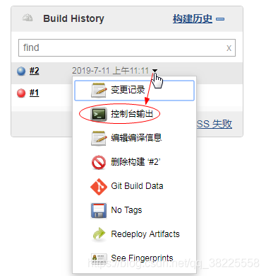
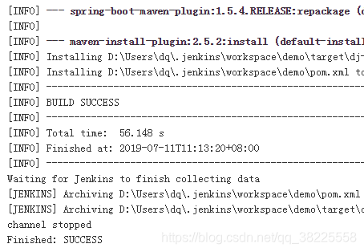
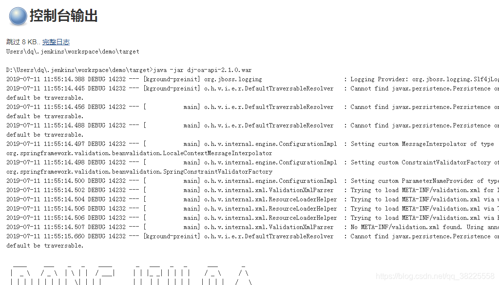

#### 4、构建成功 -> 浏览器访问测试

浏览器输入自己项目配置的相应地址端口访问即可
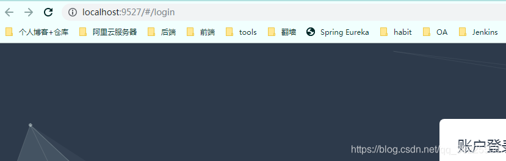

#### 5、最后

在Jenkins工作台中我们也可以查看所有的构建失败或者成功，以及其它信息... 你们自己点着玩应该就会了哈
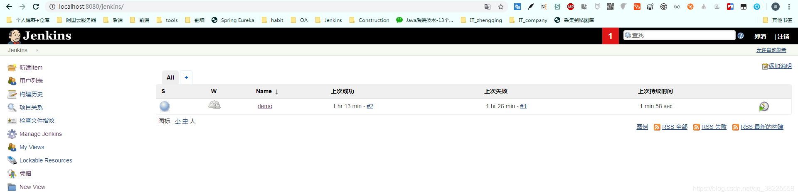

### 六、问题解决

#### 插件问题

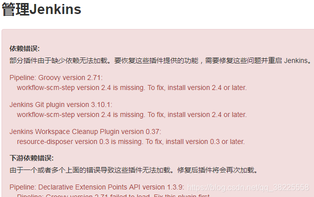
如果在刚开始进来安装插件失败导致如上错误可以在 `Manage Jenkins` -> `Manage Plugins` -> `Advanced` -> `高级` -> `升级站点`
中修改站点为http形式

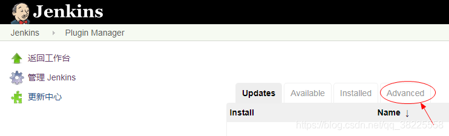
然后在高级下面修改站点url为 http://updates.jenkins.io/update-center.json

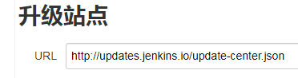
最后再手动去安装Jenkins需要的插件即可...

#### Windows下以war包形式安装Jenkins控制台出现中文乱码解决方式

如下图，我在Windows下以war包形式放在tomcat上运行Jenkins后，控制台输出信息出现中文乱码...
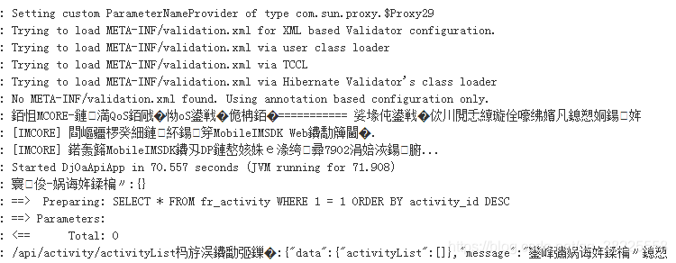

##### 解决

###### 1、全局设置新增参数

http://localhost:8080/jenkins/configure
进入全局设置找到全局属性新增键值对 LANG < - > zh_CN.UTF-8 ，保存

###### 2、修改tomcat安装目录下的server.xml配置文件

修改 `URIEncoding="utf-8"` 为 `useBodyEncodingForURI="true"`

> 如果没有 `URIEncoding="utf-8"` ， 直接添加 `useBodyEncodingForURI="true"` 即可

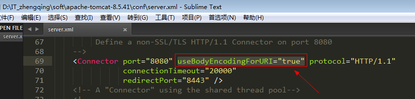

###### 3、配置计算机环境变量

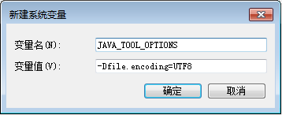

###### 4、重启Jenkins

重启之后，进入控制台查看输出信息，如下图，成功解决中文乱码！
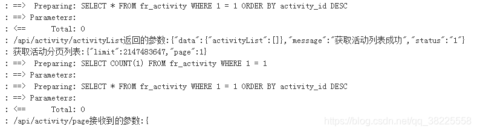

