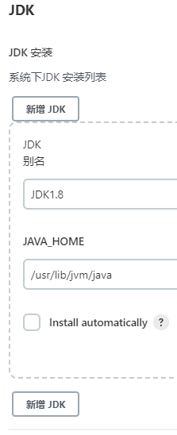

# Jenkins配置

> tips: 这里不配置也可以！！！

`Manage Jenkins` -> `Global Tool Configuration`

### JDK

`JDK1.8` -> `/usr/lib/jvm/java`

### Maven

`maven` -> `/home/soft/maven/apache-maven-3.6.3`

### NodeJS

> tips: 配置这个的话 还需要安装`NodeJS`插件

`nodejs` -> `/home/soft/node-v12.18.3-linux-x64`

